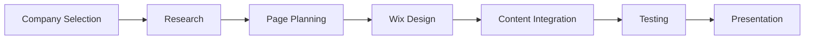

# Project Notes: CrowdStrike Website Development

## Purpose

This file summarizes the development approach, website sections, contribution, and learning outcomes for the **CrowdStrike Website Development** project completed in the Applications of Information and Communications Technology course.

---

## Project Context

The course task was to select a cybersecurity company and create a website based on its product, theme, brand, or website style. Our group selected **CrowdStrike** and built a Wix-based website focused on CrowdStrike Falcon and the company’s cybersecurity positioning.

This project should be understood as a **themed academic website development exercise**, not an official company website.

---

## Live Website

```text
https://hnai1211.wixsite.com/crowdstrike
```

---

## Website Pages

| Page | Description |
|---|---|
| Home | Landing page introducing the CrowdStrike theme |
| Company | Company overview and background |
| Product | CrowdStrike Falcon product information |
| Target Market | Target industries and potential customers |
| Marketing Mix | 4Ps: Product, Price, Place, and Promotion |
| About | Company story and supporting content |
| Reflections | Reflections and learning from team members |

---

## Development Platform

The website was developed using **Wix Website Builder**.

Wix was used because it allowed:

- Visual website design
- Fast page creation
- Simple navigation setup
- Easy media integration
- Hosted website deployment
- No complex backend requirement

---

## My Contribution

My main responsibility was the **home page**.

Tasks included:

- Designing the landing page structure.
- Adding interactive elements.
- Improving the first impression of the website.
- Testing page behavior.
- Checking visual consistency with the selected cybersecurity theme.
- Reviewing navigation flow and layout consistency.

---

## Design Theme

The website uses a cybersecurity-inspired visual style based on:

- Red and black color palette
- CrowdStrike-like branding direction
- Large hero sections
- Product-focused messaging
- Simple navigation bar
- Screenshot-based visual documentation

---

## Development Workflow



---

## Key Achievements

- Built a complete themed website using Wix.
- Created multiple website sections for company, product, market, and reflections.
- Applied basic ICT and web design concepts.
- Presented a cybersecurity product in a structured way.
- Collaborated as a group and divided work by website section.
- Documented the project through presentation and screenshots.

---

## Screenshots Included

| Screenshot | Purpose |
|---|---|
| `screenshots/home.PNG` | Website home page |
| `screenshots/intro.PNG` | Intro overlay / project introduction |
| `screenshots/product.PNG` | Product page |
| `screenshots/company.PNG` | Company page |
| `screenshots/target-market.PNG` | Target market page |
| `screenshots/marketing-mix.PNG` | Marketing mix page |
| `screenshots/about.PNG` | About page |
| `screenshots/reflections.PNG` | Reflections page |

---

## Presentation File

```text
presentation/CrowdStrike-Website-Development_ICT.pptx
```

---

## Suggested GitHub Folder

```text
semester-01-fall-2023/
└── applications-of-ict/
    └── crowdstrike-website-development/
```

---

## Important Note

The website is an academic project and should be presented as a **themed website development exercise**, not as an official clone or official CrowdStrike website.

---

## Disclaimer

This project is not affiliated with CrowdStrike. It was created only for academic learning and portfolio documentation.
