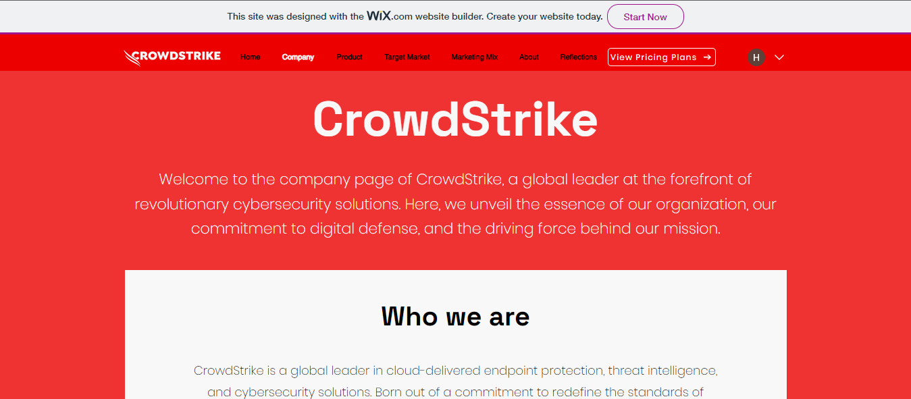
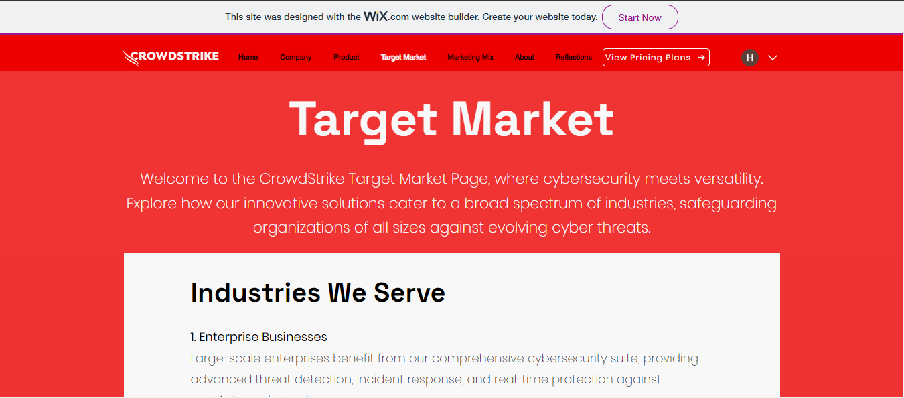
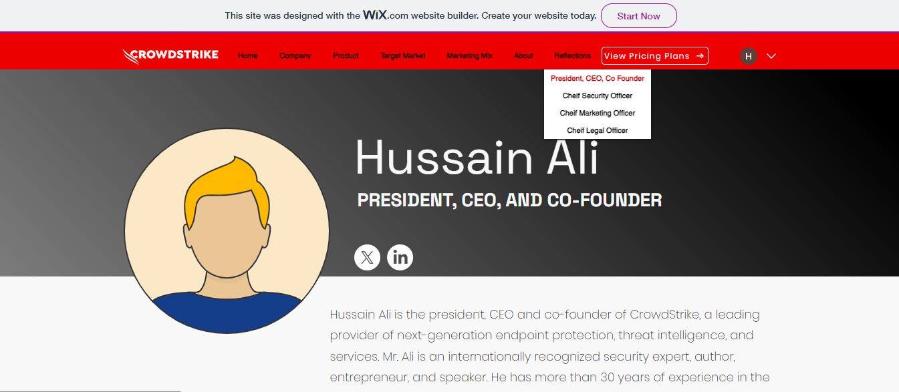
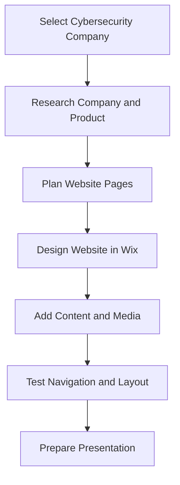

# CrowdStrike Website Development


## Overview

This project was completed for the **Applications of Information and Communications Technology** course. The task was to choose a cybersecurity company and design a website based on its product, theme, brand, or website concept.

Our group selected **CrowdStrike** and created a themed academic website using **Wix Website Builder**. The website presents CrowdStrike’s company profile, Falcon product overview, target market, marketing mix, and reflection pages.

> This is an unofficial academic website project created for learning purposes. It is not affiliated with, endorsed by, or maintained by CrowdStrike.

---

## Live Website

The website is available here:

```text
https://hnai1211.wixsite.com/crowdstrike
```

---

## Project Preview

### Home Page


### Introduction Page


### Product Page


### Company Page



### Target Market Page



### Marketing Mix Page


### About Page


### Reflections Page



---

## Project Information

| Field | Details |
|---|---|
| Course | Applications of Information and Communications Technology |
| Project Title | CrowdStrike Website Development |
| Company Selected | CrowdStrike |
| Product Focus | CrowdStrike Falcon |
| Platform Used | Wix Website Builder |
| Project Type | Group Website Development Project |
| Status | Completed |
| Live Website | `https://hnai1211.wixsite.com/crowdstrike` |

---

## Project Objective

The objective of this project was to design and develop a company-themed website that demonstrates basic web development, digital presentation, content organization, navigation design, and user experience principles.

The website was designed to:

- Present a cybersecurity company profile.
- Showcase the CrowdStrike Falcon platform.
- Explain the target market.
- Apply the marketing mix concept.
- Include group reflections and project learning.
- Demonstrate website design using Wix.

---

## My Contribution

My contribution focused mainly on the **home page** and overall website testing.

| Area | Contribution |
|---|---|
| Home Page Development | Led the development of the home page and created an engaging first impression |
| Interactive Elements | Added interactive website elements for better user engagement |
| Website Testing | Tested the website for usability, navigation, and presentation consistency |
| Cross-Browser Review | Checked website behavior across browsers and screen sizes |
| Visual Consistency | Helped maintain a consistent CrowdStrike-inspired visual style |

---

## Website Sections

| Section | Purpose |
|---|---|
| Home | Main landing page and brand introduction |
| Company | Overview of CrowdStrike as a cybersecurity company |
| Product | Information about CrowdStrike Falcon |
| Target Market | Industries and users targeted by the product |
| Marketing Mix | Explanation of Product, Price, Place, and Promotion |
| About | Company story and supporting content |
| Reflections | Group member reflections and learning outcomes |

---

## CrowdStrike Theme

The project presents CrowdStrike as a cybersecurity company focused on endpoint protection, cloud-based threat detection, threat intelligence, and incident response. The website highlights CrowdStrike Falcon as the main product and explains its value through a simple academic website design.

---

## Marketing Mix Summary

| 4P | Explanation |
|---|---|
| Product | CrowdStrike Falcon as a cybersecurity platform |
| Price | Subscription-based pricing and plans |
| Place | Cloud-based access and deployment across environments |
| Promotion | Digital marketing, brand visibility, events, and cybersecurity success stories |

---

## Key Features

- Wix-based website design
- Cybersecurity company theme
- Red and black CrowdStrike-inspired visual style
- Navigation menu with multiple sections
- Product-focused page
- Target market explanation
- Marketing mix page
- Group reflections section
- Screenshots included for portfolio preview
- Presentation included for academic documentation

---

## Website Development Workflow



---

## Repository Structure

```text
crowdstrike-website-development/
│
├── README.md
├── PROJECT_NOTES.md
│
├── presentation/
│   └── CrowdStrike-Website-Development_ICT.pptx
│
└── screenshots/
    ├── about.PNG
    ├── company.PNG
    ├── home.PNG
    ├── intro.PNG
    ├── marketing-mix.PNG
    ├── product.PNG
    ├── reflections.PNG
    └── target-market.PNG
```

---

## Presentation

The project presentation is available in the `presentation/` folder:

```text
presentation/CrowdStrike-Website-Development_ICT.pptx
```

---

## Learning Outcomes

Through this project, I learned how to:

- Build a website using Wix.
- Organize website content into clear sections.
- Design a website around a cybersecurity company theme.
- Apply ICT concepts in a practical website development task.
- Present product information in a user-friendly way.
- Understand basic user experience and navigation design.
- Work collaboratively on a group website project.
- Connect cybersecurity branding with digital communication.

---

## Academic Notice

This project was created as part of university coursework for academic learning and portfolio documentation.

---

## Disclaimer

This is an unofficial academic project inspired by CrowdStrike’s cybersecurity theme and product positioning. It is not affiliated with, endorsed by, or maintained by CrowdStrike. All brand names and trademarks belong to their respective owners.
