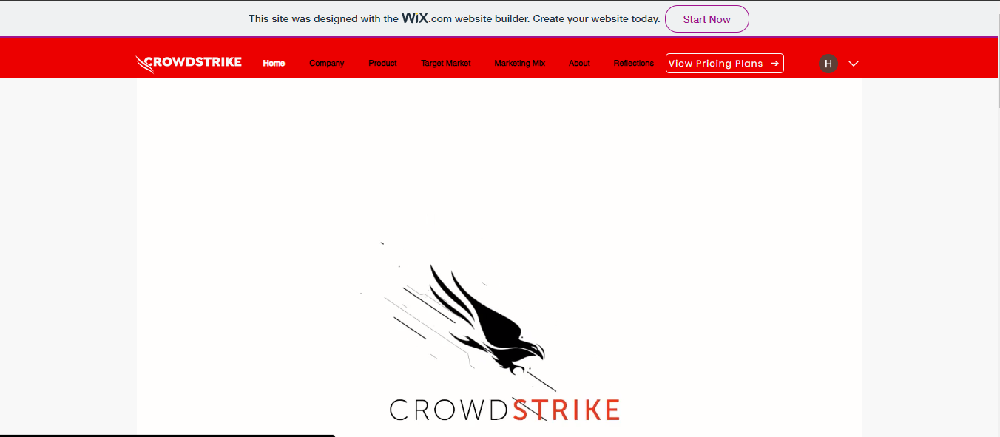
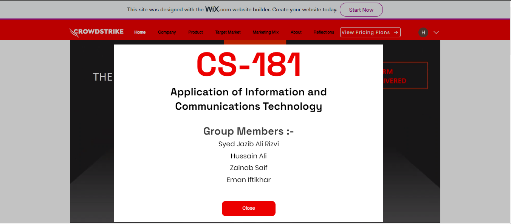
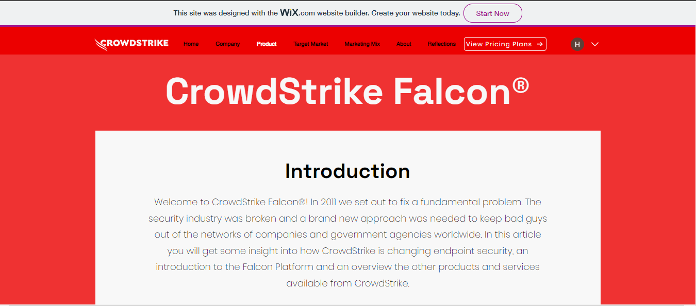
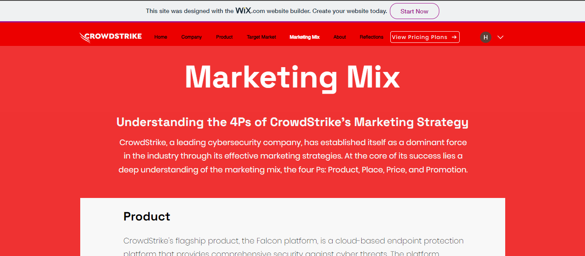
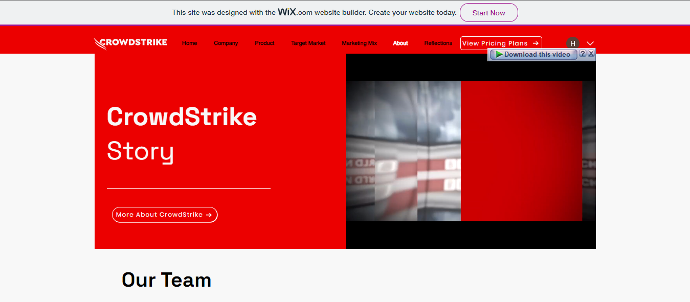
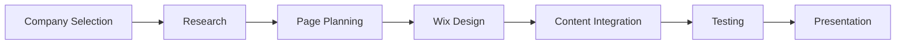

# CrowdStrike Website Development


## Overview

This project was completed for the **Applications of Information and Communication Technologies** lab component. The task was to select a company and design a website based on its product, theme, brand, or website concept.

Our group selected **CrowdStrike** and created a cybersecurity-themed academic website using **Wix Website Builder**. The website presents CrowdStrike’s company profile, Falcon product overview, target market, marketing mix, and group reflection pages.

> This is an unofficial academic website project created for learning purposes. It is not affiliated with, endorsed by, or maintained by CrowdStrike.

## Live Website

The website is available here:

```txt
https://hnai1211.wixsite.com/crowdstrike
```

## Project Information

| Field | Details |
|---|---|
| Course | Applications of Information and Communication Technologies |
| Semester | Semester 1, Fall 2023 |
| Project Title | CrowdStrike Website Development |
| Company Theme | CrowdStrike |
| Product Focus | CrowdStrike Falcon |
| Platform Used | Wix Website Builder |
| Project Type | Group Website Development Project |
| Component | ICT Lab |
| Status | Completed |
| Live Website | `https://hnai1211.wixsite.com/crowdstrike` |

## Project Objectives

The objective of this project was to design and develop a company-themed website that demonstrates basic web development, digital presentation, content organization, navigation design, and user experience principles.

The website was designed to:

- Present a cybersecurity company profile.
- Showcase the CrowdStrike Falcon platform.
- Explain the target market.
- Apply the marketing mix concept.
- Include group reflections and learning outcomes.
- Demonstrate visual website development using Wix.
- Practice organizing digital content for an online audience.

## Project Preview

### Home Page



### Introduction Page



### Company Page


### Product Page



### Target Market Page


### Marketing Mix Page



### About Page



### Reflections Page


## Website Sections

| Section | Purpose |
|---|---|
| Home | Main landing page and first impression |
| Introduction | Introductory overview of the selected company theme |
| Company | Overview of CrowdStrike as a cybersecurity company |
| Product | Information about CrowdStrike Falcon |
| Target Market | Industries and users targeted by the product |
| Marketing Mix | Explanation of Product, Price, Place, and Promotion |
| About | Supporting company/theme information |
| Reflections | Group member reflections and learning outcomes |

## My Contribution

My contribution focused mainly on the **home page** and overall website testing.

| Area | Contribution |
|---|---|
| Home Page Development | Designed and developed the main landing page to create a strong first impression |
| Interactive Elements | Added interactive website elements for better user engagement |
| Website Testing | Tested usability, navigation, and page behavior |
| Cross-Browser Review | Checked website behavior across browsers and screen sizes |
| Visual Consistency | Helped maintain a consistent cybersecurity-inspired visual style |
| Final Review | Reviewed layout, navigation flow, and presentation readiness |

## Design Theme

The website used a cybersecurity-inspired design direction based on:

- Red and black visual palette
- CrowdStrike-inspired branding direction
- Large hero sections
- Product-focused messaging
- Simple navigation structure
- Screenshot-based project documentation
- Professional cybersecurity tone

## Marketing Mix Summary

| 4P | Explanation |
|---|---|
| Product | CrowdStrike Falcon as a cybersecurity platform |
| Price | Subscription-based pricing and service plans |
| Place | Cloud-based access and deployment across different environments |
| Promotion | Digital marketing, cybersecurity events, brand visibility, and success stories |

## Development Platform

The website was developed using **Wix Website Builder**.

Wix was used because it allowed:

- Visual website design
- Fast page creation
- Simple navigation setup
- Easy media integration
- Hosted website deployment
- No complex backend requirement
- Quick presentation of a company-themed website

## Development Workflow



## Key Features

- Wix-based website design
- Cybersecurity company theme
- CrowdStrike-inspired visual style
- Multiple website sections
- Product-focused page
- Target market explanation
- Marketing mix page
- Group reflections section
- Website screenshots for portfolio preview
- Presentation file for academic documentation

## Repository Structure

```txt
crowdstrike-website-development/
├── README.md
├── presentation/
│   └── CrowdStrike-Website-Development.pptx
└── screenshots/
    ├── about.PNG
    ├── company.PNG
    ├── home.PNG
    ├── intro.PNG
    ├── marketing-mix.PNG
    ├── product.PNG
    ├── reflections.PNG
    └── target-market.PNG
```

## Presentation File

The project presentation is available in the `presentation/` folder:

```txt
presentation/CrowdStrike-Website-Development.pptx
```

## Learning Outcomes

Through this project, I learned how to:

- Build a website using Wix.
- Organize website content into clear sections.
- Design a website around a cybersecurity company theme.
- Apply ICT concepts in a practical website development task.
- Present cybersecurity product information in a user-friendly way.
- Understand basic user experience and navigation design.
- Work collaboratively on a group website project.
- Connect cybersecurity branding with digital communication.

## Academic Notice

This project was created as part of university coursework for academic learning and portfolio documentation.

## Disclaimer

This project is an unofficial academic website development exercise. It is not affiliated with, endorsed by, or maintained by CrowdStrike.