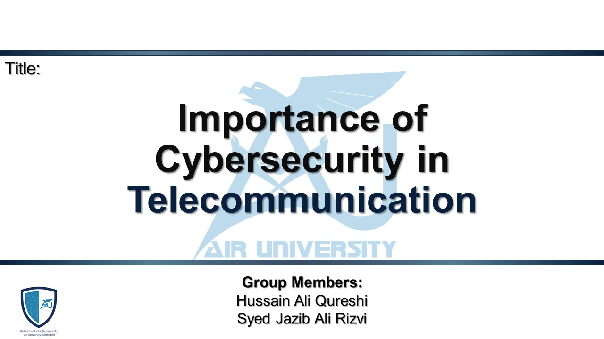
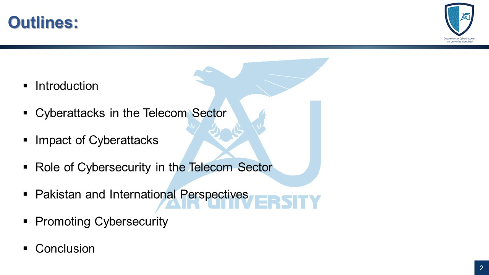
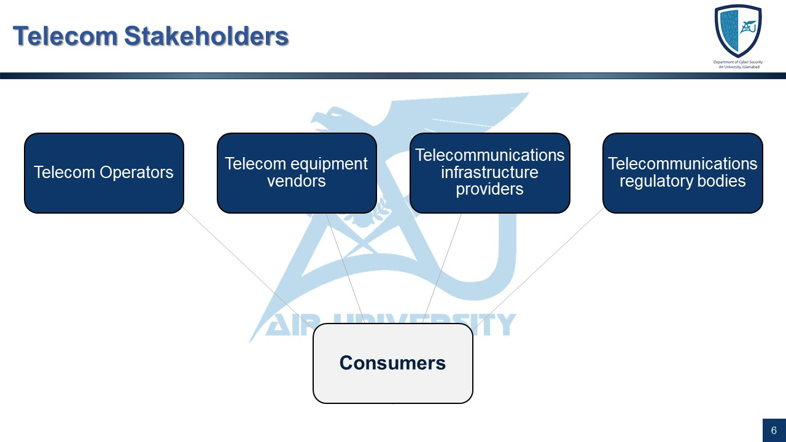
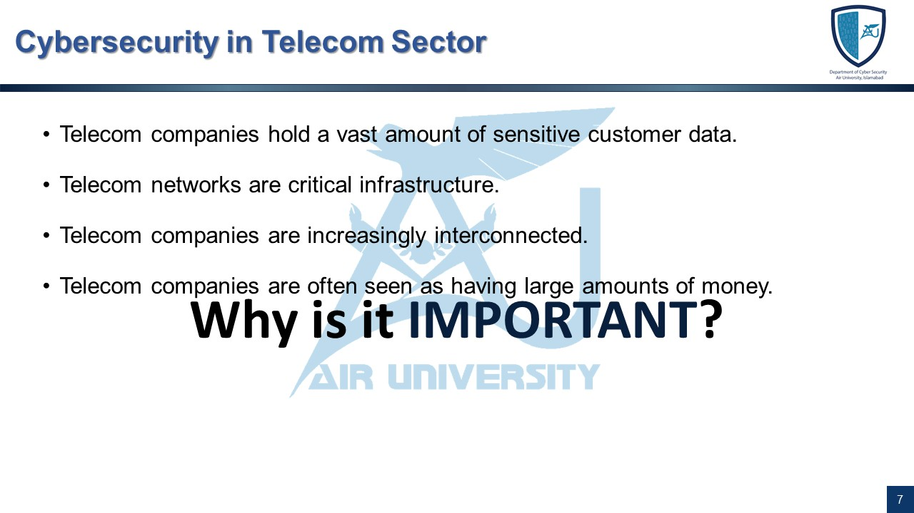
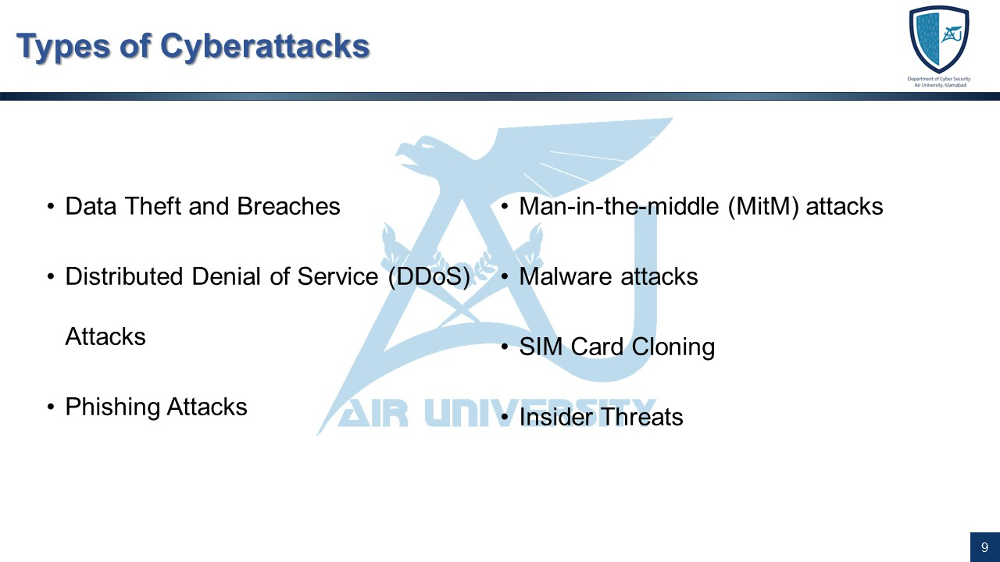
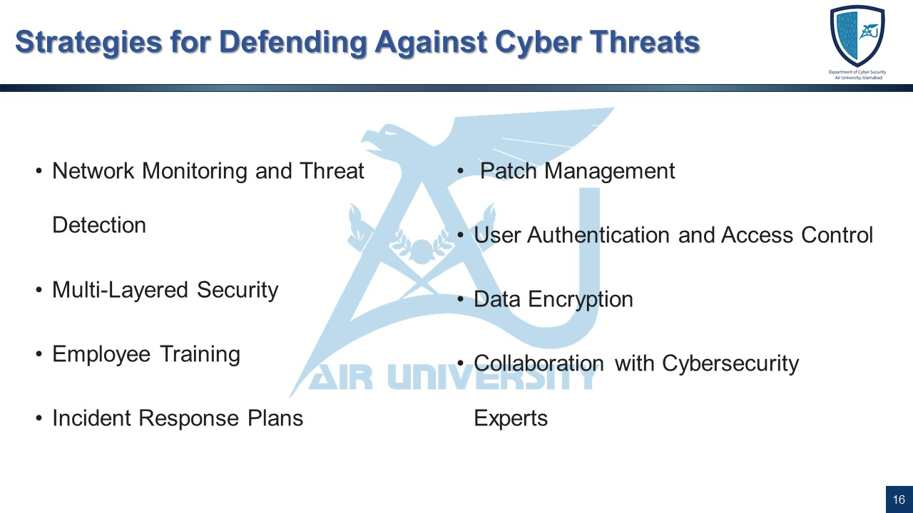
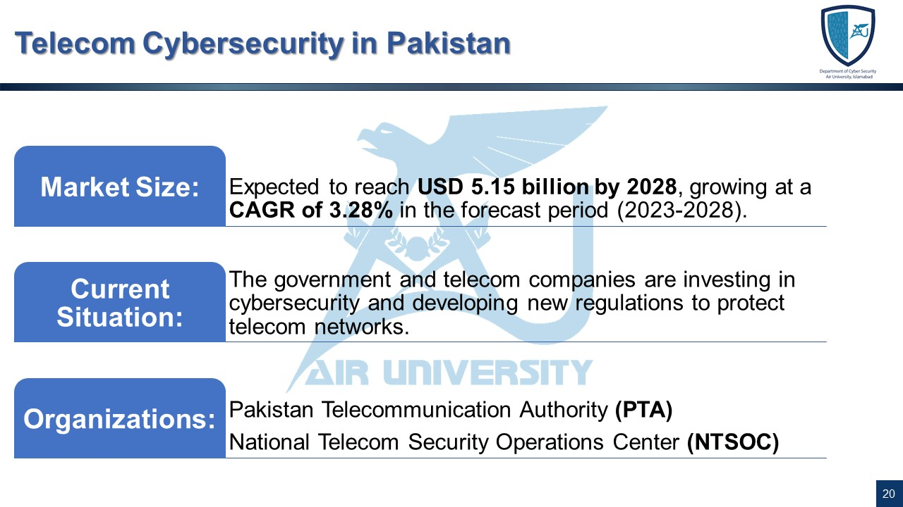
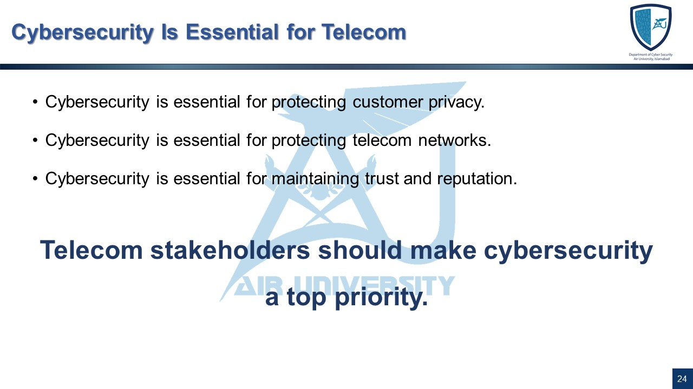

# Importance of Cybersecurity in Telecommunication


## Overview

This presentation was prepared for the **Applications of Information and Communication Technologies** course. The topic focuses on the **importance of cybersecurity in the telecommunication sector**.

Telecommunication networks support voice communication, mobile services, internet connectivity, business operations, emergency services, and digital communication. Because telecom providers manage sensitive customer data and large-scale infrastructure, cybersecurity plays an important role in maintaining service availability, user trust, privacy, and national security.

This version preserves the original Semester 1 presentation style while improving content clarity, alignment, typography, and overall portfolio readability.

## Project Information

| Field | Details |
|---|---|
| Course | Applications of Information and Communication Technologies |
| Semester | Semester 1, Fall 2023 |
| Project Title | Importance of Cybersecurity in Telecommunication |
| Project Type | Academic Presentation |
| Focus Area | Telecom Security |
| File Format | PowerPoint Presentation |
| Final File | `Telecom_Cybersecurity_ICT.pptx` |
| Status | Completed |

## Presentation Objectives

The main objectives of this presentation were to:

- Explain the role of telecommunication networks in modern society.
- Discuss why telecom infrastructure is considered critical infrastructure.
- Identify common cyber threats targeting telecom organizations.
- Explain the impact of telecom cyberattacks on users, businesses, and national systems.
- Present defensive strategies for improving telecom cybersecurity.
- Highlight the importance of awareness, regulation, and incident response.

## Project Preview

### Title Slide



### Presentation Outline



### Telecom Stakeholders



### Importance of Cybersecurity in Telecom



### Cyberattacks in Telecom



### Defense Strategies



### Pakistan Perspective



### Conclusion



## Topics Covered

- Introduction to telecommunication
- Means of telecommunication
- Telecom stakeholders
- Importance of cybersecurity in telecom
- Cyberattacks in the telecom sector
- Impact of cyberattacks
- Cost of cybercrime
- Role of cybersecurity in telecom
- Defense strategies
- Telecom cybersecurity in Pakistan
- International perspective
- Cybersecurity promotion and awareness
- Conclusion

## Key Concepts

### Telecommunication

Telecommunication refers to the transmission of voice, data, and video over long distances using electronic and digital communication systems. Examples include mobile networks, internet services, video conferencing, instant messaging, and social media communication.

### Why Cybersecurity Matters in Telecom

Telecom networks are important because they support:

- National communication infrastructure
- Business communication
- Emergency communication
- Internet access
- Customer identity and billing data
- Mobile and digital services
- Public and private sector connectivity

A successful cyberattack on telecom infrastructure can disrupt communication services, expose customer data, damage public trust, and create national security risks.

## Common Cyberattacks in Telecom

| Attack Type | Description |
|---|---|
| Data Breach | Unauthorized access or exposure of customer information |
| DDoS Attack | Overwhelming telecom services with excessive traffic |
| Phishing | Deceptive communication used to steal credentials or sensitive information |
| Man-in-the-Middle Attack | Interception of communication between users or systems |
| Malware | Malicious software used to steal data, disrupt services, or compromise systems |
| SIM Card Cloning | Copying SIM identity to misuse telecom services |
| Insider Threat | Misuse of access by employees, contractors, or trusted users |

## Defensive Strategies

The presentation highlights several strategies for defending telecom infrastructure:

- Continuous network monitoring
- Threat detection systems
- Multi-layered security architecture
- Employee cybersecurity training
- Incident response planning
- Patch management
- Strong authentication
- Access control
- Data encryption
- Security awareness programs
- Collaboration with cybersecurity experts

## Repository Structure

```txt
telecom-cybersecurity-presentation/
├── README.md
├── presentation/
│   └── Telecom_Cybersecurity.pptx
└── screenshots/
    ├── conclusion.JPG
    ├── defense-strategies.JPG
    ├── outline.JPG
    ├── pakistan-perspective.JPG
    ├── telecom-attacks.JPG
    ├── telecom-cybersecurity-importance.JPG
    ├── telecom-stakeholders.JPG
    └── title-slide.JPG
```

## Presentation File

The final presentation is available in the `presentation/` folder:

```txt
presentation/Telecom_Cybersecurity.pptx
```

## Learning Outcomes

Through this project, I learned how to:

- Understand telecom networks as critical infrastructure.
- Identify common cyber threats affecting telecom companies.
- Explain how cyberattacks impact telecom providers and customers.
- Connect cybersecurity with public safety, privacy, and national infrastructure.
- Present cybersecurity concepts in a structured academic format.
- Improve slide readability, visual organization, and presentation flow.

## Academic Notice

This project was prepared as part of university coursework for academic learning and presentation purposes. It is maintained here as part of an academic cybersecurity portfolio.