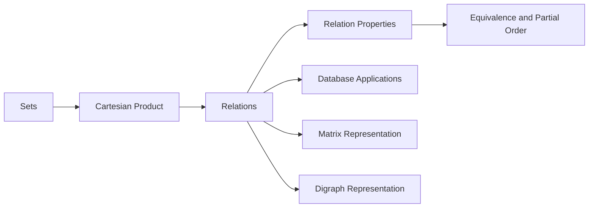

# Relations and Their Properties


## Overview

This project was completed for the **Discrete Structures** course as a group presentation on **Relations and Their Properties**. The presentation explains mathematical relations, their representation methods, relation properties, and their applications in databases, matrices, and directed graphs.

The project connects discrete mathematics with computer science foundations by showing how relations are used in relational databases, primary keys, composite keys, matrix representation, and digraph-based modeling.

---

## Project Preview

### Title Slide


### Table of Contents


---

## Project Information

| Field | Details |
|---|---|
| Course | Discrete Structures |
| Course Code | MA-216 |
| Topic | Relations and Their Properties |
| Chapter | Chapter 9 |
| Project Type | Group Presentation |
| Status | Completed |
| Main Contribution | Application of Relations and Relations with Matrices |
| Presentation | Improved and polished version included |

---

## Topics Covered

- Cartesian product
- Relations
- Functions as relations
- Relations on a set
- Properties of relations
- Reflexive relations
- Symmetric relations
- Antisymmetric relations
- Asymmetric relations
- Transitive relations
- Equivalence relations
- Partial order relations
- Combining relations
- Composite relations
- Powers of relations
- n-ary relations
- Databases and relations
- Primary key
- Composite key
- Relations and matrices
- Properties of relations using matrices
- Relations and directed graphs

---

## My Contribution

My assigned contribution in this group presentation focused on:

| Section | Description |
|---|---|
| Application of Relations | Explained how relations are used in practical computing contexts |
| Relations and Matrices | Explained how binary relations can be represented using matrices |
| Matrix-Based Properties | Covered reflexive, symmetric, antisymmetric, join, meet, composition, and power of relation matrices |

---

## Core Concepts

### Relations

A binary relation from set `A` to set `B` is a subset of the Cartesian product `A × B`. Relations describe how elements from one set are associated with elements from another set.

### Relations on a Set

A relation on a set `A` is a relation from `A` to itself. These relations are commonly studied for properties such as reflexivity, symmetry, antisymmetry, and transitivity.

### Equivalence Relations

An equivalence relation satisfies:

- Reflexivity
- Symmetry
- Transitivity

### Partial Order Relations

A partial order relation satisfies:

- Reflexivity
- Antisymmetry
- Transitivity

### n-ary Relations

An n-ary relation involves `n` sets and is useful in database systems where each record can be represented as a tuple of multiple fields.

---

## Application in Databases

Relations are strongly connected to relational databases. In database systems:

| Concept | Meaning |
|---|---|
| Field | A column or attribute in a table |
| Record | A row represented as an n-tuple of fields |
| Relation | A collection of records |
| Primary Key | Attribute that uniquely identifies each record |
| Composite Key | Combination of two or more attributes that uniquely identify a record |

Example relation:

```text
Student(Name, ID, Major, GPA)
```

Each row can be treated as a tuple:

```text
(Anderson, 231455, CSE, 3.88)
```

### Database Relations Slide


---

## Relations and Matrices

A binary relation can be represented using a matrix.

For a relation `R` from set `A` to set `B`:

- Rows represent elements of set `A`
- Columns represent elements of set `B`
- A matrix entry is `1` if the ordered pair exists in the relation
- A matrix entry is `0` if the ordered pair does not exist

Example:

```text
R = { (1, 2), (2, 3), (3, 1) }
```

Matrix representation:

```text
      1  2  3
1     0  1  0
2     0  0  1
3     1  0  0
```

### Relations and Matrices Slide


---

## Matrix-Based Relation Properties

| Property | Matrix Condition |
|---|---|
| Reflexive | All principal diagonal entries are 1 |
| Symmetric | If `mᵢⱼ = 1`, then `mⱼᵢ = 1` |
| Antisymmetric | For `i ≠ j`, `mᵢⱼ` and `mⱼᵢ` are not both 1 |
| Join / Union | Boolean OR of relation matrices |
| Meet / Intersection | Boolean AND of relation matrices |
| Composition | Boolean product of relation matrices |
| Power of Relation | Repeated Boolean matrix composition |

---

## Relations and Digraphs

A directed graph, or digraph, can represent a relation.

- Vertices represent set elements.
- Directed edges represent ordered pairs.
- Loops represent reflexive pairs.
- Opposite arrows can indicate symmetry.
- Directed paths help explain transitivity.

### Relations and Digraphs Slide


---

## Visual Concept Flow



---

## Repository Structure

```text
relations-and-their-properties/
│
├── README.md
├── PRESENTATION_NOTES.md
│
├── presentation/
│   └── Relations_and_Their_Properties_DS_ppt.pptx
│
└── screenshots/
    ├── database-relations.JPG
    ├── relations-digraphs.JPG
    ├── relations-matrices.JPG
    ├── table-of-contents.JPG
    └── title-slide.JPG
```

---

## Presentation

The improved and polished project presentation is available in the `presentation/` folder:

```text
presentation/Relations_and_Their_Properties_DS_ppt.pptx
```

The presentation includes corrected wording, improved examples, clearer database and matrix explanations, and a stronger key takeaways slide.

---

## Learning Outcomes

Through this project, I learned how to:

- Define and explain mathematical relations.
- Identify different types of relation properties.
- Connect relations with database concepts.
- Explain records as n-tuples in relational databases.
- Represent binary relations using matrices.
- Analyze relation properties through matrix conditions.
- Understand the role of relations in computer science foundations.

---

## Academic Notice

This project was prepared as part of university coursework for academic learning and presentation purposes.

---

## Disclaimer

The material is based on course learning, group research, and presentation content for Discrete Structures. It is maintained here as part of an academic portfolio.
