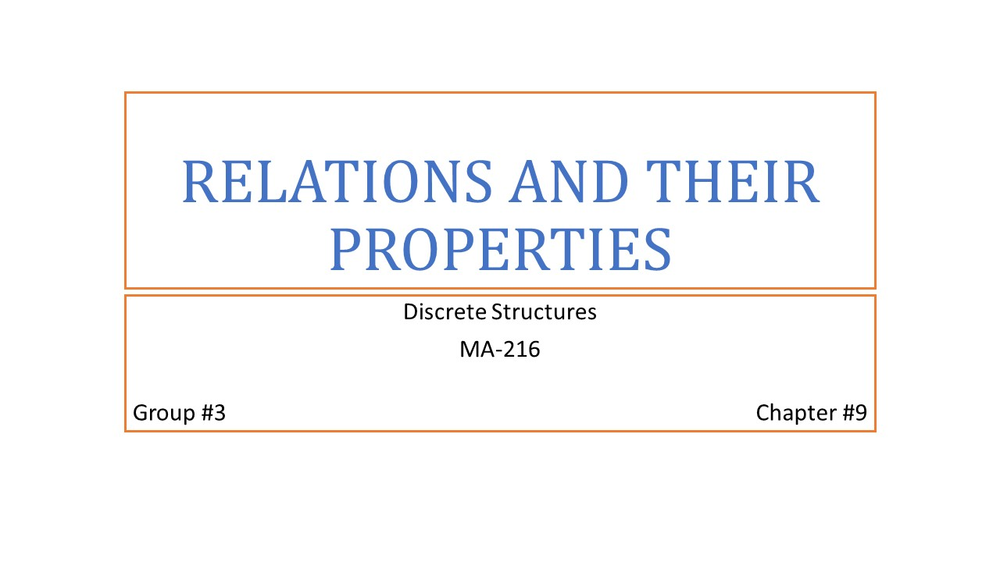
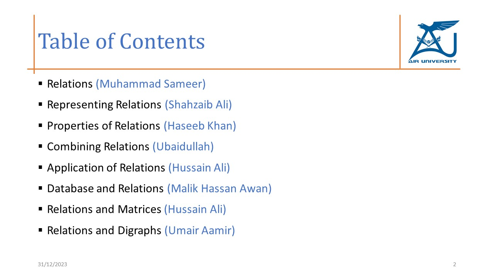
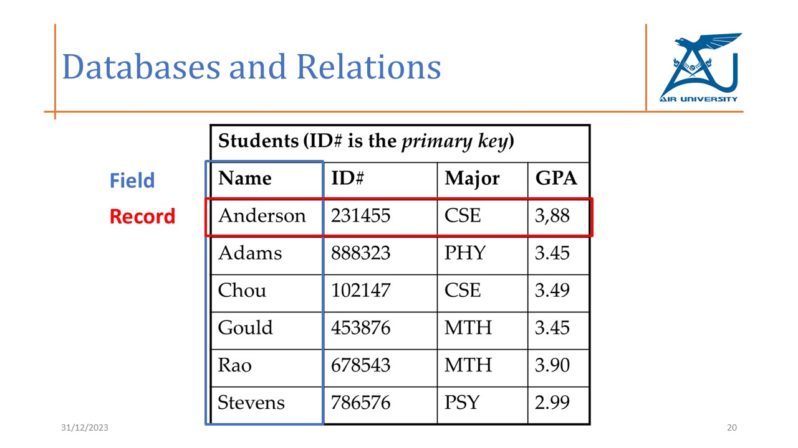
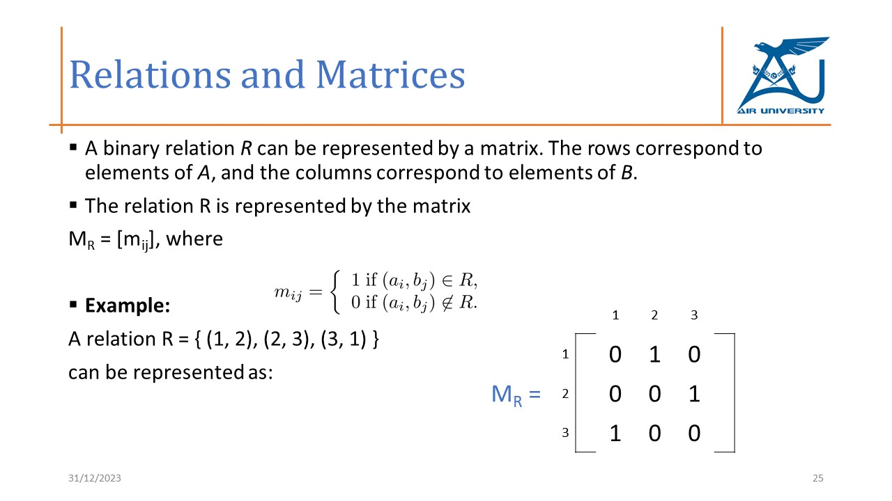
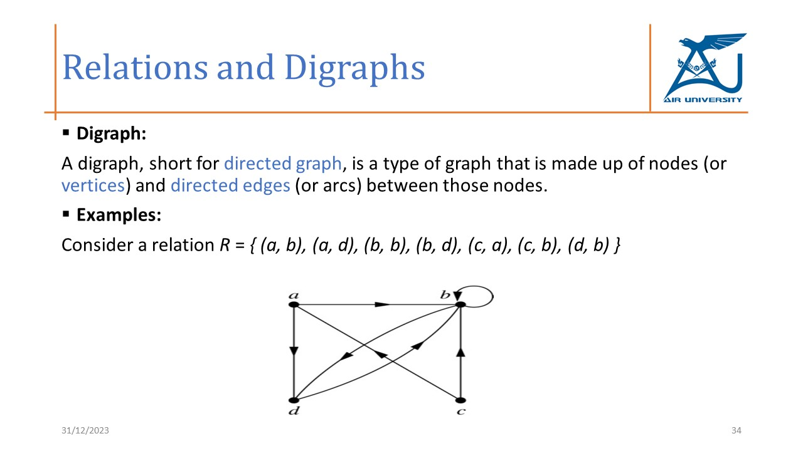
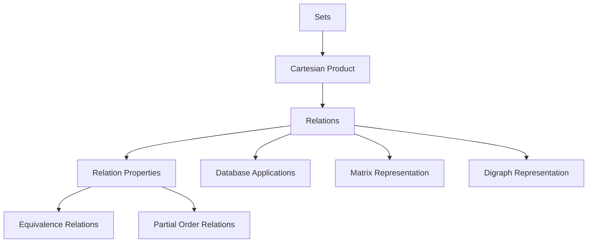

# Relations and Their Properties


## Overview

This project was completed as a group presentation for the **Discrete Structures** course. The presentation explains **Relations and Their Properties**, including relation definitions, representation methods, relation properties, database applications, matrix representation, and directed graph representation.

Relations are an important concept in computer science because they help model connections between objects, users, records, permissions, database entries, graph nodes, and system entities. This project connects discrete mathematics with practical computing concepts such as relational databases, primary keys, composite keys, matrices, and digraphs.

## Project Information

| Field | Details |
|---|---|
| Course | Discrete Structures |
| Course Code | MA-216 |
| Semester | Semester 1, Fall 2023 |
| Topic | Relations and Their Properties |
| Chapter | Chapter 9 |
| Project Type | Group Presentation |
| Main Contribution | Applications of Relations and Relations with Matrices |
| Status | Completed |
| Presentation File | `Relations_and_Their_Properties_DS.pptx` |

## Presentation Objectives

The objective of this presentation was to explain relations in a clear and structured way by covering both mathematical theory and practical computing applications.

The project focused on:

- Defining Cartesian products and relations.
- Explaining relations on a set.
- Describing functions as special types of relations.
- Identifying relation properties.
- Explaining equivalence relations and partial orders.
- Showing how relations can be combined.
- Connecting relations with relational databases.
- Representing relations using matrices.
- Representing relations using directed graphs.

## Project Preview

### Title Slide



### Table of Contents



### Database Relations



### Relations and Matrices



### Relations and Digraphs



## Topics Covered

- Cartesian product
- Binary relations
- Functions as relations
- Relations on a set
- Reflexive relations
- Symmetric relations
- Antisymmetric relations
- Asymmetric relations
- Transitive relations
- Equivalence relations
- Partial order relations
- Combining relations
- Composite relations
- Powers of relations
- n-ary relations
- Database relations
- Primary keys and composite keys
- Matrix representation of relations
- Properties of relations using matrices
- Directed graph representation of relations

## My Contribution

My assigned contribution focused on the application and representation side of the presentation.

| Section | Contribution |
|---|---|
| Applications of Relations | Explained how relations are used in computing and database systems |
| Database Connections | Connected mathematical relations with relational database concepts |
| Relations and Matrices | Explained how binary relations can be represented using matrices |
| Matrix-Based Properties | Covered reflexive, symmetric, antisymmetric, join, meet, composition, and power of relation matrices |

## Core Concepts

### Binary Relation

A binary relation from set `A` to set `B` is a subset of the Cartesian product `A × B`.

Example:

```txt
A = {1, 2, 3}
B = {x, y, z}

R = {(1, x), (2, y), (3, z)}
```

This means selected elements from set `A` are related to selected elements from set `B`.

### Relation on a Set

A relation on a set `A` is a relation from `A` to itself. These relations are commonly analyzed using properties such as reflexivity, symmetry, antisymmetry, and transitivity.

### Equivalence Relation

An equivalence relation satisfies three properties:

- Reflexive
- Symmetric
- Transitive

### Partial Order Relation

A partial order relation satisfies three properties:

- Reflexive
- Antisymmetric
- Transitive

## Relation Properties

| Property | Meaning |
|---|---|
| Reflexive | Every element is related to itself |
| Symmetric | If `a` is related to `b`, then `b` is related to `a` |
| Antisymmetric | If `a` is related to `b` and `b` is related to `a`, then `a = b` |
| Asymmetric | If `a` is related to `b`, then `b` is not related to `a` |
| Transitive | If `a` is related to `b` and `b` is related to `c`, then `a` is related to `c` |

## Application in Databases

Relations are closely connected to relational databases. In database systems, a table can be viewed as a relation, and each row can be viewed as a tuple.

| Database Concept | Meaning |
|---|---|
| Field | A column or attribute in a table |
| Record | A row represented as an n-tuple of fields |
| Relation | A collection of records |
| Primary Key | Attribute that uniquely identifies each record |
| Composite Key | Combination of two or more attributes that uniquely identify a record |

Example relation:

```txt
Student(Name, ID, Major, GPA)
```

Example tuple:

```txt
(Anderson, 231455, CSE, 3.88)
```

## Relations and Matrices

A binary relation can be represented using a matrix.

For a relation `R` from set `A` to set `B`:

- Rows represent elements of set `A`.
- Columns represent elements of set `B`.
- A matrix entry is `1` if the ordered pair exists in the relation.
- A matrix entry is `0` if the ordered pair does not exist.

Example:

```txt
R = {(1, 2), (2, 3), (3, 1)}
```

Matrix representation:

```txt
      1  2  3
1     0  1  0
2     0  0  1
3     1  0  0
```

## Matrix-Based Relation Properties

| Property | Matrix Condition |
|---|---|
| Reflexive | All main diagonal entries are `1` |
| Symmetric | The matrix is mirrored across the main diagonal |
| Antisymmetric | For `i ≠ j`, opposite off-diagonal entries cannot both be `1` |
| Join / Union | Boolean OR of relation matrices |
| Meet / Intersection | Boolean AND of relation matrices |
| Composition | Boolean matrix product |
| Power of Relation | Repeated Boolean matrix composition |

## Relations and Digraphs

A directed graph, or digraph, can represent a relation visually.

- Vertices represent set elements.
- Directed edges represent ordered pairs.
- Loops represent reflexive pairs.
- Opposite arrows can indicate symmetry.
- Directed paths help explain transitivity.

## Concept Flow



## Repository Structure

```txt
relations-and-their-properties/
├── README.md
├── presentation/
│   └── Relations_and_Their_Properties.pptx
└── screenshots/
    ├── database-relations.JPG
    ├── relations-digraphs.JPG
    ├── relations-matrices.JPG
    ├── table-of-contents.JPG
    └── title-slide.JPG
```

## Presentation File

The final presentation is available in the `presentation/` folder:

```txt
presentation/Relations_and_Their_Properties.pptx
```

## Learning Outcomes

Through this project, I learned how to:

- Explain mathematical relations in a structured way.
- Identify common relation properties.
- Connect discrete mathematics with database systems.
- Understand records as n-tuples in relational databases.
- Represent binary relations using matrices.
- Analyze relation properties through matrix conditions.
- Understand how directed graphs can represent relations visually.
- Present mathematical computing concepts in an academic format.

## Portfolio Relevance

Although this is not a direct cybersecurity project, it supports important computing foundations used in cybersecurity and software systems, including:

- Access-control relationships
- Database structures
- Graph-based modeling
- Formal reasoning
- System relationships
- Matrix and graph representation

## Academic Notice

This project was prepared as part of university coursework for academic learning and presentation purposes. It is maintained here as part of an academic cybersecurity portfolio.