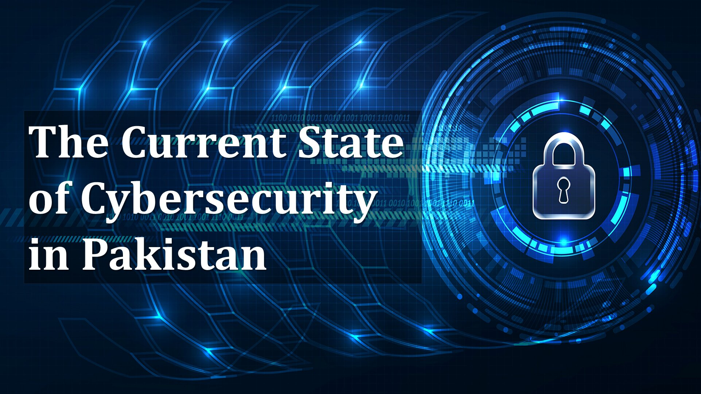
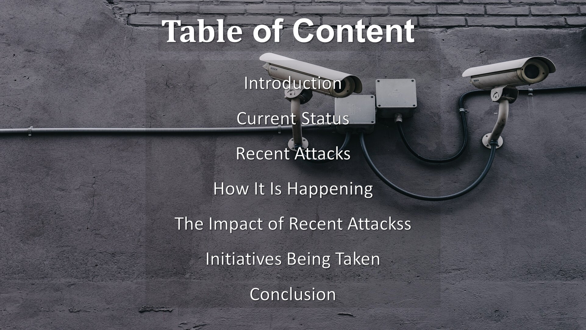
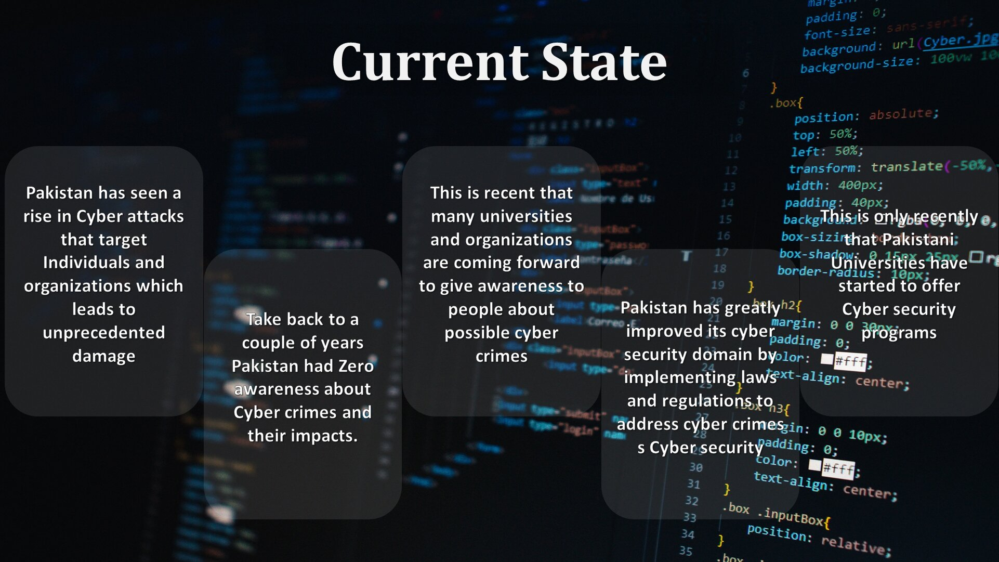
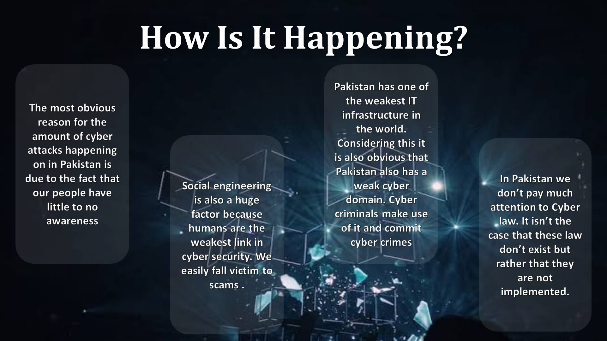
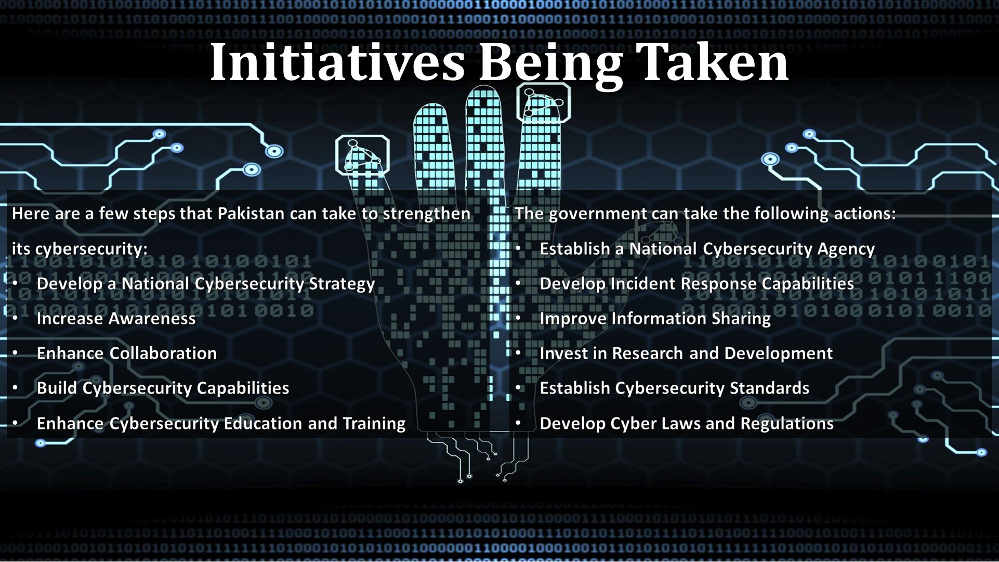

# The Current State of Cybersecurity in Pakistan


## Overview

This presentation was prepared for the **Functional English** course during Semester 1 of the BS Cyber Security program at Air University Islamabad.

The project focuses on **the current state of cybersecurity in Pakistan**. It explains Pakistan’s growing dependence on digital technology, common cybersecurity risks, recent cyber incidents, public awareness gaps, the impact of cyberattacks, and initiatives needed to improve national cybersecurity resilience.

This project is included in the portfolio because it connects English communication skills with cybersecurity awareness, public education, and national cyber policy understanding.

## Project Information

| Field | Details |
|---|---|
| Course | Functional English |
| Semester | Semester 1, Fall 2023 |
| Project Title | The Current State of Cybersecurity in Pakistan |
| Project Type | Academic Presentation |
| Focus Area | Cybersecurity Awareness and National Cybersecurity |
| File Format | PowerPoint Presentation |
| Final File | `Cybersecurity_in_Pakistan_Functional_English.pptx` |
| Status | Completed |

## Purpose

The purpose of this presentation was to explain cybersecurity challenges in Pakistan using clear and understandable English.

The presentation was designed to improve communication, research, and presentation skills while discussing a topic directly connected to the BS Cyber Security program.

## Main Idea

Pakistan’s use of digital technology is increasing, which also increases the importance of cybersecurity. The presentation explains cyber risks, recent incidents, public awareness gaps, and initiatives needed to improve Pakistan’s cybersecurity posture.

## Presentation Flow

The presentation follows this structure:

1. Introduction
2. Current cybersecurity status
3. Recent cyberattacks
4. How cyberattacks are happening
5. Impact of recent attacks
6. Initiatives being taken
7. Conclusion

## Presentation Objectives

The project focused on:

- Introducing cybersecurity as a national and public concern.
- Explaining the current cybersecurity situation in Pakistan.
- Discussing examples of cyber incidents and their effects.
- Highlighting common causes of cyberattacks.
- Explaining the impact of cyberattacks on individuals, businesses, and government systems.
- Presenting initiatives that can improve cybersecurity awareness and response.
- Practicing academic presentation and English communication skills.

## Project Preview

### Title Slide



### Table of Contents



### Current State



### Recent Attacks


### Causes of Cyberattacks



### Impact of Attacks


### Initiatives



### Conclusion


## Topics Covered

- Introduction to cybersecurity in Pakistan
- Current cybersecurity status
- Recent cyber incidents
- Common causes of cyberattacks
- Impact of cyberattacks
- Public awareness challenges
- Government and institutional initiatives
- Cybersecurity education and training
- Conclusion

## Key Takeaways

- Cybersecurity is a growing concern in Pakistan.
- Awareness is one of the most important defenses.
- Technical controls alone are not enough.
- Cyber laws, education, and national strategy are also necessary.
- Pakistan needs coordinated efforts from government, academia, organizations, and citizens.

## Key Message

Pakistan’s digital environment is expanding rapidly, but cybersecurity awareness, secure technology practices, cyber law implementation, institutional capability, and incident response maturity still need improvement.

Cybersecurity awareness, education, stronger regulation, national coordination, and better response capabilities are important for building a safer digital Pakistan.

## Cybersecurity Challenges Discussed

| Challenge | Explanation |
|---|---|
| Low Awareness | Many users do not fully understand phishing, scams, weak passwords, or safe online behavior. |
| Social Engineering | Attackers manipulate users through fake messages, calls, links, or impersonation. |
| Weak Cyber Hygiene | Poor password practices, unpatched systems, and unsafe browsing habits increase risk. |
| Data Exposure | Sensitive personal, financial, or organizational data may be exposed through breaches or poor security practices. |
| Infrastructure Gaps | Some organizations may lack mature cybersecurity systems, monitoring, and response processes. |
| Policy and Enforcement Gaps | Cyber laws and policies need effective implementation, awareness, and institutional support. |

## Causes of Cyberattacks

Cyberattacks often happen because of a combination of human, technical, and organizational weaknesses.

Common causes include:

- Limited public awareness
- Phishing and social engineering
- Weak passwords
- Poor system updates
- Unsafe links and attachments
- Lack of security training
- Weak monitoring and detection
- Poor implementation of cybersecurity practices
- Increasing use of digital platforms without proper protection

## Impact of Cyberattacks

Cyberattacks can affect individuals, organizations, and national systems.

| Impact Area | Description |
|---|---|
| Financial Loss | Stolen funds, fraud, recovery costs, and business disruption |
| Data Breach | Exposure of sensitive personal or organizational information |
| Privacy Risk | Misuse of personal data, identity information, or account credentials |
| Service Disruption | Interruption of digital services and daily operations |
| Trust Damage | Loss of public trust in digital platforms and organizations |
| National Security Risk | Potential targeting of public sector or critical systems |

## Suggested Initiatives

The presentation highlights several initiatives that can help strengthen cybersecurity in Pakistan:

- Improve public cybersecurity awareness.
- Promote cybersecurity education and training.
- Strengthen cyber laws and regulations.
- Develop national cybersecurity capabilities.
- Establish or strengthen cybersecurity institutions.
- Build incident response teams.
- Encourage information sharing between organizations.
- Promote secure digital infrastructure.
- Invest in cybersecurity research and development.
- Create cybersecurity standards and best practices.

## Repository Structure

```txt
cybersecurity-in-pakistan-presentation/
├── README.md
├── presentation/
│   └── Cybersecurity_in_Pakistan.pptx
└── screenshots/
    ├── attack-cause.jpg
    ├── conclusion.jpg
    ├── current-state.jpg
    ├── impact-of-attacks.jpg
    ├── initiatives.jpg
    ├── recent-attacks.jpg
    ├── table-of-contents.jpg
    └── title-slide.jpg
```

## Presentation File

The final presentation is available in the `presentation/` folder:

```txt
presentation/Cybersecurity_in_Pakistan.pptx
```

## Learning Outcomes

Through this project, I learned how to:

- Present a cybersecurity topic in clear English.
- Explain national cybersecurity issues to a general audience.
- Connect cybersecurity with public awareness, law, policy, and education.
- Organize technical information into a structured presentation.
- Improve academic communication and public speaking.
- Use visual slides to communicate security-related ideas.
- Summarize cyber risks and improvement strategies in simple language.

## Portfolio Relevance

This project supports my cybersecurity portfolio by showing:

- Cybersecurity awareness and communication skills
- Ability to explain security issues to non-technical audiences
- Understanding of cyber risks in a national context
- Early academic interest in cybersecurity policy and public education
- Presentation and documentation skills

## Recommended Future Improvements

This project can be improved further by:

- Adding proper references for cyber incidents and policy claims.
- Improving slide readability by increasing contrast and font size.
- Replacing broad claims with more precise, evidence-based wording.
- Adding a final references slide.
- Updating facts if the presentation is reused in a current professional context.

## Academic Notice

This project was prepared as part of university coursework for academic learning and presentation purposes.

## Disclaimer

This presentation is maintained as part of an academic portfolio. The content reflects an early Semester 1 academic presentation and should not be treated as a formal cybersecurity assessment report or current national cybersecurity report.