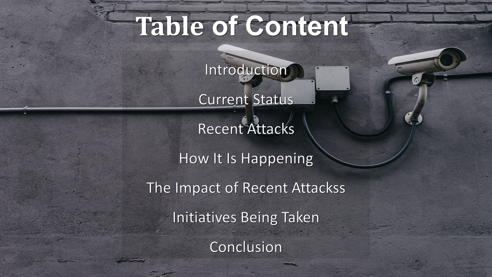
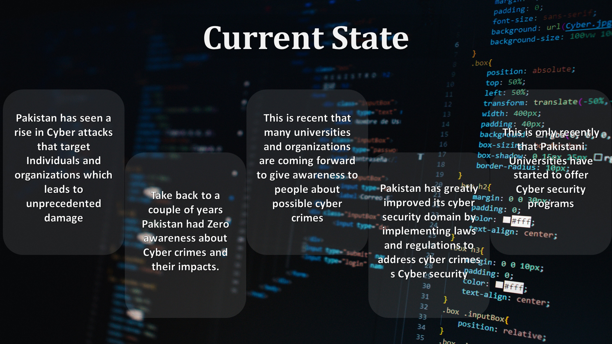
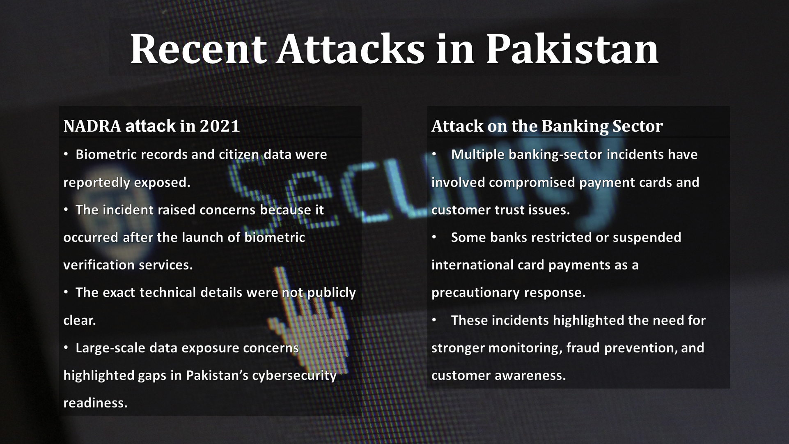
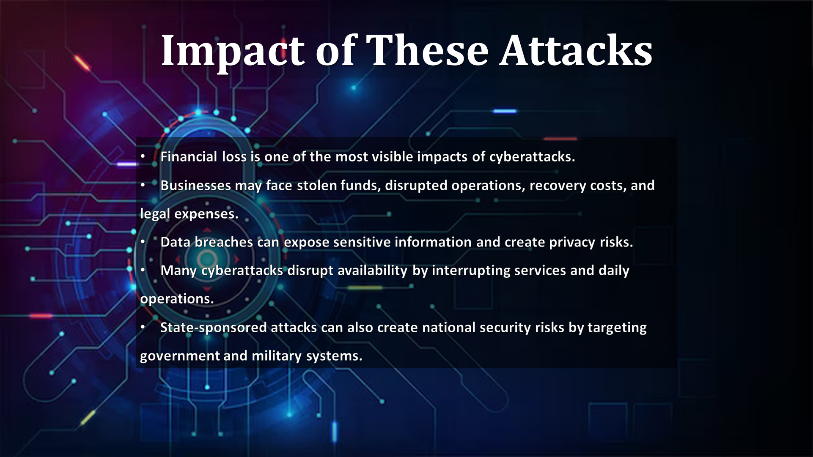
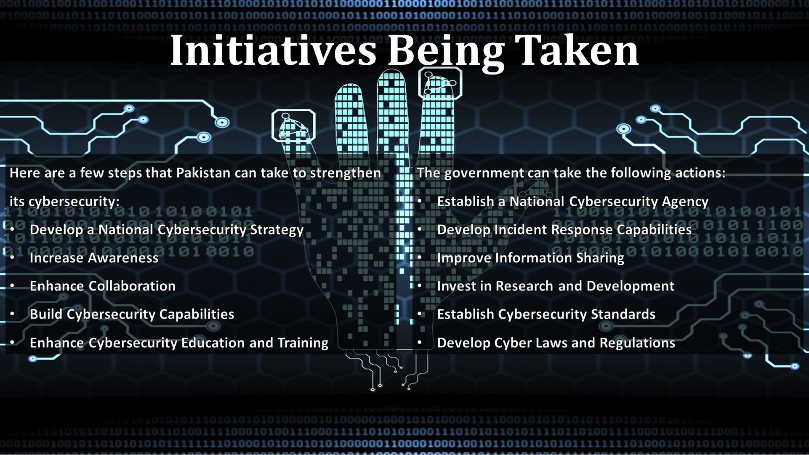
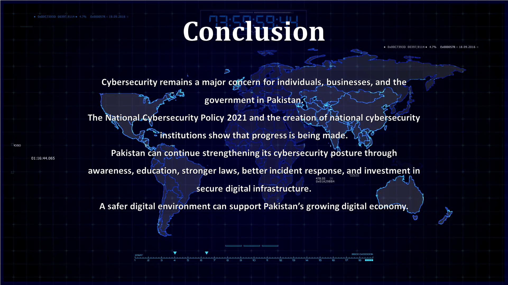

# The Current State of Cybersecurity in Pakistan


## Overview

This presentation was prepared for the **Functional English** course. The topic focuses on **the current state of cybersecurity in Pakistan**.

The presentation discusses Pakistan’s increasing dependence on digital technology, the rise of cybercrime, recent cyber incidents, public awareness challenges, the impact of attacks, and initiatives that can strengthen the national cybersecurity environment.

> This version preserves the original Semester 1 presentation style while improving content clarity, grammar, typography, alignment, and wording for portfolio use.

---

## Project Preview

### Title Slide


### Table of Contents



### Current State



### Recent Attacks



### Causes of Cyberattacks


### Impact of Attacks



### Initiatives



### Conclusion



---

## Project Information

| Field | Details |
|---|---|
| Course | Functional English |
| Project Topic | The Current State of Cybersecurity in Pakistan |
| Project Type | Academic Presentation |
| Focus Area | Cybersecurity Awareness and National Cybersecurity |
| Final File | `Cybersecurity_in_Pakistan_Functional_English.pptx` |
| Status | Completed |
| Portfolio Update | Original design preserved with cleanup |

---

## Topics Covered

- Introduction
- Current cybersecurity status in Pakistan
- Recent attacks in Pakistan
- How cyberattacks are happening
- Impact of recent attacks
- Initiatives being taken
- Government actions
- Conclusion

---

## Key Message

Pakistan’s digital environment is expanding rapidly, but cyber awareness, cyber law implementation, infrastructure maturity, and security practices still need improvement. Cybersecurity awareness, education, national strategy, stronger institutions, and better incident response are necessary for building a safer digital Pakistan.

---

## Current State

The presentation explains that Pakistan has seen an increase in cyberattacks targeting both individuals and organizations. It also highlights that cybersecurity awareness has improved recently, with universities and organizations beginning to educate people about cyber threats.

---

## Recent Attacks Discussed

| Incident | Main Concern |
|---|---|
| NADRA-related data concerns | Biometric and citizen data exposure concerns |
| Banking sector attacks | Compromised banking cards and customer trust issues |

---

## Causes of Cybersecurity Challenges

- Low public awareness
- Weak cyber hygiene
- Social engineering
- Poor implementation of cyber laws
- Weak IT infrastructure
- Increasing cybercrime activity
- Lack of mature cybersecurity practices

---

## Suggested Initiatives

- Develop a national cybersecurity strategy
- Increase public awareness
- Enhance collaboration
- Build cybersecurity capabilities
- Improve cybersecurity education and training
- Establish a national cybersecurity agency
- Develop incident response capabilities
- Improve information sharing
- Invest in research and development
- Establish cybersecurity standards
- Strengthen cyber laws and regulations

---

## Repository Structure

```text
cybersecurity-in-pakistan-presentation/
│
├── README.md
├── PRESENTATION_NOTES.md
│
├── presentation/
│   └── Cybersecurity_in_Pakistan_Functional_English.pptx
│
└── screenshots/
    ├── title-slide.PNG
    ├── table-of-contents.PNG
    ├── current-state.PNG
    ├── recent-attacks.PNG
    ├── attack-causes.PNG
    ├── impact-of-attacks.PNG
    ├── initiatives.PNG
    └── conclusion.PNG
```

---

## Presentation File

```text
presentation/Cybersecurity_in_Pakistan_Functional_English.pptx
```

---

## Learning Outcomes

Through this presentation, I learned how to:

- Discuss cybersecurity issues in a national context.
- Explain cyber risks in simple language.
- Connect cybersecurity with public awareness and policy.
- Present cybersecurity challenges clearly.
- Understand the need for education, law, regulation, and national cyber strategy.
- Improve public speaking and academic presentation skills.

---

## Academic Notice

This project was prepared as part of university coursework for academic learning and presentation purposes.

---

## Disclaimer

This presentation is maintained as part of an academic portfolio. The content reflects a Semester 1 academic presentation and should not be treated as a formal cybersecurity assessment report.
