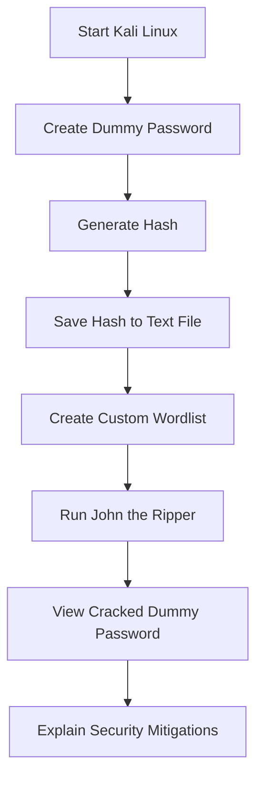

# Demo Notes: Hash Cracking with John the Ripper

## Purpose

These notes describe the safe demonstration flow for the **Hash Cracking with John the Ripper** project. The demo is designed for academic learning only and must be performed with dummy data in a controlled lab environment.

The included presentation is an improved and polished version of the original class presentation. It includes cleaner wording, improved formatting, a completed mitigation slide, and a stronger defensive conclusion.

---

## Safe Lab Rules

Before starting the demo, make sure:

- Only dummy passwords are used.
- Only self-generated hashes are used.
- No real user credentials are used.
- No leaked hashes are used.
- No university, company, or third-party accounts are targeted.
- The demonstration is performed in a local lab environment only.

---

## Demo Environment

| Component | Details |
|---|---|
| Operating System | Kali Linux |
| Main Tool | John the Ripper |
| GUI Tool | Johnny |
| Wordlist Tool | CUPP |
| Hash Type | MD5 / Raw-MD5 for demonstration |
| Data Type | Dummy password hash |

---

## Demonstration Flow



---

## Step-by-Step Demo

### 1. Create a Dummy Password

Use a simple password only for demonstration.

Example:

```text
jazib123
```

---

### 2. Generate a Dummy MD5 Hash

Generate the hash locally and save it in a text file.

Example file:

```text
password1.txt
```

---

### 3. Create a Custom Wordlist

Use CUPP to generate a targeted wordlist.

```bash
cupp -i
```

CUPP asks for basic target-related information and generates possible password combinations.

> For this demo, use fake information only.

---

### 4. Run John the Ripper

Use the following command structure:

```bash
john --wordlist=<wordlist-file> --format=<hash-format> <hash-file>
```

Example:

```bash
john --wordlist=jazib.txt --format=Raw-MD5 password1.txt
```

---

### 5. Show the Cracked Password

After John finds a match, display the result using:

```bash
john --show --format=Raw-MD5 password1.txt
```

---

### 6. Explain the Result

Explain that John matched wordlist entries against the hash until it found the original dummy password.

Main point:

> Weak and predictable passwords are easier to crack when attackers have access to password hashes.

---

## Optional Johnny GUI Demo

Johnny provides a graphical interface for John the Ripper.

Suggested flow:

1. Open Johnny in Kali Linux.
2. Load the hash file.
3. Select the wordlist.
4. Select the correct hash format.
5. Start the attack.
6. Show the recovered dummy password.

---

## Screenshots Included

| Screenshot | Purpose |
|---|---|
| `screenshots/Cupp.png` | Shows CUPP wordlist generation |
| `screenshots/JohnTheRipper.png` | Shows John the Ripper execution |
| `screenshots/Johnny-JtR-GUI.png` | Shows Johnny GUI |
| `screenshots/ppt-cover.png` | Shows presentation cover slide |
| `screenshots/ppt-ToC.png` | Shows presentation table of contents |

---

## Key Talking Points

- Hashing is a one-way transformation.
- Password hashes are safer than storing plain text passwords.
- Weak passwords can still be cracked.
- Wordlists improve cracking speed.
- MD5 is insecure and should not be used for password storage.
- Salting protects against precomputed hash attacks.
- bcrypt, scrypt, Argon2, and PBKDF2 are better choices for password storage.
- MFA reduces the impact of password compromise.

---

## Mitigation Summary

| Problem | Defensive Control |
|---|---|
| Weak password | Long passphrases |
| Common password | Password blacklist |
| Fast cracking | Adaptive hashing |
| Precomputed hash attack | Unique salt |
| Credential reuse | MFA |
| Brute-force login attempts | Rate limiting |
| User mistakes | Security awareness |

---

## Final Safety Reminder

This demo must remain educational and authorized. Never use John the Ripper or similar tools against real accounts, leaked hashes, or systems without explicit permission.
