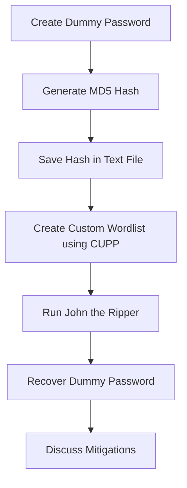

# Hash Cracking with John the Ripper


## Overview

This project was completed for the **Introduction to Cybersecurity** course as a research-based presentation and live demonstration of a cybersecurity tool. The selected topic was **password hash cracking**, demonstrated using **John the Ripper** on Kali Linux.

The project explains how password hashes work, why weak passwords are vulnerable, how custom wordlists improve password recovery attempts, and how John the Ripper can be used in a controlled lab environment to test password strength.

> **Note:** This project uses dummy hashes and lab-created data only. It is intended strictly for academic and authorized cybersecurity learning.

## Project Information

| Field | Details |
|---|---|
| Course | Introduction to Cybersecurity |
| Semester | Semester 1, Fall 2023 |
| Degree | BS Cyber Security |
| University | Air University Islamabad |
| Project Type | Research Presentation + Live Demonstration |
| Topic | Password Hash Cracking |
| Tool Demonstrated | John the Ripper |
| Environment | Kali Linux |
| Hash Type | MD5 / Raw-MD5 for demonstration |
| Data Type | Dummy password hash |
| Status | Completed |
| Final Presentation | `Hash-Cracking_CYS.pptx` |

## Purpose

The purpose of this project was to understand password hash cracking from a defensive cybersecurity perspective. The demo was designed to show how weak and predictable passwords can be recovered when an attacker obtains password hashes.

The demonstration was performed only with dummy passwords and self-generated hashes in a local lab environment.

## Objectives

- Research and explain the purpose of John the Ripper.
- Understand the concept of password hashing.
- Demonstrate how weak password hashes can be cracked in a lab.
- Generate a custom wordlist using CUPP.
- Use John the Ripper to crack a dummy MD5 hash.
- Show Johnny as a graphical interface for John the Ripper.
- Discuss mitigation techniques against hash cracking risks.

## Tools and Technologies

| Tool / Technology | Purpose |
|---|---|
| Kali Linux | Cybersecurity testing environment |
| John the Ripper | Password hash cracking and auditing |
| Johnny GUI | Graphical interface for John the Ripper |
| CUPP | Custom wordlist generation |
| MD5 / Raw-MD5 | Dummy hash format used for demonstration |
| Linux Terminal | Command-line execution |

## Safe Lab Rules

Before starting the demo, make sure:

- Only dummy passwords are used.
- Only self-generated hashes are used.
- No real user credentials are used.
- No leaked hashes are used.
- No university, company, or third-party accounts are targeted.
- The demonstration is performed in a local lab environment only.

## Demonstration Workflow



## Step-by-Step Demo

### 1. Create a Dummy Password

Use a simple password only for demonstration.

```text
jazib123
```

### 2. Generate a Dummy MD5 Hash

Generate the hash locally and save it in a text file.

Example file:

```text
password1.txt
```

### 3. Create a Custom Wordlist

Use CUPP to generate a targeted wordlist.

```bash
cupp -i
```

CUPP asks for basic target-related information and generates possible password combinations.

> For this demo, use fake information only.

### 4. Run John the Ripper

Use the following command structure:

```bash
john --wordlist=<wordlist-file> --format=<hash-format> <hash-file>
```

Example used for educational demonstration:

```bash
john --wordlist=jazib.txt --format=Raw-MD5 password1.txt
```

### 5. Show the Cracked Password

After John finds a match, display the result using:

```bash
john --show --format=Raw-MD5 password1.txt
```

### 6. Explain the Result

John matched candidate passwords from the wordlist against the hash until it found the original dummy password.

Main point:

> Weak and predictable passwords are easier to crack when attackers have access to password hashes.

## Optional Johnny GUI Demo

Johnny provides a graphical interface for John the Ripper.

Suggested flow:

1. Open Johnny in Kali Linux.
2. Load the hash file.
3. Select the wordlist.
4. Select the correct hash format.
5. Start the attack.
6. Show the recovered dummy password.

## Project Preview

### Presentation Cover


### Table of Contents


### CUPP Wordlist Generation


### John the Ripper Execution


### Johnny GUI


## Key Talking Points

- Hashing is a one-way transformation.
- Password hashes are safer than storing plaintext passwords.
- Weak passwords can still be cracked.
- Wordlists improve cracking speed.
- MD5 is insecure and should not be used for password storage.
- Salting protects against precomputed hash attacks.
- bcrypt, scrypt, Argon2, and PBKDF2 are better choices for password storage.
- MFA reduces the impact of password compromise.

## Mitigation Against Hash Cracking

| Risk | Mitigation |
|---|---|
| Weak passwords | Use long and unique passphrases |
| Predictable passwords | Avoid names, dates, phone numbers, and common words |
| Fast hash algorithms | Avoid MD5 and SHA-1 for password storage |
| Precomputed attacks | Use unique salts for every password |
| Offline cracking | Use adaptive hashing algorithms such as bcrypt, scrypt, Argon2, or PBKDF2 |
| Credential compromise | Enable multi-factor authentication |
| Repeated login attempts | Apply rate limiting and account lockout |
| User negligence | Provide password security awareness |

## Repository Structure

```text
hash-cracking-john-the-ripper/
├── README.md
├── presentation/
│   └── Hash-Cracking.pptx
└── screenshots/
    ├── Cupp.png
    ├── Johnny-JtR-GUI.png
    ├── JohnTheRipper.png
    ├── ppt-cover.png
    └── ppt-ToC.png
```

## Presentation

The improved and polished project presentation is available in the `presentation/` folder:

```text
presentation/Hash-Cracking.pptx
```

## Learning Outcomes

Through this project, I learned how to:

- Explain password hashing in a beginner-friendly way.
- Use John the Ripper in a controlled lab environment.
- Generate a custom wordlist using CUPP.
- Understand how weak passwords can be recovered from hashes.
- Use Johnny GUI as a visual interface for John the Ripper.
- Connect offensive password auditing concepts with defensive controls.
- Explain mitigations such as salting, adaptive hashing, MFA, and password awareness.

## Portfolio Relevance

This project supports my cybersecurity portfolio by showing:

- Practical exposure to a common password auditing tool.
- Understanding of password hash cracking concepts.
- Ability to perform controlled lab demonstrations safely.
- Awareness of ethical boundaries in cybersecurity testing.
- Defensive thinking around password security and mitigation.

## Academic Notice

This project is intended strictly for academic learning, ethical research, and authorized cybersecurity demonstrations.

## Disclaimer

The demonstration was performed using dummy data in a controlled educational environment. No real accounts, real users, leaked hashes, or unauthorized systems were targeted.

Never use John the Ripper or similar tools against real accounts, leaked hashes, or systems without explicit permission.
