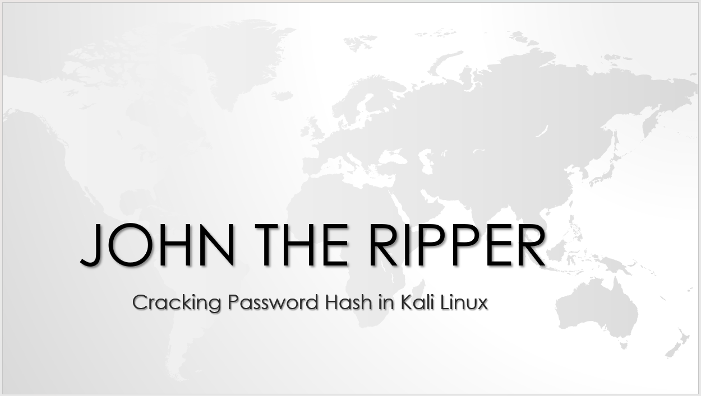
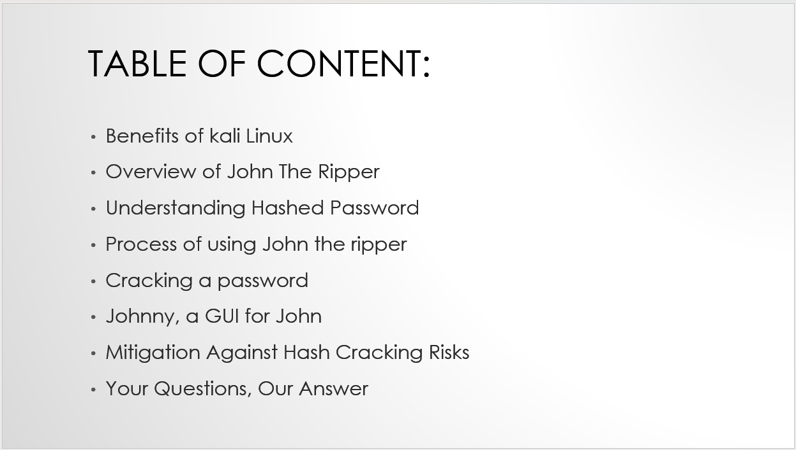
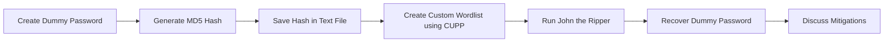
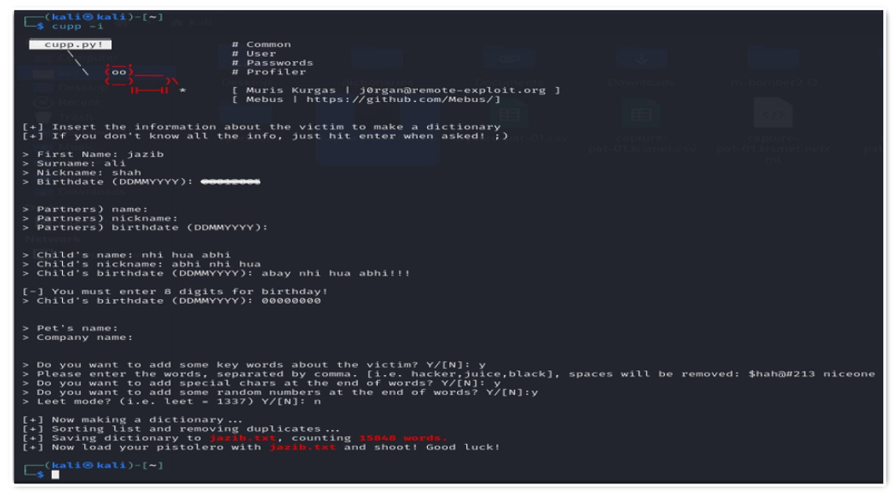
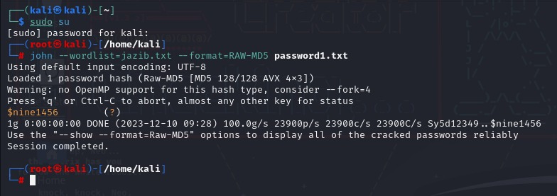
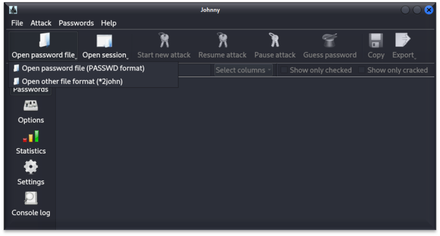

# Hash Cracking with John the Ripper


## Overview

This project was completed for the **Introduction to Cybersecurity** course as a research-based presentation and live demonstration of a cybersecurity tool. The selected topic was **password hash cracking**, demonstrated using **John the Ripper** on Kali Linux.

The project explains how password hashes work, why weak passwords are vulnerable, how custom wordlists improve password recovery attempts, and how John the Ripper can be used in a controlled lab environment to test password strength.

> **Note:** This project uses dummy hashes and lab-created data only. It is intended strictly for academic and authorized cybersecurity learning.

---

## Project Preview

### Presentation Cover



### Table of Contents



---

## Project Information

| Field | Details |
|---|---|
| Course | Introduction to Cybersecurity |
| Degree | BS Cyber Security |
| University | Air University Islamabad |
| Project Type | Research Presentation + Live Demonstration |
| Topic | Password Hash Cracking |
| Tool Demonstrated | John the Ripper |
| Environment | Kali Linux |
| Status | Completed |
| Presentation | Improved and polished version included |

---

## Objectives

- Research and explain the purpose of John the Ripper.
- Understand the concept of password hashing.
- Demonstrate how weak password hashes can be cracked in a lab.
- Generate a custom wordlist using CUPP.
- Use John the Ripper to crack a dummy MD5 hash.
- Show Johnny as a graphical interface for John the Ripper.
- Discuss mitigation techniques against hash cracking risks.

---

## Tools and Technologies

| Tool / Technology | Purpose |
|---|---|
| Kali Linux | Cybersecurity testing environment |
| John the Ripper | Password hash cracking and auditing |
| Johnny GUI | Graphical interface for John the Ripper |
| CUPP | Custom wordlist generation |
| MD5 Hash | Dummy hash format used for demonstration |
| Linux Terminal | Command-line execution |

---

## Demonstration Workflow



---

## Methodology

The project followed a controlled and academic demonstration approach:

1. Researched Kali Linux and John the Ripper.
2. Explained password hashing and hash storage.
3. Generated a dummy password hash.
4. Created a small custom wordlist using CUPP.
5. Executed John the Ripper against the dummy hash.
6. Demonstrated password recovery in a lab environment.
7. Introduced Johnny GUI for easier tool usage.
8. Discussed defensive measures against hash cracking.

---

## Demo Screenshots

### CUPP Wordlist Generation



### John the Ripper Execution



### Johnny GUI



---

## Example Command Structure

```bash
john --wordlist=<wordlist-file> --format=<hash-format> <hash-file>
```

Example used for educational demonstration:

```bash
john --wordlist=jazib.txt --format=Raw-MD5 password1.txt
```

> The command above is shown for academic understanding only. Use such tools only in authorized lab environments.

---

## Key Learning Outcomes

- Passwords are usually stored as hashes instead of plain text.
- Weak passwords can still be recovered if attackers obtain password hashes.
- Wordlists make password cracking faster when passwords are predictable.
- MD5 is outdated and should not be used for secure password storage.
- Password security depends on strong password policies, salting, adaptive hashing, and multi-factor authentication.
- Hash cracking tools are useful for authorized password auditing and defensive security testing.

---

## Mitigation Against Hash Cracking

| Risk | Mitigation |
|---|---|
| Weak passwords | Use long and unique passphrases |
| Predictable passwords | Avoid names, dates, phone numbers, and common words |
| Fast hash algorithms | Avoid MD5 and SHA-1 for password storage |
| Precomputed attacks | Use unique salts for every password |
| Offline cracking | Use adaptive hashing algorithms such as bcrypt, scrypt, Argon2, or PBKDF2 |
| Credential compromise | Enable multi-factor authentication |
| Repeated login attempts | Apply rate limiting and account lockout |
| User negligence | Provide password security awareness |

---

## Repository Structure

```text
hash-cracking-john-the-ripper/
│
├── README.md
├── DEMO_NOTES.md
│
├── presentation/
│   └── Hash-Cracking_CYS_ppt.pptx
│
└── screenshots/
    ├── Cupp.png
    ├── Johnny-JtR-GUI.png
    ├── JohnTheRipper.png
    ├── ppt-cover.png
    └── ppt-ToC.png
```

---

## Presentation

The improved and polished project presentation is available in the `presentation/` folder:

```text
presentation/Hash-Cracking_CYS_ppt.pptx
```

The presentation includes improved formatting, clearer wording, a completed mitigation section, and a stronger academic/defensive conclusion.

---

## Ethical Notice

This project is intended strictly for academic learning, ethical research, and authorized cybersecurity demonstrations. It must not be used to crack real passwords, access accounts, test third-party systems, or attack any organization without explicit written permission.

---

## Disclaimer

The demonstration was performed using dummy data in a controlled educational environment. No real accounts, real users, leaked hashes, or unauthorized systems were targeted.
