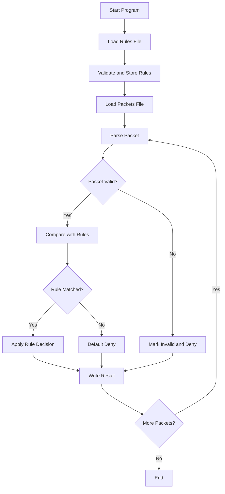

# Project Notes: Firewall Rule Engine in C++

## Purpose

These notes explain the enhanced version of the Programming Fundamentals firewall project.

The original project was preserved in spirit, but the implementation was improved to make it cleaner, safer, and more suitable for GitHub portfolio presentation.

---

## What Was Enhanced

| Area | Enhancement |
|---|---|
| Code Structure | Split into `main.cpp`, `firewall.cpp`, and `firewall.h` |
| Input Handling | Added better rule and packet validation |
| File Paths | Added default paths and command-line argument support |
| Output | Changed output to clean CSV-style format |
| Security Logic | Added default deny when no rule matches |
| IP Validation | Added IPv4 format checking |
| GitHub Upload | Removed compiled `.exe` files |
| Documentation | Added README, notes, sample data, and expected output |

---

## Program Flow



---

## Rule Priority

Rules are checked from top to bottom.

The first matching rule wins.

Example:

```text
5 PRO UDP ALLOW
7 DST 8.8.8.8 DENY
```

If a UDP packet is sent to `8.8.8.8`, whichever rule appears first will decide the result.

In the sample rule file, destination `8.8.8.8` is checked before general TCP allow, but after UDP allow. This demonstrates why rule order matters.

---

## Default Deny

If no rule matches a packet, the program denies it automatically.

This is a common security concept:

```text
Deny by default, allow only when explicitly permitted.
```

---

## Sample Data Included

### rules.txt

Contains sample firewall rules.

### packets.txt

Contains simulated packets.

### expected-result.txt

Contains the expected output after running the program.

---

## Suggested Screenshot

After compiling and running the program, take a screenshot of the terminal output and save it as:

```text
screenshots/program-output.png
```

Then add it to the README if desired.

---

## Files to Avoid Uploading

Do not upload generated binaries:

```text
firewall.exe
firewall
*.o
*.obj
```

These are build outputs and should stay ignored by `.gitignore`.

---

## Learning Outcomes

This enhanced version demonstrates:

- Better C++ file organization
- Defensive input validation
- Cleaner rule processing
- Basic network security logic
- GitHub-ready software documentation
