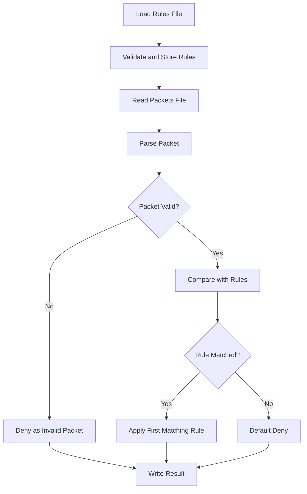
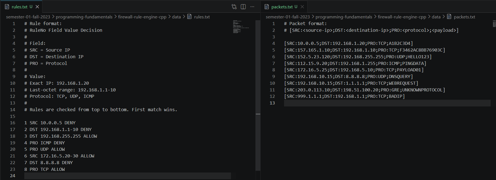
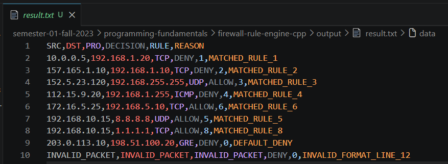
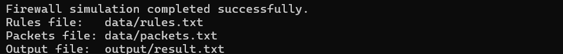

# Firewall Rule Engine in C++


## Overview

This project is an enhanced version of a **Programming Fundamentals** coursework project. It simulates a basic firewall rule engine using C++.

The program reads firewall rules from a file, reads simulated packet-like records from another file, applies the rules in priority order, and writes the final allow/deny decision to an output file.

The enhanced version improves the original coursework project with cleaner code structure, safer input validation, better file organization, command-line file path support, default-deny behavior, and CSV-style output.

## Project Information

| Field | Details |
|---|---|
| Course | Programming Fundamentals |
| Semester | Semester 1, Fall 2023 |
| Project Title | Firewall Rule Engine in C++ |
| Language | C++ |
| Project Type | Console-Based Firewall Simulator |
| Input Files | `data/rules.txt`, `data/packets.txt` |
| Output File | `output/result.txt` |
| Status | Enhanced for Portfolio |

## Purpose

The purpose of this project was to apply basic C++ programming concepts to a cybersecurity-inspired problem.

The original project was preserved in spirit, but the implementation was improved to make it cleaner, safer, and more suitable for GitHub portfolio presentation.

## Features

- Loads firewall rules from a text file
- Loads simulated packets from a text file
- Supports source IP rules
- Supports destination IP rules
- Supports protocol rules
- Supports exact IP matching
- Supports simple last-octet IP ranges such as `192.168.1.1-10`
- Uses first-match rule priority
- Applies default-deny behavior when no rule matches
- Validates IPv4 addresses
- Detects invalid packet formats
- Writes results in CSV-style format
- Supports command-line file paths
- Uses separate `main.cpp`, `firewall.cpp`, and `firewall.h` files

## Firewall Workflow



## Rule Priority

Rules are checked from top to bottom.

The first matching rule wins.

Example:

```txt
5 PRO UDP ALLOW
7 DST 8.8.8.8 DENY
```

If a UDP packet is sent to `8.8.8.8`, the result depends on which matching rule appears first. This demonstrates why firewall rule order is important.

## Default Deny

If no rule matches a packet, the program denies it automatically.

This follows a common security principle:

```txt
Deny by default, allow only when explicitly permitted.
```

## Rule Format

```txt
RuleNo Field Value Decision
```

Example:

```txt
1 SRC 10.0.0.5 DENY
2 DST 192.168.1.1-10 DENY
3 PRO TCP ALLOW
```

| Field | Meaning |
|---|---|
| RuleNo | Rule number |
| Field | `SRC`, `DST`, or `PRO` |
| Value | IP address, simple last-octet IP range, or protocol |
| Decision | `ALLOW` or `DENY` |

## Packet Format

```txt
[SRC:<source-ip>;DST:<destination-ip>;PRO:<protocol>;<payload>]
```

Example:

```txt
[SRC:192.168.10.15;DST:1.1.1.1;PRO:TCP;WEBREQUEST]
```

## Project Preview

### Sample Data



### Sample Result



### Expected Output



## Repository Structure

```txt
firewall-rule-engine-cpp/
├── README.md
├── .gitignore
├── src/
│   ├── main.cpp
│   ├── firewall.cpp
│   └── firewall.h
├── data/
│   ├── rules.txt
│   └── packets.txt
├── output/
│   └── result.txt
└── screenshots/
    ├── expected-output.png
    ├── sample-data.png
    └── sample-result.png
```

## How to Compile

From the project root folder:

```bash
g++ src/main.cpp src/firewall.cpp -std=c++17 -Wall -Wextra -pedantic -o firewall
```

On Windows using MinGW, this creates:

```txt
firewall.exe
```

## How to Run

### Default Run

```bash
./firewall
```

On Windows PowerShell:

```powershell
.\firewall.exe
```

The default run uses:

```txt
data/rules.txt
data/packets.txt
output/result.txt
```

### Run with Custom File Paths

```bash
./firewall data/rules.txt data/packets.txt output/result.txt
```

On Windows PowerShell:

```powershell
.\firewall.exe data\rules.txt data\packets.txt output\result.txt
```

## Sample Rules

```txt
1 SRC 10.0.0.5 DENY
2 DST 192.168.1.1-10 DENY
3 DST 192.168.255.255 ALLOW
4 PRO ICMP DENY
5 PRO UDP ALLOW
6 SRC 172.16.5.20-30 ALLOW
7 DST 8.8.8.8 DENY
8 PRO TCP ALLOW
```

## Sample Output

```txt
SRC,DST,PRO,DECISION,RULE,REASON
10.0.0.5,192.168.1.20,TCP,DENY,1,MATCHED_RULE_1
157.165.1.10,192.168.1.10,TCP,DENY,2,MATCHED_RULE_2
152.5.23.120,192.168.255.255,UDP,ALLOW,3,MATCHED_RULE_3
112.15.9.20,192.168.1.255,ICMP,DENY,4,MATCHED_RULE_4
172.16.5.25,192.168.5.10,TCP,ALLOW,6,MATCHED_RULE_6
192.168.10.15,8.8.8.8,UDP,ALLOW,5,MATCHED_RULE_5
192.168.10.15,1.1.1.1,TCP,ALLOW,8,MATCHED_RULE_8
203.0.113.10,198.51.100.20,GRE,DENY,0,DEFAULT_DENY
INVALID_PACKET,INVALID_PACKET,INVALID_PACKET,DENY,0,INVALID_FORMAT_LINE_12
```

## Core Programming Concepts Used

- Structures
- Classes
- Vectors
- File handling
- String parsing
- Functions
- Header files
- Conditional logic
- Loops
- Input validation
- Modular programming
- Command-line arguments

## Cybersecurity Relevance

This project is a simplified simulation of packet filtering. Real firewalls are much more advanced, but the project demonstrates the basic idea of applying ordered rules to traffic-like data and making allow/deny decisions.

It also introduces important security concepts such as:

- Rule priority
- Default-deny behavior
- Protocol-based filtering
- Source and destination filtering
- Input validation
- Defensive programming

## Enhancement Summary

Compared to the original coursework version, this enhanced version includes:

| Area | Enhancement |
|---|---|
| Code Structure | Split into `main.cpp`, `firewall.cpp`, and `firewall.h` |
| Input Handling | Added better rule and packet validation |
| File Paths | Added default paths and command-line argument support |
| Output | Changed output to clean CSV-style format |
| Security Logic | Added default-deny behavior when no rule matches |
| IP Validation | Added IPv4 format checking |
| GitHub Upload | Removed compiled `.exe` files |
| Documentation | Added README, sample data, screenshots, and expected output |

## Limitations

- Does not inspect real network traffic
- Does not support CIDR notation
- Does not support port-based filtering
- Supports only simple last-octet IP ranges
- Does not support stateful firewall logic
- Does not include a GUI
- Does not perform live packet capture

## Future Improvements

- Add CIDR notation support
- Add port-based filtering
- Add logging levels
- Add unit tests
- Add JSON or CSV input support
- Add a small GUI or web interface
- Add rule conflict detection
- Add support for IPv6
- Add more detailed packet parsing

## Learning Outcomes

Through this project, I learned how to:

- Organize C++ code into multiple files.
- Use file handling for reading input and writing output.
- Parse structured text data.
- Validate user-controlled input.
- Apply conditional logic to simulated security rules.
- Understand basic firewall rule ordering.
- Apply the default-deny security principle.
- Improve an academic programming project for GitHub presentation.

## Academic Notice

This project was completed for academic learning and portfolio documentation. It is a simplified simulation and does not inspect, capture, modify, or block real network traffic.