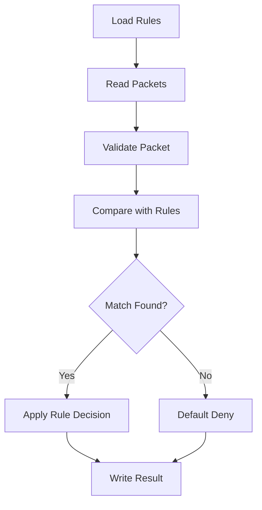

# Firewall Rule Engine in C++


## Overview

This is an enhanced version of my **Programming Fundamentals** project. The project simulates a basic firewall rule engine in C++.

The program reads firewall rules from a file, reads simulated network packets from another file, applies the rules in priority order, and writes the final allow/deny decision to an output file.

The enhanced version improves the original coursework project with cleaner code structure, safer input validation, better file organization, command-line support, default deny behavior, and CSV-style output.

---

## Project Information

| Field | Details |
|---|---|
| Course | Programming Fundamentals |
| Project Title | Firewall Rule Engine in C++ |
| Language | C++ |
| Project Type | Console-Based Firewall Simulator |
| Input Files | `rules.txt`, `packets.txt` |
| Output File | `result.txt` |
| Status | Enhanced Version |

---

## Features

- Loads firewall rules from a text file
- Loads simulated packets from a text file
- Supports source IP rules
- Supports destination IP rules
- Supports protocol rules
- Supports exact IP matching
- Supports simple last-octet IP ranges such as `192.168.1.1-10`
- Uses first-match rule priority
- Applies default deny when no rule matches
- Validates IPv4 addresses
- Detects invalid packet formats
- Writes results in CSV-style format
- Supports command-line file paths
- Uses separate `main.cpp`, `firewall.cpp`, and `firewall.h` files

---

## Firewall Workflow



---

## Repository Structure

```text
firewall-rule-engine-cpp/
│
├── README.md
├── PROJECT_NOTES.md
│
├── src/
│   ├── main.cpp
│   ├── firewall.cpp
│   └── firewall.h
│
├── sample-data/
│   ├── rules.txt
│   └── packets.txt
│
├── output/
│   └── expected-result.txt
│
└── screenshots/
```

---

## Rule Format

```text
RuleNo Field Value Decision
```

Example:

```text
1 SRC 10.0.0.5 DENY
2 DST 192.168.1.1-10 DENY
3 PRO TCP ALLOW
```

| Field | Meaning |
|---|---|
| RuleNo | Rule number |
| Field | `SRC`, `DST`, or `PRO` |
| Value | IP address, IP range, or protocol |
| Decision | `ALLOW` or `DENY` |

Rules are checked from top to bottom. The first matching rule is applied.

---

## Packet Format

```text
[SRC:<source-ip>;DST:<destination-ip>;PRO:<protocol>;<payload>]
```

Example:

```text
[SRC:192.168.10.15;DST:1.1.1.1;PRO:TCP;WEBREQUEST]
```

---

## How to Compile

From the project root folder:

```bash
g++ src/main.cpp src/firewall.cpp -o firewall
```

On Windows, this creates:

```text
firewall.exe
```

---

## How to Run

### Default run

```bash
./firewall
```

On Windows PowerShell:

```powershell
.\firewall.exe
```

The default run uses:

```text
sample-data/rules.txt
sample-data/packets.txt
output/result.txt
```

### Run with custom file paths

```bash
./firewall sample-data/rules.txt sample-data/packets.txt output/result.txt
```

On Windows PowerShell:

```powershell
.\firewall.exe sample-data\rules.txt sample-data\packets.txt output\result.txt
```

---

## Sample Output

```text
SRC,DST,PRO,DECISION,RULE,REASON
10.0.0.5,192.168.1.20,TCP,DENY,1,MATCHED_RULE_1
157.165.1.10,192.168.1.10,TCP,DENY,2,MATCHED_RULE_2
152.5.23.120,192.168.255.255,UDP,ALLOW,3,MATCHED_RULE_3
```

---

## Core Programming Concepts Used

- Structures
- Classes
- Vectors
- File handling
- String parsing
- Functions
- Header files
- Conditional logic
- Loops
- Input validation
- Modular programming

---

## Cybersecurity Relevance

This project is a simplified simulation of packet filtering. Real firewalls are much more advanced, but the project demonstrates the basic concept of applying rules to traffic-like data and making allow/deny decisions.

---

## Enhancement Summary

Compared to the original coursework version, this enhanced version includes:

- Cleaner folder structure
- Separate implementation files
- Better input validation
- Default deny behavior
- CSV-style output
- Command-line argument support
- Cleaner sample data
- Removal of compiled `.exe` files
- GitHub-ready documentation

---

## Limitations

- Does not inspect real network traffic
- Does not support CIDR notation
- Does not support port-based filtering
- Supports only simple last-octet IP ranges
- No GUI
- No live packet capture
- No advanced logging or rule priority groups

---

## Future Enhancements

- Add CIDR support
- Add TCP/UDP port filtering
- Add logging with timestamps
- Add JSON or YAML rule files
- Add unit tests
- Add a menu-based interface
- Add GUI support
- Add support for rule categories

---

## Academic Notice

This project was created and enhanced for academic learning and portfolio documentation.

---

## Disclaimer

This is a firewall simulation project. It does not capture, block, modify, or inspect real network traffic.
