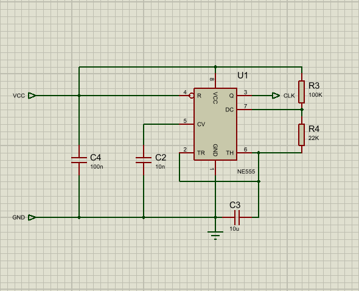
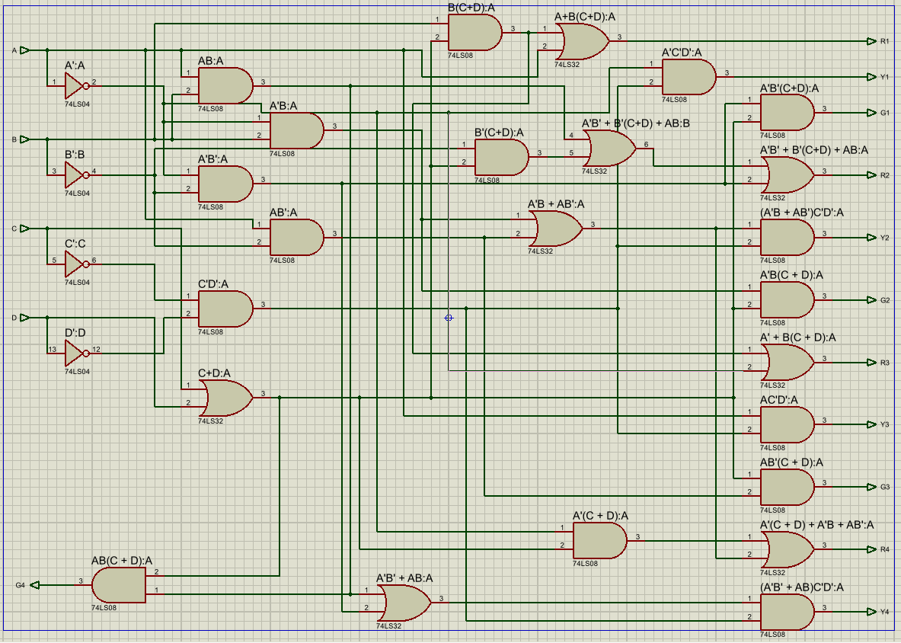
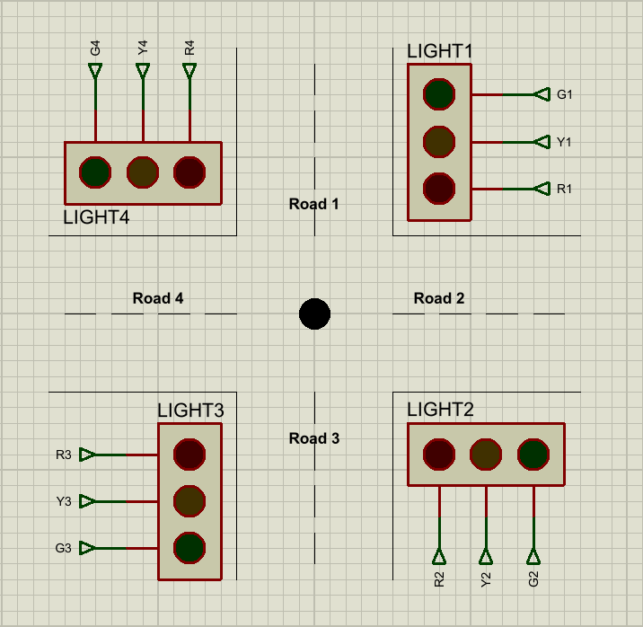

# 4-Way Traffic Signal Controller


## Overview

This project was completed for the **Digital Logic Design** course. The objective was to design and implement a **4-way traffic signal controller** using core digital logic concepts.

The original academic requirement was to build the system from base digital logic modules instead of using modern ready-made controller ICs. This helped us understand how timers, counters, sequential circuits, combinational logic, and output circuits work together in a real-world control system.

The final architecture is:

```text
NE555 1Hz Timer
        ↓
4-Bit Counter
        ↓
Traffic Logic Circuit
        ↓
Traffic Light Output LEDs
```

In this implementation, the 4-bit counter was built using **D flip-flops**. However, the same counter module could also be designed using JK flip-flops, T flip-flops, or a dedicated counter IC. The D flip-flop design was used to meet the learning objective of building the counter from basic sequential logic.

---

## Project Preview

### Main Proteus Circuit


### NE555 Timer Module



### 4-Bit Counter Module


### Traffic Logic Module



### Traffic Lights Module



### Running Simulation State 1


### Running Simulation State 2


### Running Simulation Overview


### Hardware Running State


---

## Project Information

| Field | Details |
|---|---|
| Course | Digital Logic Design |
| Project Title | 4-Way Traffic Signal Controller |
| Project Type | Proteus Simulation and Hardware Implementation |
| Timer Module | NE555 1Hz Timer |
| Counter Module | 4-Bit Counter using D Flip-Flops |
| Logic Module | Combinational logic using gates |
| Output Module | LED-based traffic signals |
| Status | Recreated, verified, and documented |

---

## Academic Requirement

The project was an academic Digital Logic Design assignment. The course instructor required the design to be built using base-level digital logic instead of using a single modern IC or microcontroller that performs the entire task automatically.

This requirement was important because using only a ready-made IC would hide the actual logic design process. By building the system using a timer, flip-flop counter, Boolean logic, and LED output stage, the project demonstrates how digital logic concepts are applied in a practical control system.

---

## System Architecture

| Module | Purpose | Implementation Used | Possible Alternatives |
|---|---|---|---|
| Timer Module | Generates clock pulse | NE555 timer | Digital clock source, crystal oscillator, microcontroller timer |
| Counter Module | Generates 16 sequential states | 4-bit counter using D flip-flops | JK flip-flops, T flip-flops, 74LS counter IC |
| Logic Module | Converts counter states into traffic signals | AND, OR, NOT gates | Multiplexers, decoders, PLA, microcontroller logic |
| Output Module | Displays signal states | LEDs with resistors | Lamps, relay outputs, seven-segment/state indicators |

---

## Timing Sequence

The controller follows a 16-state cycle.

- Each road receives **green for 3 seconds**
- Yellow transition lasts **1 second**
- During transition, the outgoing road and incoming road both show yellow
- The remaining roads stay red
- The cycle repeats continuously

Because the NE555 timer generates an approximately 1Hz pulse:

```text
1 counter state ≈ 1 second
```

---

## Traffic Signal Sequence

| State | Duration | Road 1 | Road 2 | Road 3 | Road 4 |
|---:|---:|---|---|---|---|
| 0 | 1 sec | Yellow | Red | Red | Yellow |
| 1 | 1 sec | Green | Red | Red | Red |
| 2 | 1 sec | Green | Red | Red | Red |
| 3 | 1 sec | Green | Red | Red | Red |
| 4 | 1 sec | Yellow | Yellow | Red | Red |
| 5 | 1 sec | Red | Green | Red | Red |
| 6 | 1 sec | Red | Green | Red | Red |
| 7 | 1 sec | Red | Green | Red | Red |
| 8 | 1 sec | Red | Yellow | Yellow | Red |
| 9 | 1 sec | Red | Red | Green | Red |
| 10 | 1 sec | Red | Red | Green | Red |
| 11 | 1 sec | Red | Red | Green | Red |
| 12 | 1 sec | Red | Red | Yellow | Yellow |
| 13 | 1 sec | Red | Red | Red | Green |
| 14 | 1 sec | Red | Red | Red | Green |
| 15 | 1 sec | Red | Red | Red | Green |

---

## NE555 Timer Design

The NE555 timer was configured to generate an approximately 1-second clock pulse.

Values used:

| Component | Value |
|---|---:|
| Ra | 100kΩ |
| Rb | 22kΩ |
| C | 10µF |

Formula:

```text
T = C(Ra + 2Rb) / 1.44
```

Substitution:

```text
T = 10µF(100kΩ + 2×22kΩ) / 1.44
T ≈ 1 second
```

This clock output is connected to the 4-bit counter input.

---

## 4-Bit Counter

The counter generates 16 states from:

```text
0000 to 1111
```

The implementation uses four D flip-flops connected as a counter.

Counter output mapping:

```text
A = MSB
B = second bit
C = third bit
D = LSB
```

These outputs are passed to the traffic logic module.

---

## Repository Structure

```text
4-way-traffic-signal-controller/
│
├── README.md
├── PROJECT_NOTES.md
├── REPORT.md
├── .gitignore
│
├── design/
│   └── 4way-signal-truth-table.xlsx
│
├── proteus/
│   ├── FourWayTrafficSignal_Recreated.pdsprj
│   └── Proteus-Reconstruction-Guide.md
│
├── media/
│   ├── led-output-state-green.jpg
│   ├── led-output-state-red-yellow.jpg
│   └── traffic-signal-demo.mp4
│
└── screenshots/
    ├── hardware-running-state.jpg
    ├── proteus-dff-counter-module.png
    ├── proteus-main-circuit.png
    ├── proteus-ne555-timer-module.png
    ├── proteus-running-state-1.png
    ├── proteus-running-state-2.png
    ├── proteus-running-state-overview.png
    ├── proteus-traffic-lights-module.png
    └── proteus-traffic-logic-module.png
```

---

## Note on Original Proteus File

The original complete Proteus schematic was not available initially. The simulation was recreated using the truth table, Boolean equations, hardware evidence, and original design approach.

The recreated Proteus simulation follows the original architecture:

```text
NE555 timer → 4-bit counter → traffic logic → traffic lights
```

---

## Learning Outcomes

Through this project, I learned how to:

- Build a 1Hz clock using an NE555 timer
- Design a 4-bit counter using flip-flops
- Convert timing requirements into a truth table
- Derive Boolean equations from output states
- Implement combinational logic using gates
- Use Proteus subcircuits for modular design
- Build a physical breadboard version of a digital logic system
- Understand how digital logic applies to real control systems

---

## Disclaimer

This project is an educational Digital Logic Design implementation. It is intended for academic learning and demonstration only.
