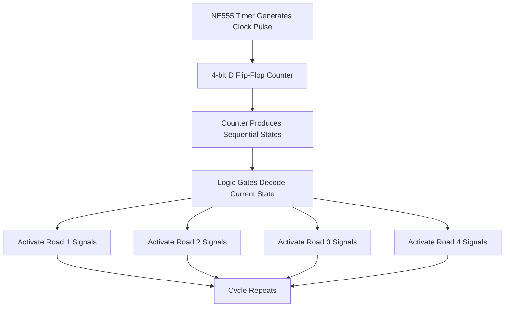

# 4-Way Traffic Signal Controller


## Overview

This project was completed for the **Digital Logic Design** course during **Semester 2, Spring 2024**.

The project implements a **4-way traffic signal controller** using digital logic concepts. It includes a Proteus simulation, timing design, truth table, reconstructed circuit files, hardware implementation media, screenshots, and a Markdown report.

The controller is designed around a sequential timing cycle where each road receives a green signal for a fixed duration, followed by a yellow transition before the next road becomes active.

---

## Project Information

| Field | Details |
|---|---|
| Course | Digital Logic Design |
| Semester | Semester 2, Spring 2024 |
| Project Title | 4-Way Traffic Signal Controller |
| Project Type | Digital Logic Simulation and Hardware Prototype |
| Simulation Tool | Proteus |
| Core Concepts | Sequential Logic, Counters, Timers, Logic Gates |
| Status | Completed |

---

## Project Objectives

The main objectives of this project were to:

- Design a 4-way traffic signal controller using digital logic concepts.
- Implement sequential state-based control for traffic lights.
- Use a timer circuit to generate regular clock pulses.
- Use a counter to move through signal states.
- Design traffic light logic using digital gates.
- Simulate the circuit in Proteus.
- Build and test a hardware prototype.
- Document the design using screenshots, truth table, report, and demo media.

---

## System Design Summary

The traffic controller follows a repeated sequence for four roads.

Each road receives:

- Green signal for approximately 3 seconds
- Yellow transition for approximately 1 second
- Red signal while the other roads are active

The sequence is controlled using a clock signal and a 4-bit counter. The counter states are decoded using logic gates to activate the correct red, yellow, and green outputs.

---

## Timing Sequence

| Road | Green Duration | Yellow Duration | Other Roads |
|---|---:|---:|---|
| Road 1 | 3 seconds | 1 second | Red |
| Road 2 | 3 seconds | 1 second | Red |
| Road 3 | 3 seconds | 1 second | Red |
| Road 4 | 3 seconds | 1 second | Red |

The full cycle repeats after all four roads complete their green and yellow phases.

---

## Core Components

| Component | Purpose |
|---|---|
| NE555 Timer | Generates an approximate 1 Hz clock pulse |
| D Flip-Flop Counter | Produces sequential binary states |
| Logic Gates | Decode counter states into traffic light outputs |
| LEDs | Represent red, yellow, and green traffic signals |
| Proteus | Simulates the circuit design |
| Breadboard Prototype | Demonstrates hardware implementation |

---

## NE555 Timer Design

The project uses an NE555 timer in astable mode to generate clock pulses for the sequential controller.

For an astable NE555 timer, the approximate period is:

```text
T ≈ 0.693 × (Ra + 2Rb) × C
```

Using the design values:

```text
Ra = 100kΩ
Rb = 22kΩ
C  = 10µF
```

Approximate timing:

```text
T ≈ 0.693 × (100kΩ + 2×22kΩ) × 10µF
T ≈ 1 second
```

This clock pulse drives the counter and advances the traffic signal sequence.

---

## Logic Workflow



---

## Repository Structure

```text
4-way-traffic-signal-controller/
│
├── README.md
├── REPORT.md
├── .gitignore
│
├── design/
│   └── 4way-signal-truth-table.xlsx
│
├── media/
│   ├── led-output-state-green.jpg
│   ├── led-output-state-red-yellow.jpg
│   └── traffic-signal-demo.mp4
│
├── proteus/
│   ├── FourWayTrafficSignal_Recreated.pdsprj
│   └── Proteus-Reconstruction-Guide.md
│
└── screenshots/
    ├── hardware-running-state.jpg
    ├── proteus-dff-counter-module.png
    ├── proteus-main-circuit.png
    ├── proteus-ne555-timer-module.png
    ├── proteus-running-state-1.png
    ├── proteus-running-state-2.png
    ├── proteus-running-state-overview.png
    ├── proteus-traffic-lights-module.png
    └── proteus-traffic-logic-module.png
```

---

## Design Files

The truth table is included in:

```text
design/4way-signal-truth-table.xlsx
```

This file documents the relationship between counter states and traffic signal outputs.

---

## Proteus Simulation Files

The Proteus project is included in:

```text
proteus/FourWayTrafficSignal_Recreated.pdsprj
```

A reconstruction guide is also included:

```text
proteus/Proteus-Reconstruction-Guide.md
```

The guide explains how the circuit was recreated and how the simulation can be reviewed.

---

## Report

A Markdown report is included in:

```text
REPORT.md
```

The report documents the project background, system design, timing logic, Proteus simulation, hardware implementation, and learning outcomes.

---

## Screenshots

### Main Proteus Circuit


### NE555 Timer Module


### D Flip-Flop Counter Module


### Traffic Logic Module


### Traffic Lights Module


### Running State Overview


### Running State 1


### Running State 2


### Hardware Running State


---

## Hardware Media

Additional media files are included in the `media/` folder:

```text
media/led-output-state-green.jpg
media/led-output-state-red-yellow.jpg
media/traffic-signal-demo.mp4
```

These files provide hardware implementation evidence and a short demo of the traffic signal controller.

---

## How to Review the Project

1. Open the project README for a quick overview.
2. Review `REPORT.md` for the detailed academic explanation.
3. Open the truth table from the `design/` folder.
4. Open the Proteus project from the `proteus/` folder.
5. Review screenshots to understand the circuit modules.
6. Watch the demo video in the `media/` folder for hardware behavior.

---

## Technical Notes

- The controller uses sequential logic rather than software programming.
- Timing is generated using an NE555 timer circuit.
- The counter advances the state sequence.
- Logic gates decode counter states into traffic signal outputs.
- The design is educational and prototype-based.
- The hardware version demonstrates the logic using LEDs and breadboard wiring.

---

## Important Clarification

This project is an educational Digital Logic Design prototype. It is not intended for real-world road traffic control or safety-critical deployment.

Real traffic systems require certified controllers, fail-safe mechanisms, sensor integration, emergency override logic, regulatory compliance, redundancy, and professional engineering validation.

---

## Learning Outcomes

Through this project, the following concepts were practiced:

- Sequential logic design
- Clock pulse generation using NE555 timer
- Counter-based state sequencing
- Logic gate-based output control
- Truth table design
- Proteus circuit simulation
- Hardware prototyping
- LED-based output testing
- Circuit modularization
- Academic technical documentation

---

## Limitations

- The hardware implementation is a prototype.
- Timing is approximate and depends on component tolerances.
- The circuit does not include vehicle sensors.
- There is no pedestrian crossing logic.
- There is no emergency vehicle override.
- The project is not designed for real traffic deployment.
- The Proteus file is a recreated simulation version for documentation and portfolio review.

---

## Future Enhancements

Possible improvements include:

- Add pedestrian crossing signals.
- Add emergency vehicle priority mode.
- Add sensor-based adaptive timing.
- Add reset and manual override controls.
- Add seven-segment countdown displays.
- Add PCB layout design.
- Add formal timing diagrams.
- Add Karnaugh map simplification documentation.
- Add a microcontroller-based comparison version.
- Add automated simulation screenshots for each state.

---

## Portfolio Positioning

This project represents an early academic hardware and digital logic project that demonstrates sequential circuit design, simulation, and prototype implementation.

It is best described as:

> A Digital Logic Design project implementing a 4-way traffic signal controller using an NE555 timer, D flip-flop counter, logic gates, Proteus simulation, and hardware prototype evidence.
