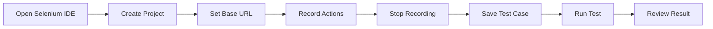

# Project Notes: Software Testing with Selenium

## Purpose

These notes summarize the **Software Testing with Selenium** project completed for the Introduction to Software Engineering course.

---

## Project Context

The project focused on testing web-based systems using Selenium. The selected examples were:

- Air University Student Portal login page
- Wikipedia search engine

The aim was to understand software testing, automated browser testing, and non-functional testing concepts.

---

## Main Testing Tool

The project used **Selenium IDE**, a browser extension that allows users to record browser actions and replay them as automated tests.

---

## Why Selenium IDE Was Used

Selenium IDE was suitable for this semester-level project because:

- It is easy to install.
- It supports recording test actions.
- It is beginner-friendly.
- It helps demonstrate automation testing without writing full code.
- It allows tests to be replayed and validated visually.

---

## Testing Areas

| Area | Explanation |
|---|---|
| Login Validation | Checking whether valid credentials lead to successful login |
| Search Validation | Checking whether search input returns relevant results |
| Performance Concept | Understanding response time and reliability |
| Load/Stress Concept | Understanding how systems behave under heavy usage |
| Tool Comparison | Understanding where Selenium fits compared with other testing tools |

---

## Important Clarification

Selenium is mainly a browser automation and functional UI testing tool. It can help simulate repeated user actions, but it is **not a dedicated load testing tool**.

For real load testing, tools such as JMeter, k6, or Locust would be more appropriate.

In this project, load and stress testing were discussed from a conceptual software engineering perspective, while Selenium was used for practical browser automation demonstration.

---

## Selenium IDE Workflow



---

## Selenium vs Other Tools

| Tool | Better Use Case |
|---|---|
| Selenium | Browser UI automation |
| JMeter | Load and performance testing |
| Postman | API testing |
| Cypress | JavaScript-focused modern web testing |
| Playwright | Modern browser automation |
| Katalon Studio | Low-code test automation |

---

## Project Files

| File | Purpose |
|---|---|
| `docs/Software-Testing-Report.docx` | Project report |
| `presentation/Software-Testing-with-Selenium_SE.pptx` | Project presentation |
| `README.md` | GitHub project overview |
| `PROJECT_NOTES.md` | Additional project explanation |

---

## Screenshot Set

The final project includes these screenshots:

```text
screenshots/
├── project-description.PNG
├── result-analysis.PNG
├── selenium-comparison.PNG
├── selenium-overview.PNG
├── selenium-recording.PNG
├── table-of-contents.PNG
├── test-case-design.PNG
├── test-execution.PNG
├── testing-methodology.PNG
└── title-slide.PNG
```

---

## Suggested GitHub Positioning

This project should be described as:

```text
An academic introduction to software testing and Selenium IDE-based browser automation.
```

Avoid describing it as a complete professional load testing framework, because Selenium IDE is not designed for true load testing.

---

## Learning Summary

This project helped me understand:

- What software testing is
- Why non-functional testing matters
- How browser automation works
- How Selenium IDE records test steps
- How test cases are designed
- How Selenium compares with other testing tools
- Why testing is important in software engineering
- Why the right testing tool should be selected based on the testing objective
