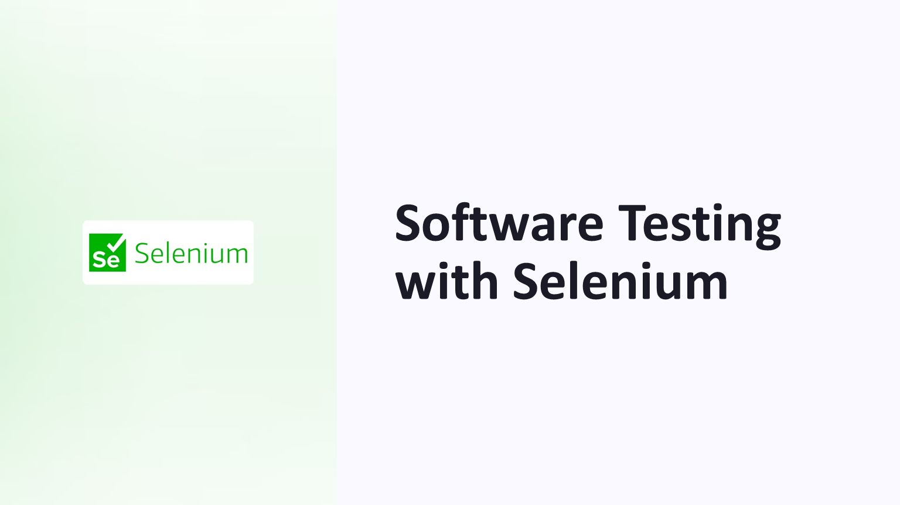
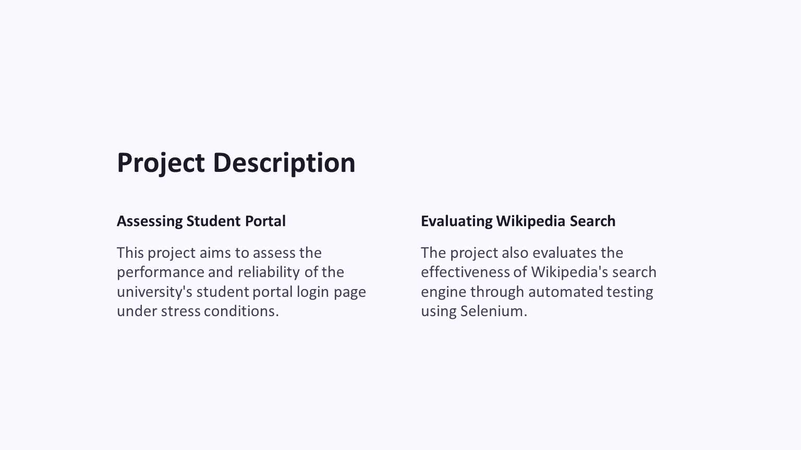
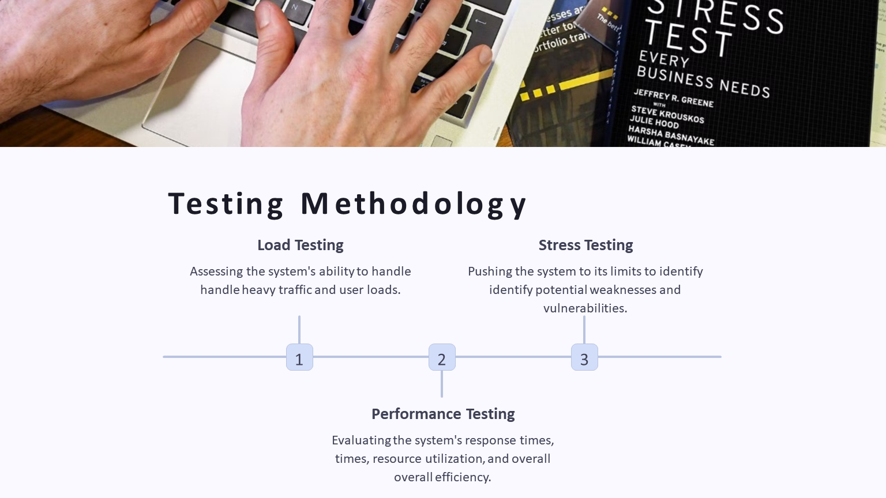
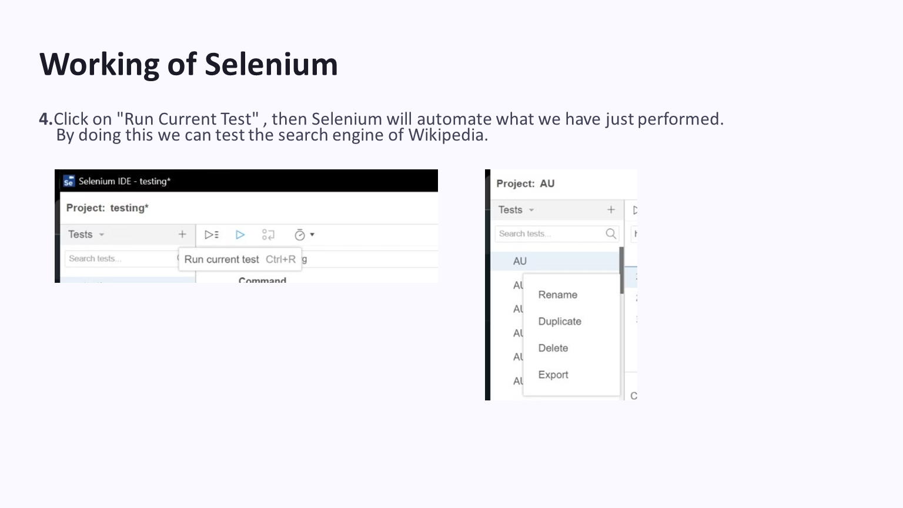
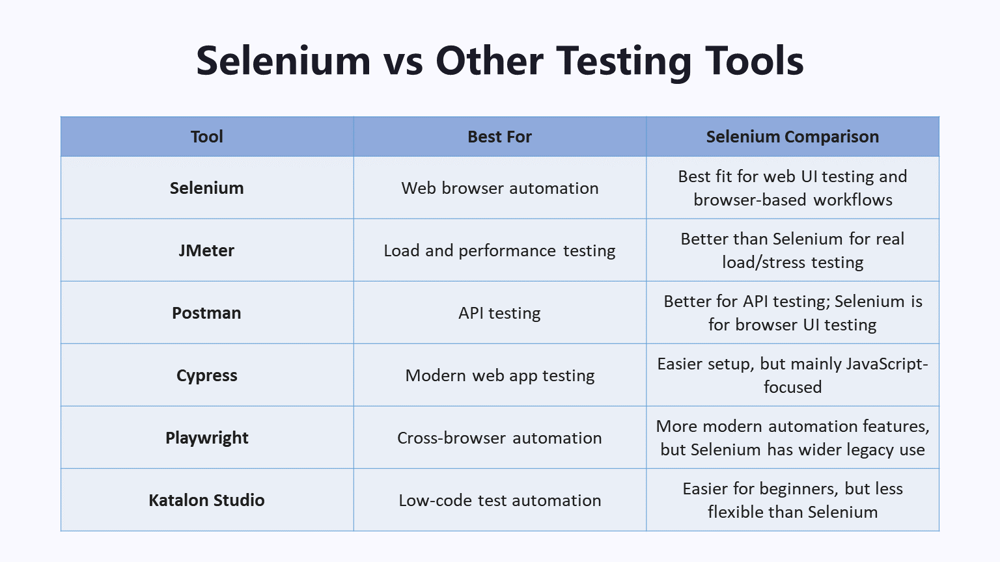
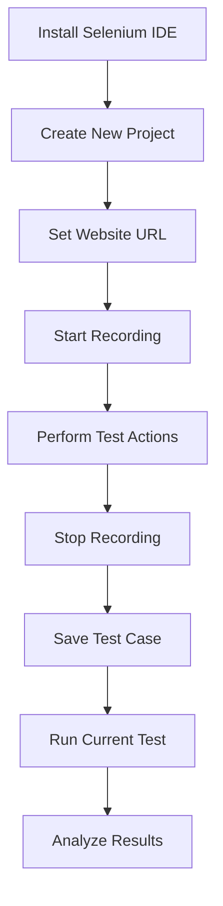

# Software Testing with Selenium


## Overview

This project was completed for the **Introduction to Software Engineering** course. The project focuses on **software testing using Selenium**, with emphasis on automated testing, non-functional testing concepts, and validation of web-based systems.

The project evaluated two web-testing scenarios:

- Testing the **Air University student portal login page**
- Testing the **Wikipedia search engine**

The work demonstrates how Selenium can be used to automate browser interactions, validate expected behavior, and support software testing activities.

---

## Project Preview

### Title Slide



### Table of Contents


### Project Description



### Selenium Overview


### Testing Methodology



### Test Case Design


### Selenium Recording


### Test Execution



### Selenium Comparison



### Result Analysis


---

## Project Information

| Field | Details |
|---|---|
| Course | Introduction to Software Engineering |
| Course Code | CS112 |
| Instructor | Sir Jalal |
| Project Topic | Software Testing with Selenium |
| Tool Used | Selenium IDE |
| Testing Area | Web Application Testing |
| Project Type | Group Report and Presentation |
| Status | Completed |

---

## Project Description

The project aimed to assess the performance, reliability, and expected behavior of selected web systems using Selenium-based automated testing.

| System | Testing Focus |
|---|---|
| Air University Student Portal | Login page validation and stress/performance-related testing concept |
| Wikipedia Search Engine | Search functionality validation using automated browser actions |

---

## Why Selenium?

Selenium was selected because it is a popular open-source framework for web application testing. It supports browser automation and helps testers record, execute, and validate user interactions.

Key reasons for using Selenium:

- Browser automation
- Cross-browser testing support
- Repetitive task automation
- Easy test recording through Selenium IDE
- Support for web application validation
- Useful for functional and non-functional testing demonstrations

---

## Testing Concepts Covered

| Concept | Description |
|---|---|
| Functional Testing | Checking whether a feature behaves according to requirements |
| Non-Functional Testing | Evaluating performance, reliability, usability, and stability |
| Load Testing | Checking how a system behaves under expected user load |
| Stress Testing | Checking system behavior under extreme conditions |
| Performance Testing | Evaluating response time, efficiency, and resource behavior |
| Automation Testing | Using tools to execute repeatable test steps automatically |

---

## Test Cases

### Login Page Validation

| Field | Details |
|---|---|
| Objective | Verify login page functionality and usability |
| Target | Air University Student Portal |
| Tool | Selenium IDE |
| Test Data | Valid username and password |
| Expected Result | User logs in successfully and is redirected to dashboard |

### Wikipedia Search Validation

| Field | Details |
|---|---|
| Objective | Verify that Wikipedia search returns relevant results |
| Target | Wikipedia |
| Tool | Selenium IDE |
| Test Data | Search keyword |
| Expected Result | Search results or relevant article page is displayed |

---

## Selenium IDE Workflow



---

## Selenium Compared with Other Testing Tools

| Tool | Best For | Selenium Comparison |
|---|---|---|
| Selenium | Web browser automation | Best fit for web UI testing and browser-based workflows |
| JMeter | Load and performance testing | Better than Selenium for real load/stress testing |
| Postman | API testing | Better for API testing; Selenium is for browser UI testing |
| Cypress | Modern web app testing | Easier setup, but mainly JavaScript-focused |
| Playwright | Cross-browser automation | More modern automation features, but Selenium has wider legacy use |
| Katalon Studio | Low-code test automation | Easier for beginners, but less flexible than Selenium |

---

## Repository Structure

```text
se_selenium_testing_project/
│
├── README.md
├── PROJECT_NOTES.md
│
├── docs/
│   └── Software-Testing-Report.docx
│
├── presentation/
│   └── Software-Testing-with-Selenium_SE.pptx
│
└── screenshots/
    ├── project-description.PNG
    ├── result-analysis.PNG
    ├── selenium-comparison.PNG
    ├── selenium-overview.PNG
    ├── selenium-recording.PNG
    ├── table-of-contents.PNG
    ├── test-case-design.PNG
    ├── test-execution.PNG
    ├── testing-methodology.PNG
    └── title-slide.PNG
```

---

## Report and Presentation

The project includes:

```text
docs/Software-Testing-Report.docx
presentation/Software-Testing-with-Selenium_SE.pptx
```

The report documents the project description, non-functional testing approach, Selenium usage, test case design, tool configuration, execution process, results, and conclusion.

The presentation summarizes the project using slides on Selenium, testing methodology, test case design, working process, tool comparison, results, conclusion, and recommendations.

---

## Important Clarification

Selenium IDE is useful for browser automation and functional testing demonstrations. It can simulate repeated browser actions, but it is **not a dedicated load testing tool**.

For real load or stress testing, tools such as JMeter, k6, or Locust would be more appropriate.

This project should therefore be understood as an academic introduction to software testing and Selenium IDE-based browser automation.

---

## Learning Outcomes

Through this project, I learned how to:

- Understand basic software testing concepts.
- Differentiate between functional and non-functional testing.
- Use Selenium IDE for browser automation.
- Record and execute automated web tests.
- Design basic test cases for web applications.
- Validate login and search functionality.
- Compare Selenium with other testing tools.
- Understand the importance of selecting the right testing tool.
- Present testing methodology and results in an academic format.

---

## Limitations

- Testing was mostly demonstration-based.
- Selenium IDE was used instead of a full Selenium WebDriver code framework.
- Stress/load testing was discussed conceptually, but Selenium IDE is not a dedicated load testing tool.
- The project does not include executable Selenium WebDriver scripts in code form.
- The Air University portal testing should only be performed in an authorized academic context.

---

## Future Enhancements

- Convert Selenium IDE tests into Selenium WebDriver scripts.
- Add Python or Java-based test automation code.
- Add explicit test case files.
- Add screenshots of actual test execution results.
- Use a dedicated load testing tool such as JMeter for actual load testing.
- Add structured test reports.
- Add pass/fail result summaries.

---

## Academic Notice

This project was completed as part of university coursework for academic learning and portfolio documentation.

---

## Ethical Notice

Testing should only be performed on systems where permission is available. Login pages, university portals, and third-party websites should not be stress tested or automated aggressively without authorization.

---

## Disclaimer

This is an academic software testing project. The included material is intended for learning and demonstration purposes only.
