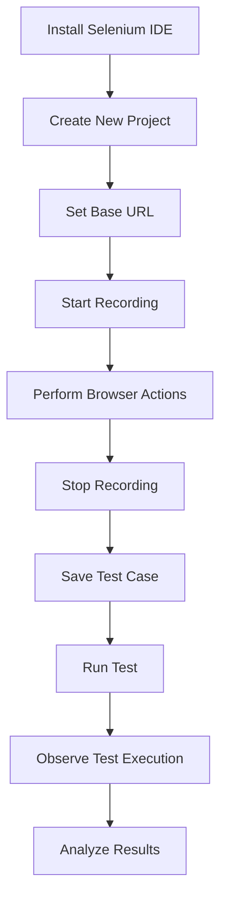
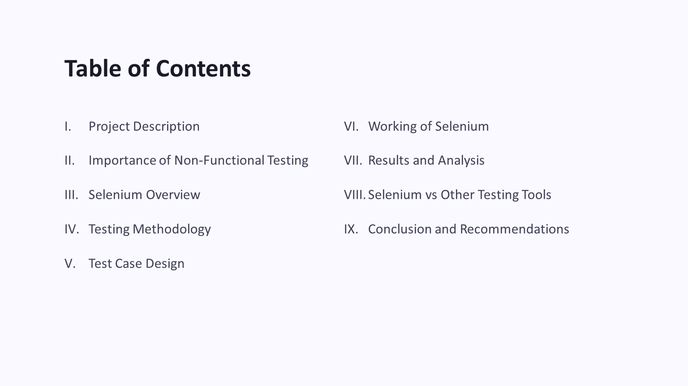
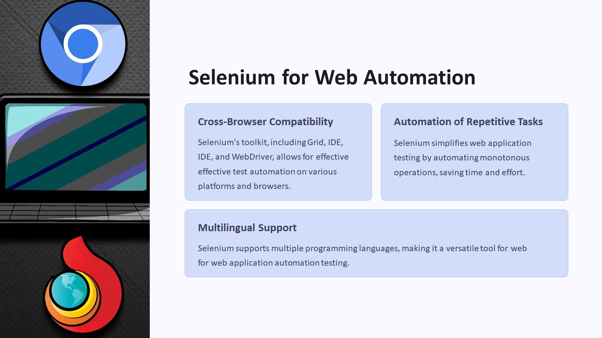
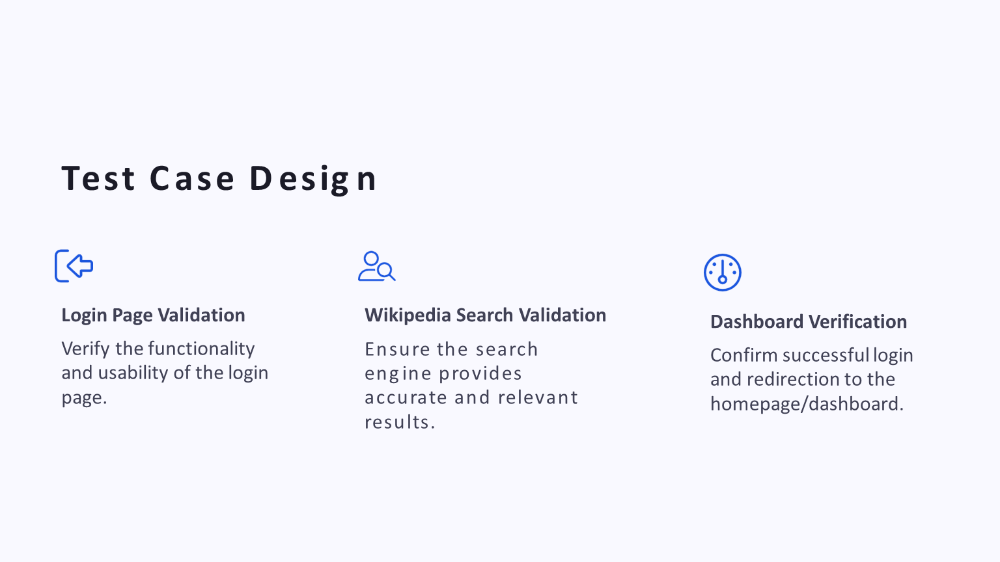
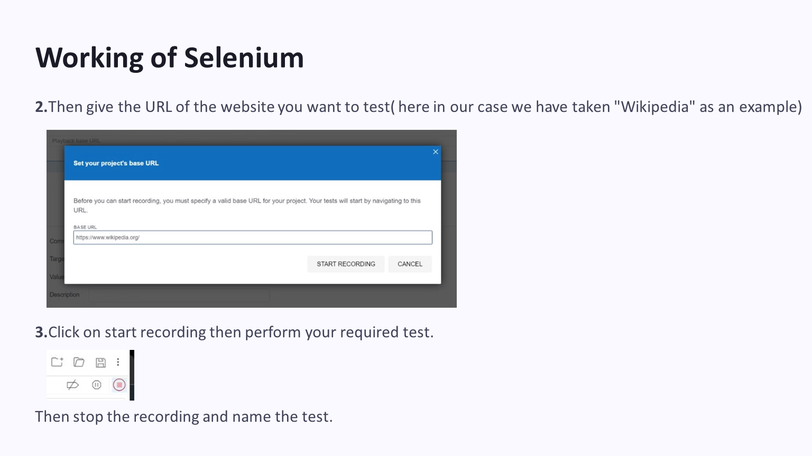
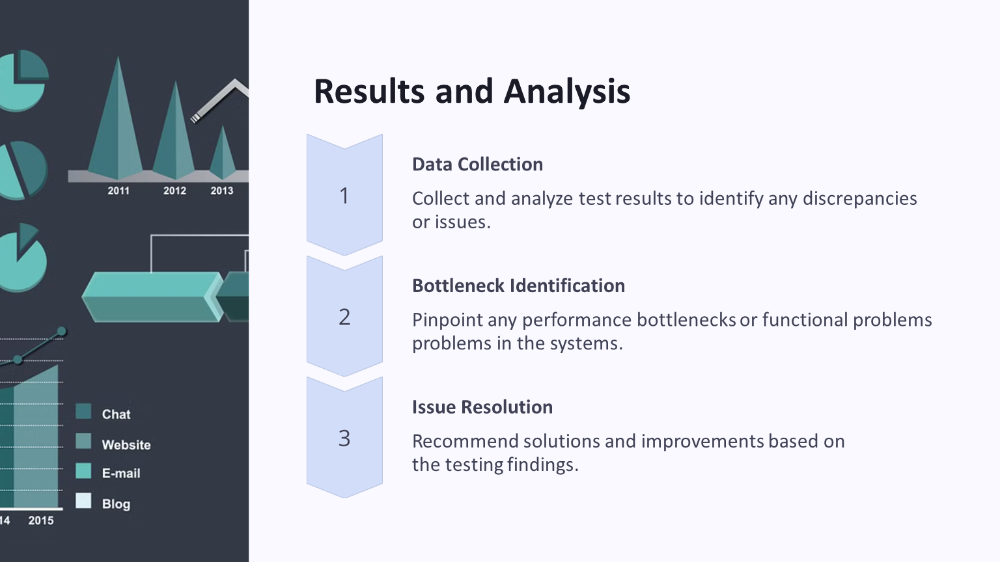

# Software Testing with Selenium


## Overview

This project was completed for the **Introduction to Software Engineering** course during **Semester 2, Spring 2024**.

The project focuses on software testing using **Selenium IDE**, with emphasis on browser-based functional testing, test case design, automated test recording, test execution, and introductory performance and stress testing demonstrations.

The project evaluated two web-based testing scenarios:

- Air University student portal login page
- Wikipedia search functionality

Selenium IDE was used to record and replay browser actions for functional testing. During the lab demonstration, performance and stress testing concepts were also demonstrated at an introductory academic level to understand how web systems may behave under repeated or heavy user actions.

---

## Project Information

| Field | Details |
|---|---|
| Course | Introduction to Software Engineering |
| Semester | Semester 2, Spring 2024 |
| Project Title | Software Testing with Selenium |
| Tool Used | Selenium IDE |
| Testing Area | Web Application Testing |
| Project Type | Group Report, Presentation, and Lab Demonstration |
| Status | Completed |

---

## Project Objectives

The main objectives of this project were to:

- Understand the role of software testing in software engineering.
- Learn the difference between functional and non-functional testing.
- Use Selenium IDE to record and execute browser-based test cases.
- Validate login and search functionality in selected web systems.
- Demonstrate introductory performance and stress testing concepts.
- Compare Selenium with other commonly used testing tools.
- Present testing methodology, results, and observations in an academic format.

---

## Tested Web Systems

| System | Testing Focus |
|---|---|
| Air University Student Portal | Login validation, repeated browser actions, and performance/stress testing demonstration |
| Wikipedia Search Engine | Search functionality validation using automated browser actions |

---

## Why Selenium IDE Was Used

Selenium IDE was selected because it is beginner-friendly and suitable for demonstrating browser automation concepts at an introductory software engineering level.

Key reasons for using Selenium IDE:

- Easy browser-based setup
- No full programming framework required
- Supports recording and replaying user actions
- Useful for demonstrating automated functional testing
- Helps visualize test execution steps
- Suitable for academic software testing demonstrations

---

## Testing Concepts Covered

| Concept | Description |
|---|---|
| Functional Testing | Checking whether a feature behaves according to expected requirements |
| Non-Functional Testing | Evaluating quality attributes such as performance, reliability, usability, and stability |
| Performance Testing | Observing response behavior and efficiency during system usage |
| Stress Testing | Observing system behavior under repeated or heavy user actions |
| Automation Testing | Using a tool to execute repeatable testing steps automatically |
| Test Case Design | Defining inputs, actions, and expected outputs before execution |

---

## Test Case Summary

### 1. Login Page Validation

| Field | Details |
|---|---|
| Target | Air University Student Portal |
| Tool | Selenium IDE |
| Objective | Verify login page behavior using valid test input |
| Expected Result | User is authenticated and redirected successfully |
| Testing Type | Functional testing with lab-level performance/stress demonstration |

### 2. Wikipedia Search Validation

| Field | Details |
|---|---|
| Target | Wikipedia |
| Tool | Selenium IDE |
| Objective | Verify that search input returns relevant results |
| Expected Result | Search result or relevant article page is displayed |
| Testing Type | Functional testing |

---

## Selenium IDE Workflow



---

## Selenium Compared with Other Testing Tools

| Tool | Best For | Comparison |
|---|---|---|
| Selenium IDE | Browser test recording and replay | Best suited for beginner-friendly UI test automation demonstrations |
| Selenium WebDriver | Code-based browser automation | More powerful than Selenium IDE for professional automation frameworks |
| JMeter | Load and performance testing | More suitable for dedicated load and stress testing |
| Postman | API testing | Better for testing APIs instead of browser interfaces |
| Cypress | Modern web application testing | Developer-friendly, especially for JavaScript-based applications |
| Playwright | Modern cross-browser automation | Strong modern alternative for automated browser testing |
| Katalon Studio | Low-code test automation | Beginner-friendly tool with broader testing features |

---

## Project Preview

### Title Slide


### Table of Contents



### Project Description


### Selenium Overview



### Testing Methodology


### Test Case Design



### Selenium Recording



### Test Execution


### Selenium Comparison


### Result Analysis



---

## Repository Structure

```text
software-testing-with-selenium/
│
├── README.md
│
├── docs/
│   └── software-testing-with-selenium.docx
│
├── presentation/
│   └── software-testing-with-selenium.pptx
│
└── screenshots/
    ├── project-description.PNG
    ├── result-analysis.PNG
    ├── selenium-comparison.PNG
    ├── selenium-overview.PNG
    ├── selenium-recording.PNG
    ├── table-of-contents.PNG
    ├── test-case-design.PNG
    ├── test-execution.PNG
    ├── testing-methodology.PNG
    └── title-slide.PNG
```

---

## Report and Presentation

The project includes the original academic report and presentation:

```text
docs/software-testing-with-selenium.docx
presentation/software-testing-with-selenium.pptx
```

The report documents the project background, testing concepts, Selenium IDE usage, test case design, execution process, results, and conclusion.

The presentation summarizes the project using slides on software testing, Selenium, testing methodology, test cases, tool comparison, result analysis, and recommendations.

---

## Important Technical Clarification

Selenium IDE was used mainly for browser automation and functional test recording. Performance and stress testing were demonstrated during the lab demo at an introductory academic level through repeated browser-based actions and observation of system behavior.

This project should not be treated as a production-grade load testing framework. For professional load, stress, and performance testing, dedicated tools such as JMeter, k6, Gatling, or Locust are more appropriate.

---

## Learning Outcomes

Through this project, the following concepts were practiced:

- Basics of software testing
- Functional and non-functional testing
- Browser automation using Selenium IDE
- Test case recording and execution
- Login page validation
- Search functionality validation
- Introductory performance and stress testing concepts
- Tool comparison and test tool selection
- Academic reporting and presentation of testing results

---

## Limitations

- The project was completed as an introductory academic testing project.
- Selenium IDE was used instead of a full Selenium WebDriver code framework.
- The original Selenium IDE `.side` project file is not included in this archive.
- Raw stress testing logs and reproducible performance testing scripts are not included.
- The project demonstrates testing concepts and lab work, but it is not a complete professional QA automation framework.
- Testing related to the Air University portal was performed only in an authorized academic context.

---

## Future Enhancements

Possible improvements include:

- Convert Selenium IDE recordings into Selenium WebDriver scripts.
- Add Python or Java-based automation code.
- Include the original `.side` file if available in the future.
- Add structured test case files.
- Add reproducible test execution logs.
- Use JMeter, k6, or Locust for dedicated load and stress testing.
- Generate automated HTML test reports.
- Add CI/CD integration for automated test execution.

---

## Portfolio Positioning

This project represents an early academic software engineering project focused on software testing fundamentals and Selenium IDE-based browser automation.

It is best described as:

> An academic software testing project covering Selenium IDE, functional testing, test case design, browser automation, and introductory performance/stress testing demonstration.
