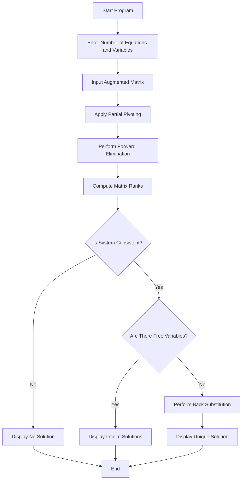
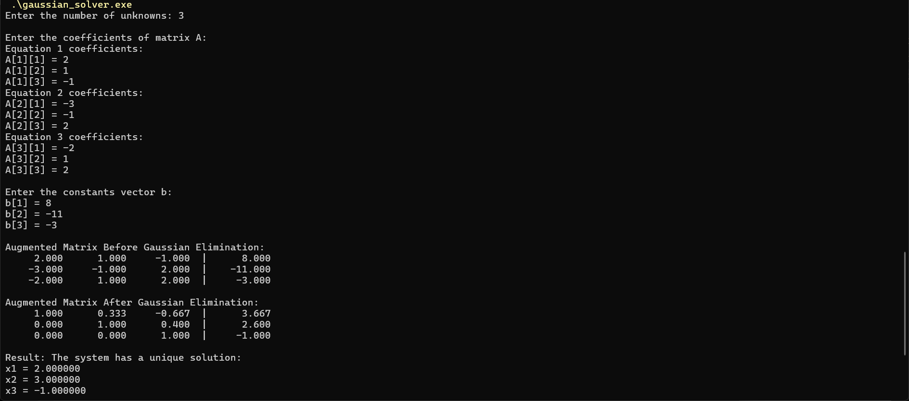
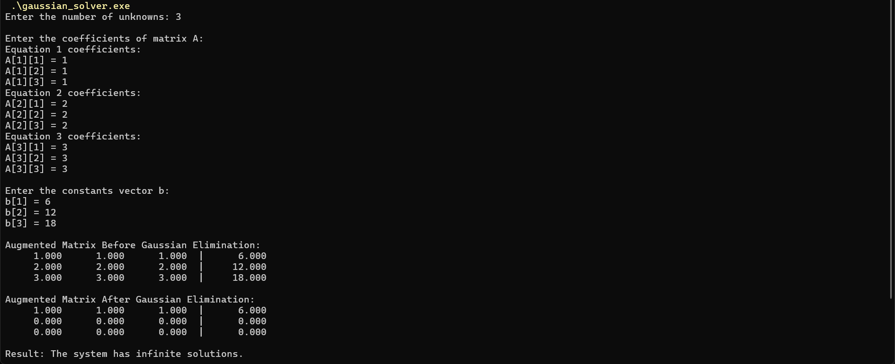
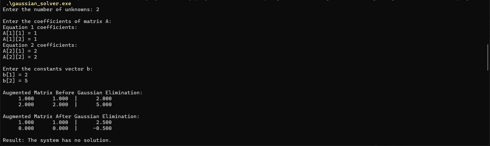

# Gaussian Elimination Solver


## Overview

This project was completed for the **Linear Algebra** course during **Semester 2, Spring 2024**.

The project implements a **Gaussian Elimination Solver** in C++ for solving systems of linear equations. It demonstrates how matrix row operations can be used to reduce an augmented matrix and determine whether a linear system has:

- A unique solution
- Infinite solutions
- No solution

The final implementation is designed as a portfolio-ready version of the original coursework. It includes improved input handling, partial pivoting, rank-based consistency checking, and sample test cases.

---

## Project Information

| Field | Details |
|---|---|
| Course | Linear Algebra |
| Semester | Semester 2, Spring 2024 |
| Project Title | Gaussian Elimination Solver |
| Language | C++ |
| Topic | Systems of Linear Equations |
| Algorithm | Gaussian Elimination |
| Project Type | Academic Programming Project |
| Status | Completed |

---

## Project Objectives

The main objectives of this project were to:

- Understand how systems of linear equations can be represented using matrices.
- Apply Gaussian elimination to transform an augmented matrix into row echelon form.
- Use row operations to solve linear systems computationally.
- Identify whether a system has a unique solution, infinite solutions, or no solution.
- Practice C++ programming for mathematical problem solving.
- Improve the original coursework into a cleaner and more reusable portfolio project.

---

## Key Features

- Solves systems of linear equations using Gaussian elimination.
- Accepts custom matrix size from user input.
- Supports augmented matrix input.
- Uses partial pivoting to improve numerical stability.
- Detects inconsistent systems.
- Distinguishes between unique, infinite, and no-solution cases.
- Includes sample input files for testing.
- Includes screenshots showing program output for different system types.
- Preserves original coursework files separately for academic history.

---

## Mathematical Concept

A system of linear equations can be represented as an augmented matrix:

```text
a11x1 + a12x2 + ... + a1nxn = b1
a21x1 + a22x2 + ... + a2nxn = b2
...
am1x1 + am2x2 + ... + amnxn = bm
```

Gaussian elimination applies elementary row operations to reduce the augmented matrix into a simpler form. The reduced matrix is then analyzed to determine the type of solution.

Possible outcomes:

| Outcome | Meaning |
|---|---|
| Unique Solution | The system has exactly one solution |
| Infinite Solutions | The system has dependent equations and at least one free variable |
| No Solution | The system is inconsistent |

---

## Algorithm Workflow



---

## Repository Structure

```text
gaussian-elimination-solver/
│
├── README.md
├── .gitignore
│
├── src/
│   └── gaussian_elimination_solver.cpp
│
├── original/
│   ├── general_gaussian_elimination_solver.cpp
│   └── fixed_6x6_consistency_checker.cpp
│
├── sample-data/
│   ├── unique-solution-input.txt
│   ├── infinite-solutions-input.txt
│   └── no-solution-input.txt
│
└── screenshots/
    ├── unique-solution.png
    ├── infinite-solutions.png
    └── no-solution.png
```

---

## Main Implementation

The portfolio-ready implementation is located in:

```text
src/gaussian_elimination_solver.cpp
```

The `original/` folder contains earlier coursework versions that are preserved for academic history. The enhanced and recommended version for review is the file inside `src/`.

---

## How to Compile and Run

### Compile with g++

```bash
g++ src/gaussian_elimination_solver.cpp -o gaussian_solver
```

### Run on Windows PowerShell

```powershell
./gaussian_solver.exe
```

### Run on Linux/macOS

```bash
./gaussian_solver
```

---

## Sample Input Files

The project includes sample input files for testing different solution cases:

| File | Purpose |
|---|---|
| `sample-data/unique-solution-input.txt` | Demonstrates a system with one exact solution |
| `sample-data/infinite-solutions-input.txt` | Demonstrates a dependent system with infinite solutions |
| `sample-data/no-solution-input.txt` | Demonstrates an inconsistent system with no solution |

---

## Example Test Cases

### 1. Unique Solution

This test case demonstrates a system that has exactly one solution.



---

### 2. Infinite Solutions

This test case demonstrates a dependent system where multiple solutions are possible.



---

### 3. No Solution

This test case demonstrates an inconsistent system where no valid solution exists.



---

## Technical Details

The enhanced solver includes:

- Dynamic matrix sizing
- Augmented matrix representation
- Floating-point comparison using tolerance
- Partial pivoting for better numerical behavior
- Forward elimination
- Rank checking for consistency
- Back substitution for unique solution cases
- Clear output messages for all major solution types

---

## Original Coursework Files

The `original/` folder contains earlier versions of the project created during the course.

These files are kept for academic traceability only. They are not the recommended implementation for portfolio review.

Recommended file:

```text
src/gaussian_elimination_solver.cpp
```

Archived files:

```text
original/general_gaussian_elimination_solver.cpp
original/fixed_6x6_consistency_checker.cpp
```

---

## Learning Outcomes

Through this project, the following concepts were practiced:

- Matrix representation of linear systems
- Gaussian elimination
- Row operations
- Rank and consistency checking
- Unique, infinite, and no-solution cases
- C++ arrays/vectors and loops
- Numerical tolerance handling
- Input/output handling
- Testing with sample cases
- Organizing an academic programming project for GitHub

---

## Limitations

- The solver is intended for academic and educational use.
- It does not implement full reduced row echelon form display.
- It does not display parametric equations for infinite-solution cases.
- It uses floating-point arithmetic, so very large or ill-conditioned systems may produce numerical approximation issues.
- It is not a replacement for professional numerical computing libraries such as Eigen, LAPACK, NumPy, or MATLAB.

---

## Future Enhancements

Possible improvements include:

- Display row echelon form step by step.
- Add reduced row echelon form output.
- Show parametric solution format for infinite-solution systems.
- Add file-based input and output support.
- Add unit tests for multiple matrix cases.
- Create a GUI version for easier educational use.
- Implement the solver using a numerical library for comparison.
- Add LaTeX-style matrix output for reports.

---

## Portfolio Positioning

This project represents an early academic programming project focused on applying Linear Algebra concepts through C++.

It is best described as:

> A C++ Gaussian elimination solver that demonstrates matrix-based solution of linear systems, including unique, infinite, and no-solution cases.
