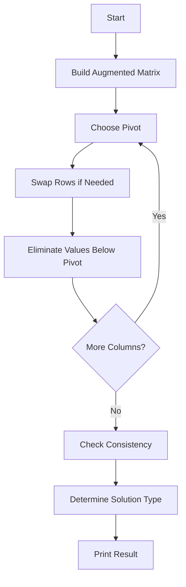

# Project Notes: Gaussian Elimination Solver in C++

## Purpose

These notes summarize the Linear Algebra project for solving systems of linear equations using Gaussian Elimination.

---

## Original Coursework Goal

The original project required a C++ program that could:

- Input the number of unknowns
- Input coefficient matrix `A`
- Input constants vector `b`
- Form augmented matrix `[A | b]`
- Perform Gaussian Elimination
- Display matrix before and after elimination
- Identify the solution type

---

## Original Files

| File | Description |
|---|---|
| `232095_Project.cpp` | Original general Gaussian Elimination implementation |
| `linear_project.cpp` | Original fixed 6x6 consistency-check implementation |

---

## Enhanced Version

The enhanced version is located at:

```text
src/gaussian_elimination_solver.cpp
```

It improves the original version by adding:

- Cleaner structure
- Better pivot handling
- Better rank and consistency detection
- Safer floating point comparison
- More readable output
- Clearer separation of input, solving, and output functions

---

## Solution Types

| Type | Meaning |
|---|---|
| Unique Solution | The system has exactly one answer |
| Infinite Solutions | The system has dependent equations and free variables |
| No Solution | The system is inconsistent |

---

## Gaussian Elimination Steps



---

## Sample Test Cases

### Unique Solution

Expected result:

```text
x1 = 2
x2 = 3
x3 = -1
```

### Infinite Solutions

The system contains dependent equations and has free variables.

### No Solution

The system contains contradictory equations.

---

## Suggested Screenshots

Use these names:

```text
screenshots/unique-solution.png
screenshots/infinite-solutions.png
screenshots/no-solution.png
```

---

## Compile Command

```bash
g++ src/gaussian_elimination_solver.cpp -o gaussian_solver
```

---

## Key Takeaways

- Gaussian Elimination is a practical method for solving linear systems.
- Augmented matrices make systems easier to process computationally.
- Pivoting improves numerical stability.
- Rank helps determine whether the system has a unique solution, infinite solutions, or no solution.
- Mathematical algorithms can be clearly implemented using C++ functions and vectors.
