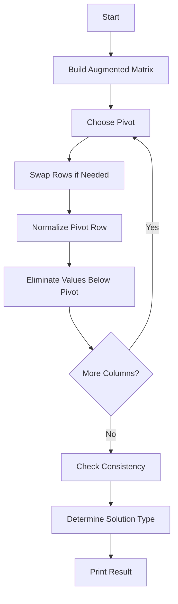

# Project Notes: Gaussian Elimination Solver in C++

## Purpose

These notes summarize the Linear Algebra project for solving systems of linear equations using Gaussian Elimination.

---

## Original Coursework Goal

The original project required a C++ program that could:

- Input the number of unknowns
- Input coefficient matrix `A`
- Input constants vector `b`
- Form augmented matrix `[A | b]`
- Perform Gaussian Elimination
- Display matrix before and after elimination
- Identify the solution type

---

## Original Files

| File | Description |
|---|---|
| `general_gaussian_elimination_solver.cpp` | Original general Gaussian Elimination implementation |
| `fixed_6x6_consistency_checker.cpp` | Instructor-specific fixed 6x6 consistency checker |

The second file was hardcoded to `6 x 6` intentionally because the instructor specifically asked for checking the consistency of a 6-equation system. Hardcoding the size made the assignment easier to implement and present.

---

## Enhanced Version

The enhanced version is located at:

```text
src/gaussian_elimination_solver.cpp
```

It improves the original version by adding:

- Cleaner structure
- Better pivot handling
- Better rank and consistency detection
- Safer floating point comparison
- More readable output
- Clearer separation of input, solving, and output functions
- Support for any `n x n` system, including `6 x 6`

---

## Relationship Between Original and Enhanced Versions

The enhanced implementation combines the ideas from both original files.

| Source Idea | How It Is Used in the Enhanced Version |
|---|---|
| General solver from `general_gaussian_elimination_solver.cpp` | Kept and improved into a cleaner `n x n` solver |
| 6x6 consistency-checking requirement | Generalized so the new program can check consistency for any size, including `6 x 6` |
| Augmented matrix output | Preserved before and after elimination |
| Unique / infinite / no solution detection | Improved using rank and inconsistency checks |

---

## Solution Types

| Type | Meaning |
|---|---|
| Unique Solution | The system has exactly one answer |
| Infinite Solutions | The system has dependent equations and free variables |
| No Solution | The system is inconsistent |

---

## Gaussian Elimination Steps



---

## Screenshot Set

The final project includes these screenshots:

```text
screenshots/
├── unique-solution.png
├── infinite-solutions.png
└── no-solution.png
```

### Unique Solution

Shows a system with exactly one solution:

```text
x1 = 2
x2 = 3
x3 = -1
```

### Infinite Solutions

Shows a dependent system where equations are multiples of each other and the system has free variables.

### No Solution

Shows an inconsistent system where equations contradict each other.

---

## Sample Test Cases

### Unique Solution Input

```text
3
2 1 -1
-3 -1 2
-2 1 2
8
-11
-3
```

Expected result:

```text
x1 = 2
x2 = 3
x3 = -1
```

### Infinite Solutions Input

```text
3
1 1 1
2 2 2
3 3 3
6
12
18
```

Expected result:

```text
The system has infinite solutions.
```

### No Solution Input

```text
2
1 1
2 2
2
5
```

Expected result:

```text
The system has no solution.
```

---

## Compile Command

```bash
g++ src/gaussian_elimination_solver.cpp -o gaussian_solver
```

Generated binaries such as `gaussian_solver.exe` should not be uploaded to GitHub.

---

## Recommended Final Structure

```text
linear_algebra_gaussian_elimination_project/
│
├── README.md
├── PROJECT_NOTES.md
│
├── src/
│   └── gaussian_elimination_solver.cpp
│
├── original/
│   ├── general_gaussian_elimination_solver.cpp
│   └── fixed_6x6_consistency_checker.cpp
│
├── sample-data/
│   ├── unique-solution-input.txt
│   ├── infinite-solutions-input.txt
│   └── no-solution-input.txt
│
└── screenshots/
    ├── unique-solution.png
    ├── infinite-solutions.png
    └── no-solution.png
```

---

## Files Not to Upload

Do not commit generated executables:

```text
gaussian_solver.exe
*.exe
*.o
*.obj
```

---

## Key Takeaways

- Gaussian Elimination is a practical method for solving linear systems.
- Augmented matrices make systems easier to process computationally.
- Pivoting improves numerical stability.
- Rank helps determine whether the system has a unique solution, infinite solutions, or no solution.
- A fixed-size assignment can be upgraded into a general-purpose solver while preserving the original coursework.
