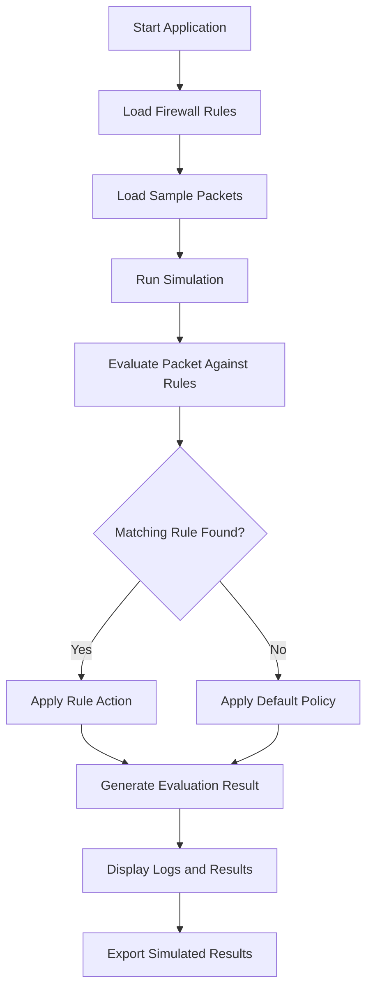
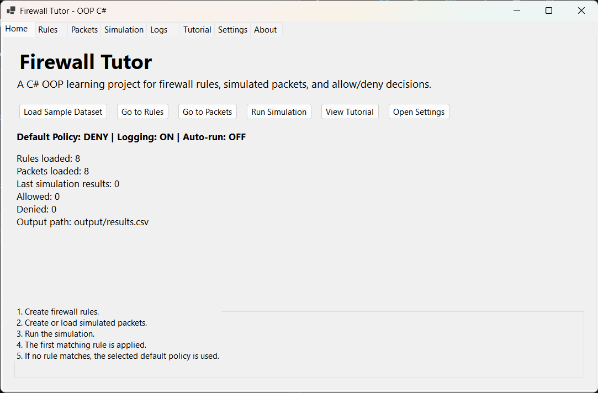
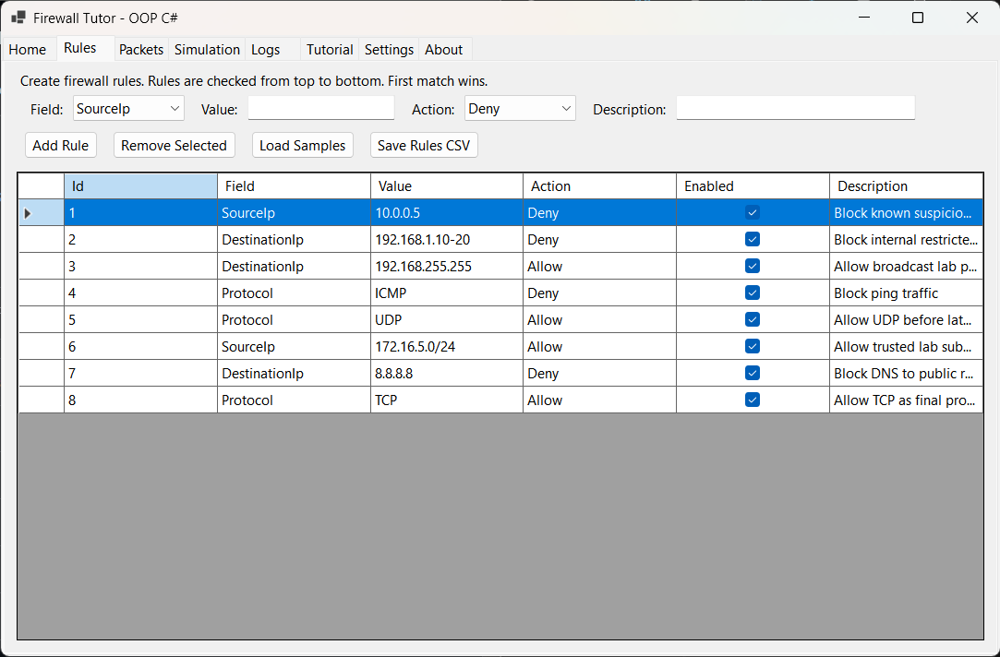
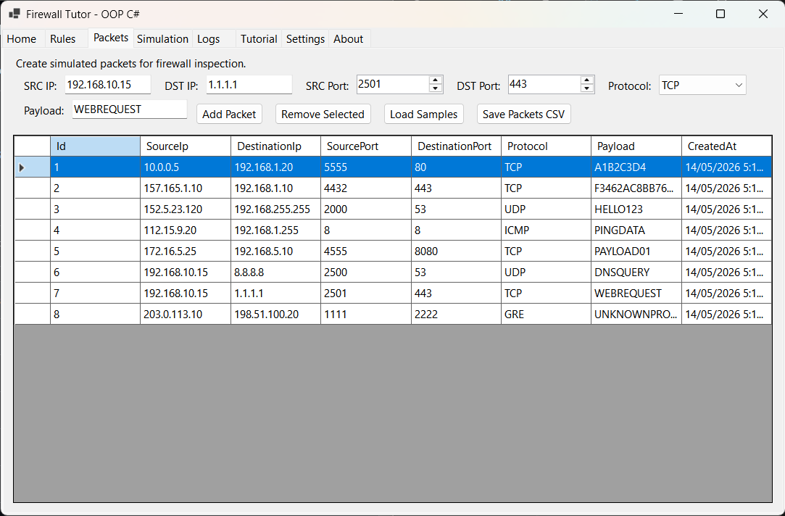
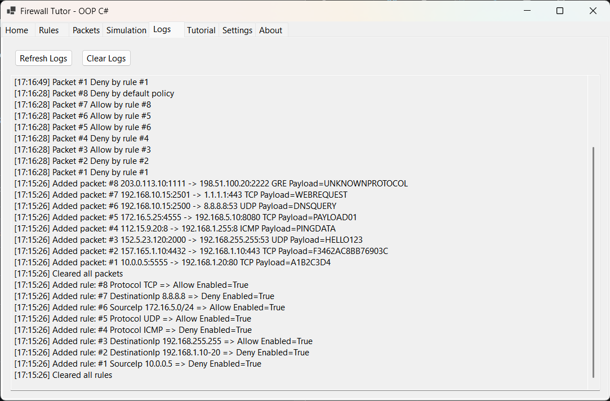
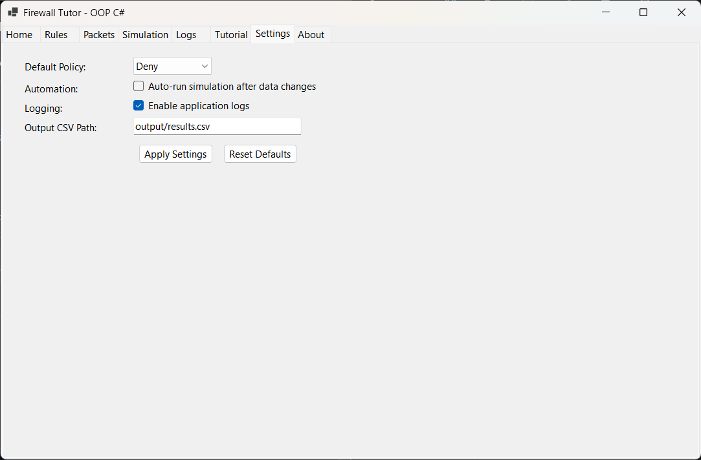
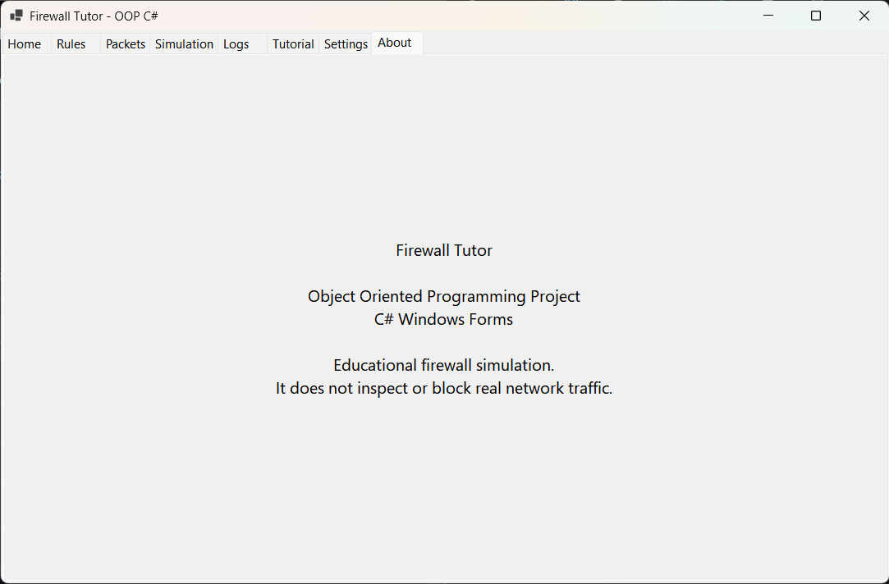

# Firewall Tutor in C#


## Overview

This project was completed for the **Object Oriented Programming** course during **Semester 2, Spring 2024**.

**Firewall Tutor** is a C# Windows Forms application that demonstrates object-oriented programming concepts through an educational firewall simulation. The application allows users to load sample firewall rules and network packets, simulate packet filtering decisions, view logs, and understand how rule-based filtering works.

The project is designed for learning purposes. It does not modify the operating system firewall or filter real network traffic. Instead, it uses sample CSV data to simulate how firewall rules may allow or deny packets.

---

## Project Information

| Field | Details |
|---|---|
| Course | Object Oriented Programming |
| Semester | Semester 2, Spring 2024 |
| Project Title | Firewall Tutor |
| Language | C# |
| Framework | .NET 8 Windows Forms |
| Theme | Educational Firewall Simulation |
| Project Type | Academic Programming Project |
| Status | Completed |

---

## Project Objectives

The main objectives of this project were to:

- Apply object-oriented programming concepts in a practical application.
- Build a GUI-based C# application using Windows Forms.
- Represent firewall rules and network packets using classes.
- Simulate rule-based firewall decision making.
- Load and process sample data from CSV files.
- Display simulation results and logs in a user-friendly interface.
- Connect programming concepts with a cybersecurity-related scenario.

---

## Key Features

- Windows Forms graphical user interface
- Sample firewall rule loading
- Sample packet loading
- Rule-based packet evaluation
- Allow/Deny decision simulation
- First-match rule priority
- Simulation logs
- Results export using CSV output
- Tutorial/help screen
- Settings screen
- About screen
- Clean OOP-based code structure

---

## OOP Concepts Demonstrated

| Concept | How It Is Used |
|---|---|
| Classes | Models such as `FirewallRule`, `NetworkPacket`, and `EvaluationResult` |
| Objects | Rules and packets are represented as runtime objects |
| Encapsulation | Data and behavior are grouped inside model and service classes |
| Abstraction | Firewall logic is handled through service classes instead of UI code |
| Enumerations | `RuleAction` and `RuleField` define fixed rule options |
| Separation of Concerns | UI, models, and services are separated into different folders |
| File Handling | CSV data is loaded and processed by storage logic |

---

## Application Workflow



---

## Rule Evaluation Logic

The firewall simulation uses a **first-match rule priority** model.

Rules are checked from top to bottom. When a packet matches a rule, that rule's action is applied and later rules are not evaluated for that packet.

This behavior is intentional because many real firewall systems also depend heavily on rule order.

Example:

```text
Rule 1: Allow all UDP traffic
Rule 2: Deny traffic to a specific destination
```

If a UDP packet matches Rule 1 first, it may be allowed before Rule 2 is checked. This demonstrates why firewall rule ordering is important in security configuration.

---

## Repository Structure

```text
firewall-tutor-csharp/
│
├── README.md
├── PROJECT_NOTES.md
├── .gitignore
│
├── data/
│   ├── packets.csv
│   └── rules.csv
│
├── docs/
│   └── firewall-tutor-csharp.docx
│
├── output/
│   └── results.csv
│
├── screenshots/
│   ├── about-screen.png
│   ├── home-screen.png
│   ├── logs-screen.png
│   ├── packets-screen.png
│   ├── rules-screen.png
│   ├── settings-screen.png
│   ├── simulation-screen.png
│   └── tutorial-screen.png
│
└── src/
    ├── FirewallTutor.csproj
    ├── Program.cs
    ├── Forms/
    │   └── MainForm.cs
    ├── Models/
    │   ├── EvaluationResult.cs
    │   ├── FirewallRule.cs
    │   ├── NetworkPacket.cs
    │   ├── RuleAction.cs
    │   └── RuleField.cs
    ├── Services/
    │   ├── CsvStorage.cs
    │   └── FirewallEngine.cs
    └── output/
        └── results.csv
```

---

## Source Code Structure

### Models

The `Models/` folder contains the data structures used by the application.

| File | Purpose |
|---|---|
| `FirewallRule.cs` | Represents a firewall rule |
| `NetworkPacket.cs` | Represents a sample network packet |
| `EvaluationResult.cs` | Stores the result of packet evaluation |
| `RuleAction.cs` | Defines allow/deny actions |
| `RuleField.cs` | Defines the packet field used for matching |

### Services

The `Services/` folder contains application logic.

| File | Purpose |
|---|---|
| `FirewallEngine.cs` | Evaluates packets against firewall rules |
| `CsvStorage.cs` | Loads and saves CSV-based data |

### Forms

The `Forms/` folder contains the Windows Forms user interface.

| File | Purpose |
|---|---|
| `MainForm.cs` | Main GUI and user interaction logic |

---

## How to Build and Run

### Requirements

- Windows operating system
- .NET 8 SDK
- Visual Studio 2022 or compatible editor

### Build from PowerShell

```powershell
cd src
dotnet build
```

### Run from PowerShell

```powershell
dotnet run
```

### Run from Visual Studio

1. Open the project folder in Visual Studio.
2. Open `src/FirewallTutor.csproj`.
3. Restore dependencies if prompted.
4. Build the solution.
5. Run the application.

---

## Input and Output Files

### Input Data

The project uses sample CSV files:

```text
data/rules.csv
data/packets.csv
```

These files contain simulated firewall rules and network packets.

### Output Data

The project includes simulated output results:

```text
output/results.csv
src/output/results.csv
```

These results are generated from sample data and are included as evidence of program execution.

---

## Screenshots

### Home Screen



### Rules Screen



### Packets Screen



### Simulation Screen


### Logs Screen



### Tutorial Screen


### Settings Screen



### About Screen



---

## Report

The original academic report is included in:

```text
docs/firewall-tutor-csharp.docx
```

The report documents the project background, objectives, implementation approach, GUI design, OOP concepts, and testing evidence.

---

## Important Technical Clarification

This project is an **educational firewall simulator**.

It does not:

- Filter real network packets
- Modify Windows Firewall rules
- Capture live network traffic
- Perform intrusion detection
- Act as a production firewall

It simulates firewall logic using sample CSV data to demonstrate object-oriented programming and basic cybersecurity concepts.

---

## Learning Outcomes

Through this project, the following concepts were practiced:

- C# programming
- Windows Forms application development
- Object-oriented design
- Class-based modeling
- CSV file handling
- Rule-based decision logic
- Firewall rule ordering
- GUI design
- Debugging and testing
- Cybersecurity-themed software development

---

## Limitations

- The application uses simulated packet data only.
- It does not interact with real firewall APIs.
- It does not monitor live traffic.
- Rule matching is simplified for academic purposes.
- The GUI is designed for learning rather than production use.
- The project is intended as an OOP demonstration, not a professional firewall product.

---

## Future Enhancements

Possible improvements include:

- Add live packet capture using a safe library or controlled lab setup.
- Add support for more advanced rule fields.
- Add rule priority editing.
- Add import/export options from the GUI.
- Add unit tests for the firewall engine.
- Add validation for malformed CSV input.
- Add dark/light theme support.
- Add charts for allowed vs denied packets.
- Add a real Windows Firewall API comparison section.
- Convert the project into a more advanced cybersecurity lab simulator.

---

## Portfolio Positioning

This project represents an early academic programming project that connects object-oriented programming with a cybersecurity-inspired use case.

It is best described as:

> A C# Windows Forms educational firewall simulator demonstrating OOP concepts, rule-based packet evaluation, CSV data handling, and cybersecurity-themed GUI development.
