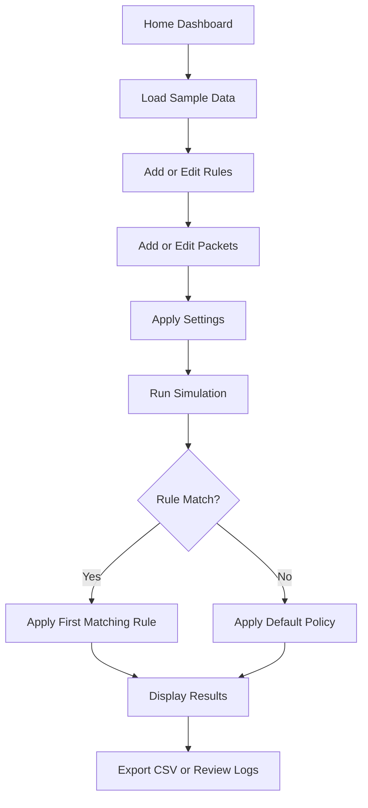

# Project Notes: Firewall Tutor

## Purpose

These notes summarize the completed and enhanced version of the **Firewall Tutor** project developed for the Object Oriented Programming course.

The original project was incomplete due to time constraints. This enhanced version completes the original plan by adding a meaningful home screen and a configurable settings screen, while keeping the project lightweight enough to run with **VS Code + .NET SDK**.

---

## Enhancement Note

The original plan included a home screen and settings screen, but those parts were not completed during the semester. The enhanced version adds them with real value:

- The **Home** tab provides quick actions, project guidance, default policy status, and dataset statistics.
- The **Settings** tab allows configuration of default policy, auto-run simulation, logging, and output file path.

---

## Final Project Structure

```text
firewall_tutor_oop-csharp/
│
├── README.md
├── PROJECT_NOTES.md
├── .gitignore
│
├── src/
│   └── FirewallTutor/
│       ├── FirewallTutor.csproj
│       ├── Program.cs
│       ├── Models/
│       ├── Services/
│       └── Forms/
│
├── data/
│   ├── rules.csv
│   ├── packets.csv
│   └── expected-results.csv
│
├── output/
│   └── .gitkeep
│
├── docs/
│   └── Original-Project-Report.docx
│
└── screenshots/
    ├── home-screen.png
    ├── rules-screen.png
    ├── packets-screen.png
    ├── simulation-screen.png
    ├── logs-screen.png
    ├── tutorial-screen.png
    ├── settings-screen.png
    └── about-screen.png
```

---

## What Was Improved

| Area | Improvement |
|---|---|
| Build Setup | Reworked to run with VS Code and .NET SDK |
| Framework | Updated to a modern .NET Windows Forms structure |
| Code Organization | Split into Models, Services, and Forms |
| Completion | Completed the missing application functionality |
| Home Screen | Added useful dashboard and quick actions |
| Settings Screen | Added configurable firewall behavior |
| Rule Engine | Added clearer rule matching behavior |
| Default Policy | Added configurable default allow/deny policy |
| Sample Data | Added CSV-based rules, packets, and expected results |
| Documentation | Added GitHub-ready README and notes |
| Repository Hygiene | Removed Visual Studio cache and build files |

---

## Settings Added

| Setting | Function |
|---|---|
| Default Policy | Determines what happens when no rule matches |
| Auto-run Simulation | Runs simulation automatically after rule or packet changes |
| Logging | Turns application logging on or off |
| Output CSV Path | Changes where exported simulation results are saved |

---

## OOP Concepts Demonstrated

| Concept | Usage |
|---|---|
| Classes | Rules, packets, services, and forms |
| Objects | Runtime rule and packet instances |
| Encapsulation | Related data and behavior grouped into classes |
| Composition | Firewall logic uses rules, packets, and results |
| Collections | Lists used to manage multiple rules and packets |
| Enums | Used for structured actions and matching fields |
| Separation of Concerns | UI and processing logic are separated |
| Event-Driven Programming | Windows Forms events handle user actions |

---

## Firewall Processing Flow



---

## Suggested Screenshots

Use these exact filenames for GitHub preview:

```text
screenshots/home-screen.png
screenshots/rules-screen.png
screenshots/packets-screen.png
screenshots/simulation-screen.png
screenshots/logs-screen.png
screenshots/tutorial-screen.png
screenshots/settings-screen.png
screenshots/about-screen.png
```

Recommended screenshot order:

1. Home tab showing dashboard and quick actions
2. Rules tab with sample rules loaded
3. Packets tab with sample packets loaded
4. Simulation tab showing allow/deny results
5. Logs tab
6. Tutorial tab
7. Settings tab showing configurable options
8. About tab

---

## About the Report

The original report is useful as academic evidence because it documents:

- Course information
- Group members
- Project title
- Intended design
- GUI modules
- OOP goals
- Testing and challenges
- Future improvements

However, the report should be treated as **original coursework documentation**, not as a fully updated technical report for the enhanced implementation.

Recommended filename:

```text
docs/Original-Project-Report.docx
```

---

## Files Not to Upload

Avoid committing:

```text
.vs/
bin/
obj/
*.exe
*.dll
*.pdb
*.user
*.suo
```

These files are generated by build tools and are not needed in GitHub source code.

---

## Build Commands

```powershell
cd src\FirewallTutor
dotnet build
dotnet run
```

---

## Key Takeaways

- Incomplete academic projects can be improved into portfolio-ready projects.
- OOP concepts become clearer when applied to a practical domain.
- A firewall simulator is a good way to connect programming with cybersecurity.
- Meaningful home and settings screens are better than decorative placeholders.
- VS Code and .NET SDK are enough for maintaining this version.
