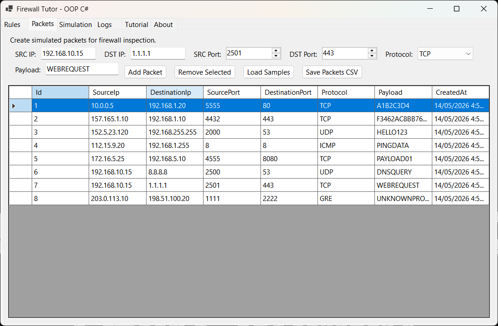
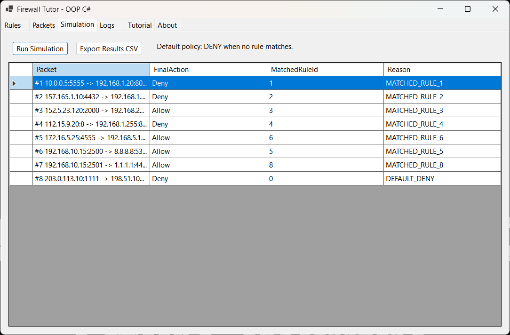
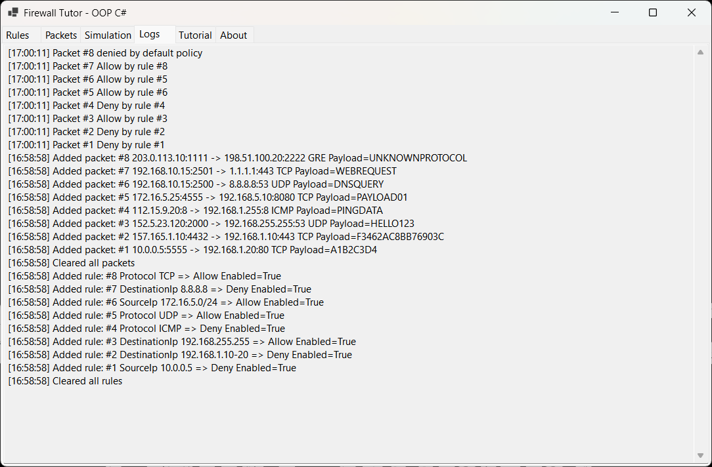
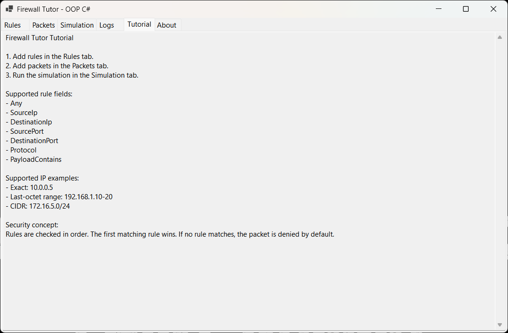
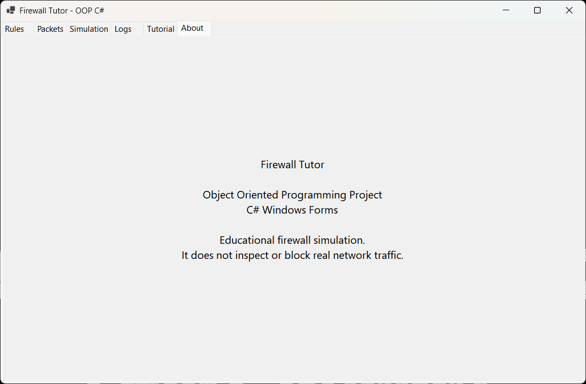
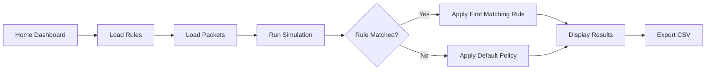

# Firewall Tutor - OOP C# Windows Forms Application


## Overview

**Firewall Tutor** is a C# Windows Forms application developed for the **Object Oriented Programming** course. The project simulates a firewall learning environment where users can manage firewall rules, add simulated packets, run packet inspection, configure firewall behavior, and view allow/deny results through a graphical interface.

The original coursework idea was incomplete due to time constraints. This version completes the original plan by adding a meaningful **Home** tab and a real **Settings** tab, while improving the code structure so the project can be built using **VS Code + .NET SDK** without requiring full Visual Studio.

---

## Project Preview

### Home Dashboard


### Rules Management


### Packet Management



### Firewall Simulation



### Logs



### Tutorial



### Settings


### About



---

## Project Information

| Field | Details |
|---|---|
| Course | Object Oriented Programming |
| Course Code | CS112 |
| Project Title | Firewall Tutor |
| Language | C# |
| Framework | .NET 8 |
| Application Type | Windows Forms Desktop Application |
| Development Setup | VS Code + .NET SDK |
| Interface Type | Tab-based Windows Forms interface |
| Status | Completed and Enhanced |
| Main Theme | Firewall rule and packet inspection simulation |

---

## Why This Version Was Enhanced

The original project was planned with multiple screens, including a home screen and settings screen, but it was not fully completed during the semester. The enhanced version completes that plan with useful functionality instead of placeholder screens.

The enhanced version improves the project by making it:

- Easier to run with VS Code
- Cleaner in folder structure
- More complete in functionality
- Better aligned with OOP concepts
- More suitable for GitHub portfolio presentation
- Free from unnecessary Visual Studio cache/build files

---

## Features

- Windows Forms graphical interface
- Home dashboard with quick actions and project statistics
- Rule management
- Packet management
- Firewall simulation
- Logs view
- Tutorial section
- Configurable settings
- About section
- CSV-based sample data
- First-match rule priority
- Configurable default policy: Allow or Deny
- Optional auto-run simulation after data changes
- Optional application logging
- Configurable output CSV path
- Exact IP matching
- Basic IP range matching
- Basic CIDR matching
- Protocol matching
- Port matching
- Payload keyword matching
- Exportable simulation results
- VS Code compatible project structure

---

## Application Tabs

| Tab | Purpose |
|---|---|
| Home | Provides project summary, quick actions, default policy status, and data statistics |
| Rules | Add, load, and manage firewall rules |
| Packets | Add, load, and manage simulated packets |
| Simulation | Apply firewall rules and generate decisions |
| Logs | View and clear application events |
| Tutorial | Explain how the firewall simulation works |
| Settings | Configure default policy, auto-run behavior, logging, and output path |
| About | Provide project information |

---

## Settings Options

| Setting | Purpose |
|---|---|
| Default Policy | Select whether unmatched packets are allowed or denied |
| Auto-run Simulation | Automatically re-run simulation when rules or packets change |
| Logging | Enable or disable application logs |
| Output CSV Path | Configure where exported results are saved |

---

## Core OOP Concepts Used

- Classes and objects
- Encapsulation
- Constructors
- Properties
- Lists and collections
- Composition
- Enums
- Services
- Separation of concerns
- Event-driven programming
- GUI-based application design

---

## Firewall Logic



---

## Rule Processing Concept

The firewall checks rules from top to bottom.

The first matching rule is applied.

If no rule matches, the configurable default policy is used.

By default, the default policy is:

```text
DENY
```

This follows a common defensive security principle:

```text
Deny by default, allow only when explicitly permitted.
```

---

## Repository Structure

```text
firewall_tutor_oop-csharp/
│
├── README.md
├── PROJECT_NOTES.md
├── .gitignore
│
├── src/
│   └── FirewallTutor/
│       ├── FirewallTutor.csproj
│       ├── Program.cs
│       ├── Models/
│       ├── Services/
│       └── Forms/
│
├── data/
│   ├── rules.csv
│   ├── packets.csv
│   └── expected-results.csv
│
├── output/
│   └── .gitkeep
│
├── docs/
│   └── Original-Project-Report.docx
│
└── screenshots/
    ├── home-screen.png
    ├── rules-screen.png
    ├── packets-screen.png
    ├── simulation-screen.png
    ├── logs-screen.png
    ├── tutorial-screen.png
    ├── settings-screen.png
    └── about-screen.png
```

---

## How to Build and Run

### Requirements

Install:

```text
.NET 8 SDK
VS Code
C# extension or C# Dev Kit extension
```

### Build

```powershell
cd src\FirewallTutor
dotnet build
```

### Run

```powershell
dotnet run
```

---

## Sample Data

The project includes CSV-based sample data:

```text
data/rules.csv
data/packets.csv
data/expected-results.csv
```

These files allow the firewall simulation to be tested without manually entering all data every time.

---

## Original Report

The `docs/Original-Project-Report.docx` file may be included as historical coursework documentation.

Important note:

> The report describes the original university project idea and early design. The current repository contains an enhanced and completed implementation, so the report should be treated as original academic documentation rather than exact technical documentation for the enhanced version.

---

## Learning Outcomes

Through this project, I learned how to:

- Build a desktop application using C# Windows Forms.
- Apply OOP concepts in a practical cybersecurity-themed project.
- Separate models, services, and forms.
- Process firewall rules and simulated packets.
- Add meaningful home and settings screens.
- Use CSV files for sample input/output.
- Build and run a Windows Forms project using VS Code and .NET SDK.
- Improve an incomplete coursework project into a portfolio-ready application.

---

## Limitations

- This is a simulation, not a real firewall.
- It does not capture live network traffic.
- It does not modify system firewall rules.
- It does not perform deep packet inspection.
- It is intended for educational use only.

---

## Future Enhancements

- Add rule import controls.
- Add better validation messages.
- Add search and filtering for logs.
- Add packet statistics dashboard with charts.
- Add unit tests for the rule engine.
- Add dark mode.
- Add persistent settings storage.
- Add real-time charting for allowed vs denied packets.

---

## Academic Notice

This project was developed and enhanced for academic learning, OOP practice, and cybersecurity portfolio documentation.

---

## Disclaimer

Firewall Tutor is an educational firewall simulation project. It does not inspect, block, capture, or modify real network traffic.
