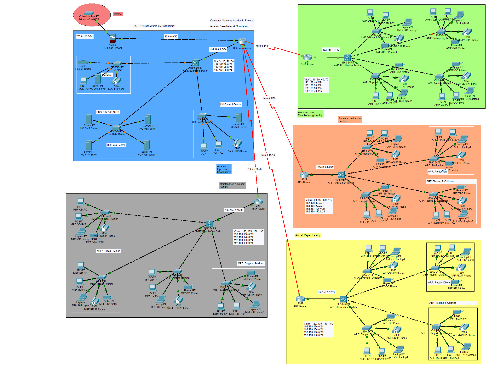

# Multi-Site Aviation Campus Network Simulation

## Overview

This project is a Cisco Packet Tracer based academic network simulation for a fictional multi-site aviation campus. It models one headquarters site and four connected facility sites using VLAN segmentation, routed point-to-point links, OSPF dynamic routing, centralized network services, and basic monitoring.

The project is prepared for GitHub portfolio review. The Packet Tracer file is included for hands-on inspection, while the topology, screenshots, command outputs, configuration notes, report, and presentation make the project understandable even without Cisco Packet Tracer.

> Academic scope: This is a fictional simulation created for learning purposes. It does not represent a real deployed network or real aviation, defense, or military infrastructure.

## Course Information

| Field | Details |
|---|---|
| Course | Computer Networks Lab |
| Course Code | CS260L |
| Department | Cyber Security |
| University | Air University, Islamabad |
| Instructor | Sir Mohsin Sarfraz |
| Semester | Semester 3, Fall 2024 |

## Team Members

| Name | Registration ID |
|---|---:|
| Hussain Ali | 232095 |
| Ahmad Ali | 232147 |

## Network Sites

| Site | Public-Safe Meaning | Role in Simulation |
|---|---|---|
| AOH / HQ | Aviation Operations Headquarters | Core routing, data center, SOC, control center, and centralized services |
| AMF | Aerostructures Manufacturing Facility | Design, prototyping, quality control, and support VLANs |
| APF | Avionics Production Facility | Avionics design, production, testing/calibration, and support VLANs |
| ARF | Aircraft Repair Facility | Overhaul, repair, testing/certification, and support VLANs |
| MRF | Maintenance and Repair Facility | Overhaul, repair, testing, and support VLANs |

## Key Concepts Demonstrated

- Hierarchical enterprise network design
- VLAN-based departmental segmentation
- Inter-VLAN routing through Layer 3 switches
- Point-to-point routed links between HQ and facility sites
- OSPF dynamic routing across all sites
- DNS, Web, FTP, Mail, and Syslog services
- Trunk links between distribution and access switches
- Factory-to-HQ service reachability
- CLI-based network verification
- Basic device hardening and logging concepts
- Public-safe documentation of an academic Packet Tracer project

## Final Service Addressing

| Service | DNS Name | IP Address | Location |
|---|---|---:|---|
| DNS | `dns.aoh.com` | `192.168.10.10` | HQ Data Center |
| Mail | `mail.aoh.com` | `192.168.10.11` | HQ Data Center |
| FTP | `ftp.aoh.com` | `192.168.10.12` | HQ Data Center |
| Web | `www.aoh.com` | `192.168.10.13` | HQ Data Center |
| Syslog | `syslog.aoh.com` | `192.168.30.10` | HQ SOC |

## VLAN Allocation Summary

The Packet Tracer file keeps the original VLAN labels as configured in the academic simulation. The table below documents the intended meaning of each VLAN.

| VLAN | Intended Segment |
|---:|---|
| 10 | HQ Data Center |
| 20 | HQ Control Center |
| 30 | HQ SOC |
| 40 | AMF Design and Development |
| 50 | AMF Prototyping and Testing |
| 60 | AMF Quality Control |
| 70 | AMF Support Services |
| 80 | APF Avionics Design |
| 90 | APF Production |
| 100 | APF Testing and Calibration |
| 110 | APF Support Services |
| 120 | ARF Overhaul Division |
| 130 | ARF Repair Division |
| 140 | ARF Testing and Certification |
| 150 | ARF Support Services |
| 160 | MRF Overhaul Division |
| 170 | MRF Repair Division |
| 180 | MRF Testing Division |
| 190 | MRF Support Services |
| 200 | Wireless Access Network |

## Repository Structure

```text
avionics-base-network/
|-- configs/
|   `-- avionics-base-network-configs.md
|-- docs/
|   `-- avionics-base-network-report.docx
|-- packet-tracer/
|   `-- avionics-base-network-simulation.pkt
|-- presentation/
|   `-- avionics-base-network-presentation.pptx
|-- screenshots/
|   |-- Screenshot 2026-05-27 054237.png
|   |-- Screenshot 2026-05-27 054444.png
|   |-- Screenshot 2026-05-27 054454.png
|   |-- Screenshot 2026-05-27 055111.png
|   |-- Screenshot 2026-05-27 055234.png
|   |-- Screenshot 2026-05-27 055309.png
|   |-- Screenshot 2026-05-27 055351.png
|   `-- verification-commands.md
|-- topology/
|   `-- logical-diagram.png
|-- .gitignore
|-- PROJECT_NOTES.md
|-- RUN_GUIDE.md
`-- README.md
```

## Main Files

| Path | Purpose |
|---|---|
| `packet-tracer/avionics-base-network-simulation.pkt` | Main Cisco Packet Tracer simulation file |
| `topology/logical-diagram.png` | Main topology image for GitHub preview |
| `screenshots/` | DNS, Web, FTP, Mail, Syslog, and service verification screenshots |
| `screenshots/verification-commands.md` | CLI-based routing, OSPF, VLAN, trunk, and ping verification evidence |
| `configs/avionics-base-network-configs.md` | Clean configuration, addressing, and verification documentation |
| `docs/avionics-base-network-report.docx` | Original academic report |
| `presentation/avionics-base-network-presentation.pptx` | Original academic presentation |


## Screenshot Evidence Preview

The screenshots below provide quick visual proof of the implemented services and testing evidence without requiring Cisco Packet Tracer to be opened first.

### Topology Preview



### Service and Verification Screenshots

| Evidence | Preview |
|---|---|
| DNS records for `aoh.com` services |  |
| Web server homepage loaded through `www.aoh.com` |  |
| AMF web page loaded through `www.aoh.com/amf.html` |  |
| FTP login and directory listing through `ftp.aoh.com` |  |
| Mail send test through `mail.aoh.com` |  |
| Mail receive test through `mail.aoh.com` |  |
| Syslog server receiving device logs |  |

Additional CLI evidence is available in [`screenshots/verification-commands.md`](screenshots/verification-commands.md), including VLAN, trunk, OSPF, routing, and factory-to-HQ service reachability checks.

## How to Open the Simulation

1. Install Cisco Packet Tracer.
2. Open `packet-tracer/avionics-base-network-simulation.pkt`.
3. Wait for the topology links and routing to initialize.
4. Review the HQ, AMF, APF, ARF, and MRF areas in the logical workspace.
5. Test services from a factory PC using ping, browser, FTP, and email tools.
6. Inspect routers and switches through CLI using the verification commands below.

## Basic Client Verification

From any factory PC, open **Desktop > Command Prompt** and test:

```text
ping 192.168.10.10
ping 192.168.10.11
ping 192.168.10.12
ping 192.168.10.13
ping www.aoh.com
ping mail.aoh.com
ping ftp.aoh.com
```

Expected result: successful replies from each service after Packet Tracer convergence.

## Web Server Test

From a PC browser, test:

```text
http://www.aoh.com
http://www.aoh.com/amf.html
http://www.aoh.com/apf.html
http://www.aoh.com/arf.html
http://www.aoh.com/mrf.html
```

Expected result: the public-safe academic aviation-campus web pages should load.

## FTP Server Test

From a PC command prompt:

```text
ftp ftp.aoh.com
```

Login with the Packet Tracer test account configured in the simulation.

Useful FTP command:

```text
dir
```

Expected result: FTP login succeeds and the directory listing appears.

> Public documentation should not expose lab passwords. Use `<LAB_SECRET>` in reports, screenshots, and GitHub notes when credentials are referenced.

## Mail Server Test

From two Packet Tracer PCs:

1. Configure one user as `admin@aoh.com`.
2. Configure another user as `soc@aoh.com`.
3. Use `mail.aoh.com` as both incoming and outgoing mail server.
4. Send a test email from one account to the other.
5. Click **Receive** on the receiving PC.

Expected result: the email is sent and received successfully.

## Syslog Test

On a router or switch, configure logging to the Syslog server:

```cisco
logging host 192.168.30.10
logging trap debugging
logging on
```

Then generate a device event, such as entering privileged EXEC mode or changing an interface state.

Expected result: log messages appear on the Syslog server.

## Router Verification Commands

Use these commands on routers:

```cisco
show ip interface brief
show ip route
show ip ospf neighbor
show running-config
```

Important routers to verify:

```text
HQ-RTR
AMF-RTR
APF-RTR
ARF-RTR
MRF-RTR
```

## Switch Verification Commands

Use these commands on distribution and access switches:

```cisco
show vlan brief
show interfaces trunk
show ip interface brief
show running-config
```

Important switches to verify:

```text
HQ-DIST-SW
HQ-ACCESS-SW-DC
AMF-DIST-SW
APF-DIST-SW
ARF-DIST-SW
MRF-DIST-SW
```

## Verified Functionality

The final Packet Tracer simulation was verified for:

- DNS resolution
- Web access through `www.aoh.com`
- FTP login and directory listing through `ftp.aoh.com`
- Mail sending and receiving through `mail.aoh.com`
- Syslog logging from network devices
- OSPF neighbor formation between HQ and facility routers
- OSPF-learned routes from AMF and HQ routers
- VLAN presence on HQ and facility switches
- Trunk forwarding for facility VLANs
- Factory-to-HQ reachability for DNS, Mail, FTP, and Web servers

## Review Without Cisco Packet Tracer

If Cisco Packet Tracer is not available, review the project through:

1. `topology/logical-diagram.png`
2. `screenshots/`
3. `screenshots/verification-commands.md`
4. `configs/avionics-base-network-configs.md`
5. `docs/avionics-base-network-report.docx`
6. `presentation/avionics-base-network-presentation.pptx`

These files provide enough evidence to understand the topology, VLAN plan, routing design, service configuration, and testing results.

## Limitations

- This is a Packet Tracer simulation, not a production deployment.
- Some security controls are represented conceptually or at lab level.
- Packet Tracer device behavior may differ from real Cisco enterprise devices.
- The project uses academic test data and placeholder lab credentials.
- Advanced enterprise features such as AAA, VPN, HSRP/VRRP, EtherChannel, NAC, and IPS are not fully implemented.
- Packet Tracer may show brief packet loss during initial ARP resolution or network convergence. If a first ping partially fails, run the same ping again after a few seconds.

## Public Safety Notes

- This project is documented as a fictional academic network.
- Public documentation avoids presenting the topology as a real aviation or defense infrastructure.
- Credentials should be represented as `<LAB_SECRET>` in public files.
- Test emails, FTP files, and screenshots should not contain real sensitive data.
- The DOCX and PPTX are kept as original academic submission artifacts and may preserve older classroom wording. The public GitHub markdown is the normalized fictional, portfolio-safe version.

## Future Improvements

- Add a clean ACL policy matrix.
- Add EtherChannel between distribution and access layers.
- Add HSRP or VRRP for gateway redundancy.
- Add AAA using RADIUS or TACACS+.
- Add a formal IP addressing spreadsheet.
- Optionally retake screenshots with shorter public-friendly file names.
- Add a simplified cropped topology image for easier GitHub viewing.
- Add a network security policy section explaining segmentation and access control.

## Portfolio Value

This project demonstrates practical networking skills relevant to cybersecurity and infrastructure roles, including segmentation, routing, network services, verification, monitoring, and security-aware documentation. It is suitable for an academic GitHub portfolio as a Semester 3 Computer Networks Lab project.
